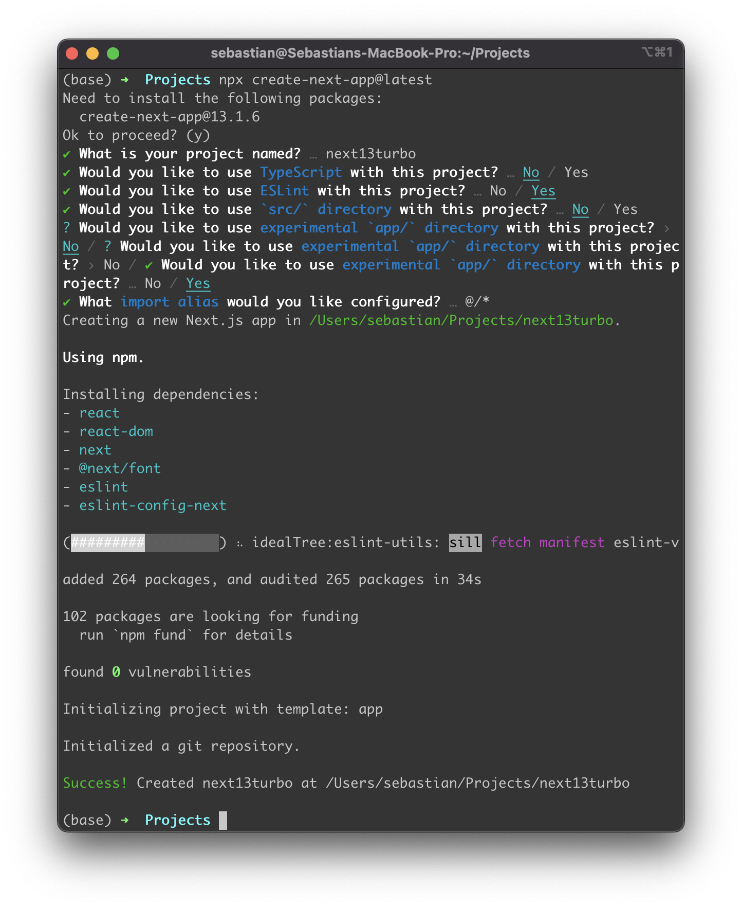
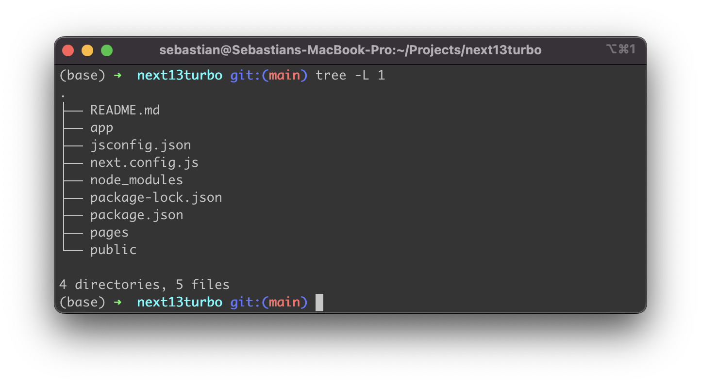
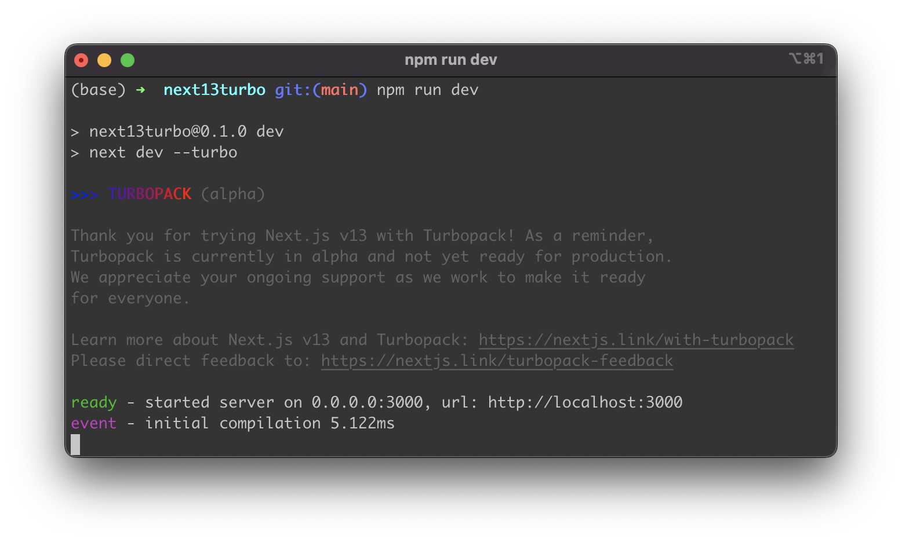
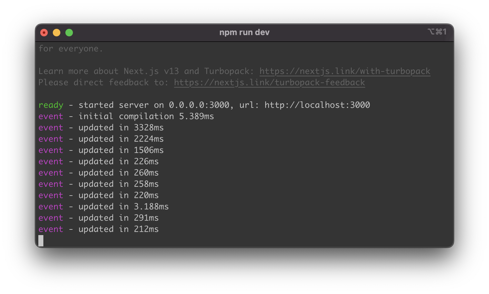

import { Image } from '@astrojs/image/components';
import YouTube from '~/components/widgets/YouTube.astro';
export const components = { img: Image };

Next.js 13 comes with a new build tool: Turbopack. Turbopack is a successor of Webpack and is built with Rust for blazing-fast build performance. Currently the Turbopack integration for Next.js 13 is in Alpha mode. In the following article you'll learn how to activate Turbopack and speed up your Next.js develeopment server significantly.

The build and bundling tool which was used as a standard in Next.js so far is Webpack. Webpack is a JavaScript-based tool and was a major change in how web application are optimized and delivered to the client. Webpack separates the code of your web application based on how it is used across your site, builds corresponding bundles and optimizes the code chunks which are provided to the client.

However, as Webpack is build with JavaScript, it is limited when it comes to maximizing performance optimizations of the build process. That is why Next.js is switching to Turbopack which is build with Rust and therefore making it possible to speed up the build process significantly. According to the statements provided by Vercel (https://nextjs.org/blog/next-13#introducing-turbopack-alpha) the following improvements can be expected when switching to the Turbopack build mode with Next.js 13:

* 700x faster updates than Webpack
* 10x faster updates than Vite
* 4x faster cold starts than Webpack

Turbopack makes sure that only bundles are provided with a very minimum set of assets included. This results in ultra-fast startup times in development mode.

_"On an application with 3,000 modules, Turbopack takes 1.8 seconds to boot up. Vite takes 11.4 seconds and Webpack takes 16.5 seconds."_

## Creating a Next.js 13 Project

If you'd like to test Turbopack with Next.js 13, you first need to setup a new Next.js 13 project. On a command line type in:

```bash
$ npx create-next-app@latest
```

You'll then receive a few question on the command line. Here you can specify the details of the project setup. Furthermore you're being asked to input a project name, e.g. next13turbo:



Once the project is created successfully you should be able to see the success message. Next enter the newly created project directory:

```bash
$ cd next13turbo
```

The project directory should then contain the following project structure:



## Starting The Development Webserver With Turbopack

Turbopack support in Next.js 13 only supports development mode of the web server at the moment. In order to activate Turbopack we need to open package.json and add option

```
-- turbo
```

to the "dev" command in the "scripts" section:

```
  "scripts": {
    "dev": "next dev --turbo",
    "build": "next build",
    "start": "next start",
    "lint": "next lint"
  },
```

Next start the development web server by typing in:

```bash
$ npm run dev
```

On the command line you can now see that the server is being started with Turbopack instead of Webpack:



You can now update every part of your Next.js application (e.g. app/page.js) and see the dev server updating the website immediately:

