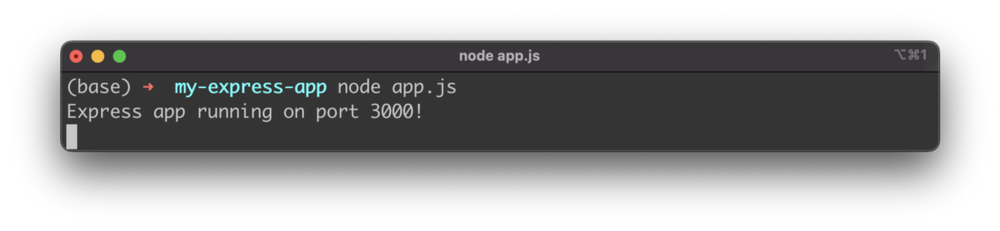
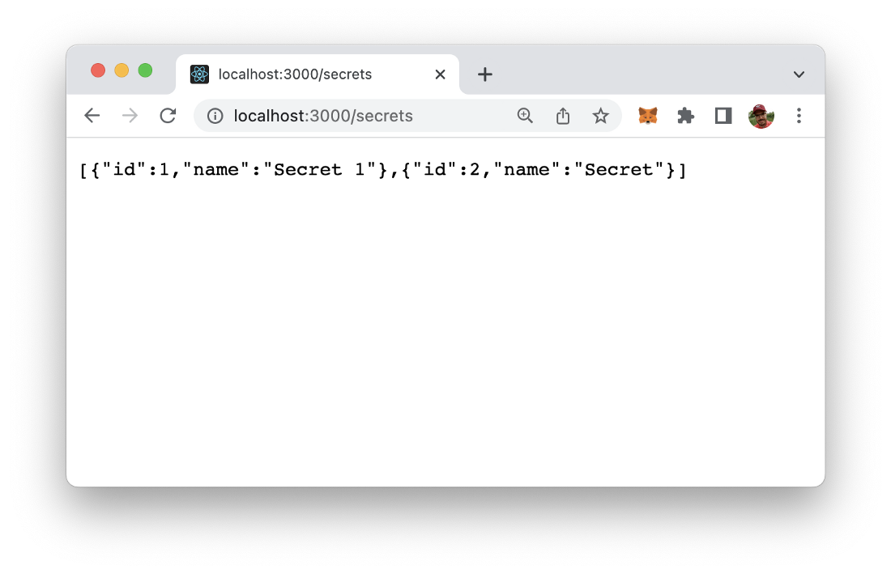
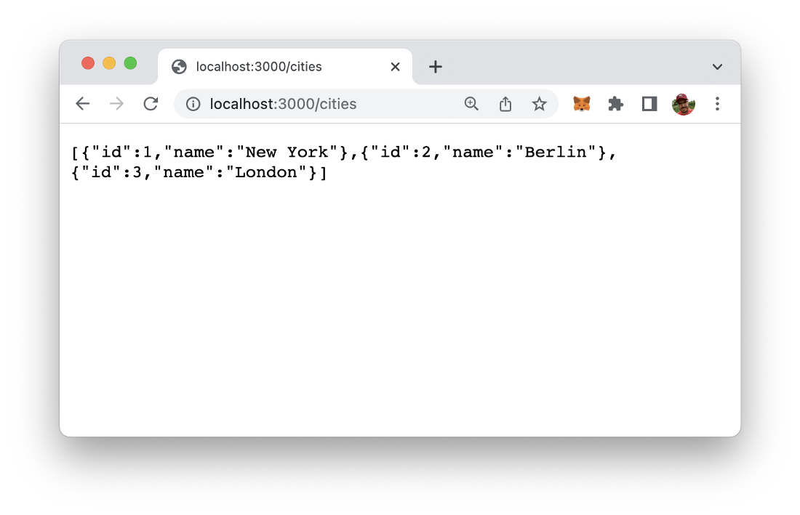
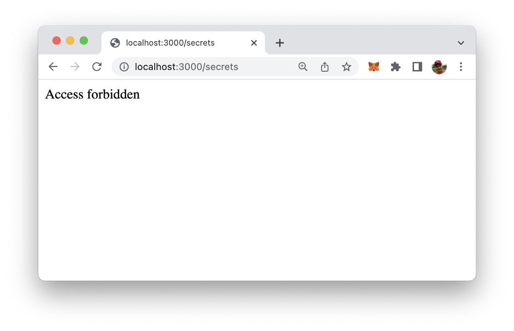
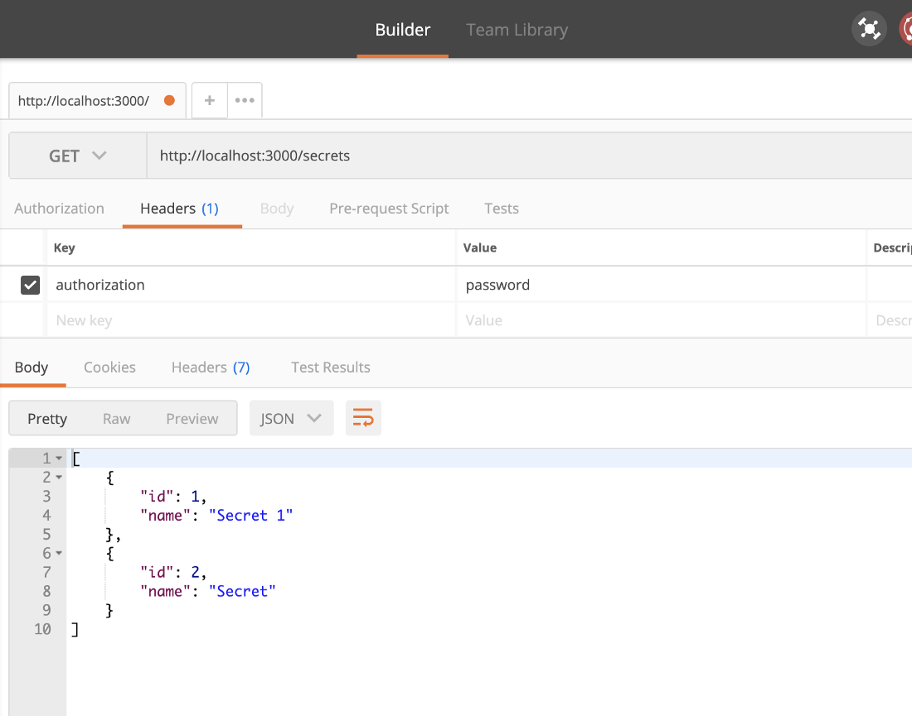

import { Image } from '@astrojs/image/components';
import YouTube from '~/components/widgets/YouTube.astro';
export const components = { img: Image };

Most often you have parts of your web application which are accessible for everyone and parts which needs to be access protected. In this article you’ll learn how to apply a basic authentication system in your Express.js web application by using the middleware mechanism.

So let’s start by revisiting the simple Node.js example which is our starting point for this tutorial:

```js
const express = require('express');
const app = express();
const port = 3000;

app.get('/', (req, res) => res.send('Hello World!'));

app.get("/cities", (req,res) => {
    const cities = [
        {
            id: 1,
            name: "New York",
        },
        {
            id: 2,
            name: "Berlin",
        },
        {
        id: 3,
        name: "London",
        },
    ];
  
    res.json(cities);
});

app.listen(port, () => console.log(`Express app running on port ${port}!`));
```

This Express web app is handling incoming GET request on two routes:

- /: The default route of the web app just returns the string “Hello World”
- /cities: The cities route of the web app returns a JSON data object which contains a list of cities, each consisting of a name and an ID.

Both routes can be accessed by everyone, so access restriction if in place so far.

Let’s change this by adding a new route to the web application and use a middleware to establish some kind of basic access restriction and authorization.

## Step 1: Add route to the Express web app

First step is to add a new route to our Express app:

```js
app.get("/secrets", (req,res) => {
    const secrets = [
        {
            id: 1,
            name: "Secret 1",
        },
        {
            id: 2,
            name: "Secret",
        }
    ];
  
    res.json(secrets);
});
```

Then make sure the Express server is up and running:



And access the new route in the browser. The result should correspond to what you can see in the following screenshot:



## Step 2: Add isAuth function

In the next step we’re adding a function with some very basic and simple authentication logic to the implementation in app.js:

```js
function isAuth(req, res, next) {
    const auth = req.headers.authorization;
    if (auth === 'password') {
      next();
    } else {
      res.status(401);
      res.send('Access forbidden');
    }
}
```

In this function we’re checking the value of the authorization field in the request header. If the value of this header field is equal to “password” then the function calls next(). If this function is called the request can be further request and the result can be delivered to the requestor.

If the value of the header field is not equal to “password” the response object is used (res), to send a response with status 401.

## Step 3: Add isAuth function as middleware to protect the route

Now we can add the isAuth function as a middleware to our /secrets route. In this case the function is protecting the access to this route:

```js
app.get(“/secrets”, isAuth , (req,res) => { … }
```

In the following code listing you can again see the full implementation of app.js:

```js
const express = require('express');
const app = express();
const port = 3000;

function isAuth(req, res, next) {
    const auth = req.headers.authorization;
    if (auth === 'password') {
      next();
    } else {
      res.status(401);
      res.send('Access forbidden');
    }
}

app.get('/', (req, res) => res.send('Hello World!'));

app.get("/cities", (req,res) => {
    const cities = [
        {
            id: 1,
            name: "New York",
        },
        {
            id: 2,
            name: "Berlin",
        },
        {
        id: 3,
        name: "London",
        },
    ];
  
    res.json(cities);
});

app.get("/secrets", isAuth , (req,res) => {
    const secrets = [
        {
            id: 1,
            name: "Secret 1",
        },
        {
            id: 2,
            name: "Secret",
        }
    ];
  
    res.json(secrets);
});

app.listen(port, () => console.log(`Express app running on port ${port}!`));
```

Now it’s time to test if the access restriction is fully working.

## Step 4: Try it out!

Restart the Node server process and first try to access to /cities route again. You should then get the result as seen in the screenshot below:



Next, let’s access to /secrets route as well and check if the authentication middleware is working:



As a result you should see the text “Access forbidden”. This is the expected result because we’ve haven’t set the request header field for authentication and therefore the process of accessing the route results in an 401 response and is rejected by the isAuth middleware function.

Ok, now let’s send an GET request to the /secrets endpoints and attach the authetication header field with a value set to “password”. To do so, we’re using the Postman (https://www.postman.com/) tool:



When this request is executed the you now should see that as a result the JSON object with secret data is returned again because the authentication check which is performed by the attached middleware function has been completed successfully.