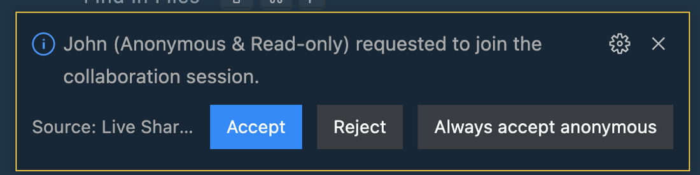

import { Image } from '@astrojs/image/components';
import YouTube from '~/components/widgets/YouTube.astro';
export const components = { img: Image };

*Photo by [Clément Hélardot](https://unsplash.com/@clemhlrdt) on [Unsplash.com](https://unsplash.com/)*

For many developers Visual Studio Code is the code editor of choice. Visual Studio Code is a free open source code editor developed by Microsoft. Features can be added to VS Code by installing extensions. In this article you’ll learn how to install and use the Live Share extension which adds live collaboration features for code editing to VS Code for free.

## Step 1: Install Visual Studio Code

Before being able to add live collaboration features to VS Code you first need to install the code editor. Go to https://code.visualstudio.com/ and download the package for your platform. Follow the instructions to get VS Code editor installed.

## Step 2: Install Live Share Extension

Open VS Code and go to the extensions view by clicking on the Extensions icon in the left-side menu bar:

In the search field type in “Live Share” to search for the Live Share Extension. You should then see search results similar to what is visible in the following screenshot:

The first search result is the Live Share extension and that’s the extension we need to get install in order to enable live collaboration features for VS Code. Hit the install button and the extension is downloaded and added to VS Code in just one step.

## Step 3: Share Your Current VS Code Project With Others

Once the installation is complete you should be able to see that a link called “Live Share” becomes visible in the editor’s status bar at the bottom:

In order to share your VS Code project now for collaboration you just need to hit that new link. You are then being asked to identify yourself by signing in with an GitHub or Microsoft account:

One you have completed the sign in the status bar changed and you should be able to see the following:

From here you can click directly on Shared. This opens up a menu of options:

Choose the first option “Invite Others (Copy Link)” and you’ll see that the link to share your VS Code session is copied to the clipboard:

You can now send this link to your friends and colleagues to start collaborating on your code. The person who uses this link is then prompted to sign in as well or join the collaboration session anonymously.

Before the person is able to enter you need to accept in the original VS Code instance:

In Visual Studio Code you can then go to the Live Share view (from the left-side menu) to get an overview of your shared coding session:

Here you can see that one additional participant (John, joined anonymously) is in your session. From here you can grant write privileges as well:

Now you’re able to edit code files simultaneously and you can see the the editing processed is tracked live across the sessions:

That’s how easy it is to start working on your VS Code project together with friends and colleagues with full live collaboration features.