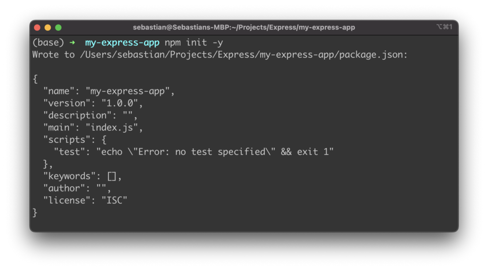
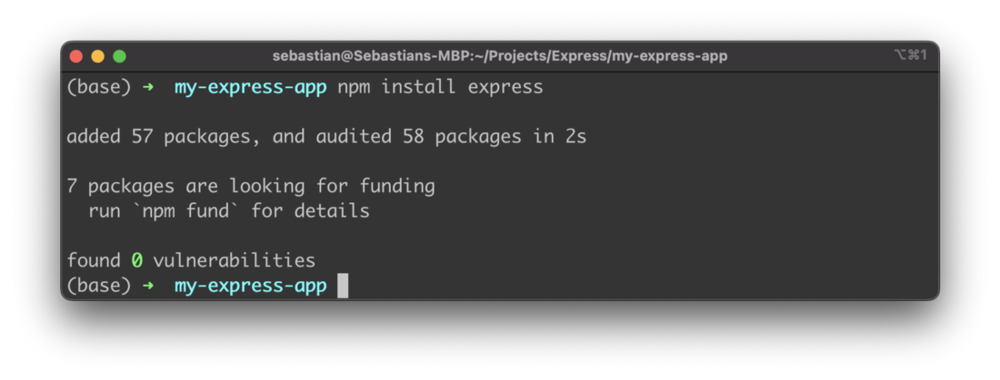
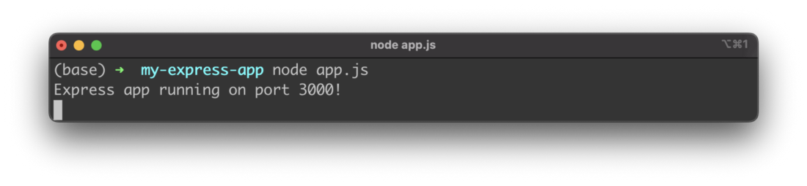
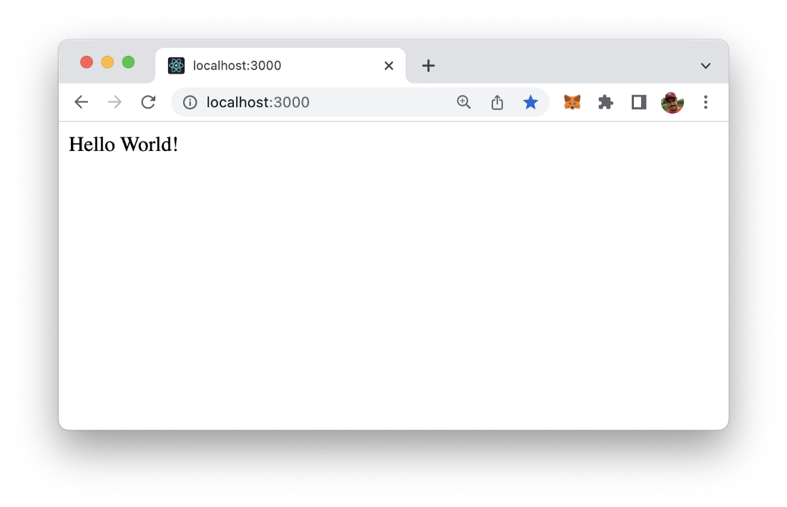
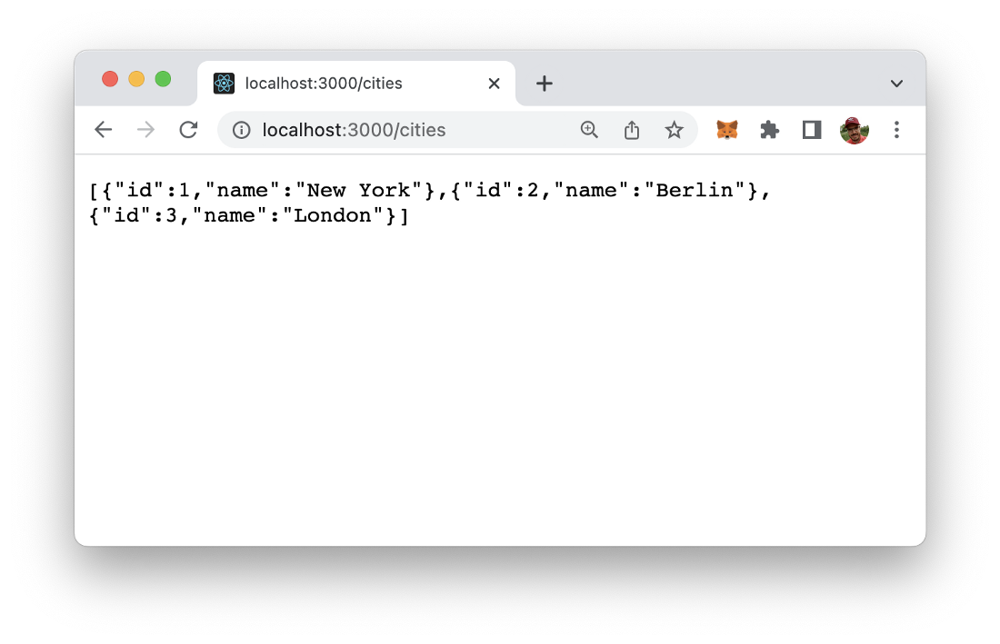

import { Image } from '@astrojs/image/components';
import YouTube from '~/components/widgets/YouTube.astro';
export const components = { img: Image };

Express is a fast, unopinionated, minimalist web framework for Node.js which makes developing web application really easy. In this tutorial you’ll learn how to create your first express web app in just a few minutes.

## Step 1: Create A New Project

The first step is to initialize a new project. Therefore create a new empty project folder:

```bash
$ mkdir my-express-app
```

Change into the newly created folder:

```bash
$ cd my-express-app
```

In init the project by creating a package.json file by using the Node.js Package Command in the following way:

```bash
$ npm init -y
```

The output confirms that the package.json file has been created successfully as you can see in the following screenshot:



## Step 2: Install Express Framework

In the next step we’re ready to install the Express framework. Just type in:

```bash
$ npm install express
```

The express package and its dependencies are added to the project:



## Step 3: Implement A Simple Express Server

In the third step let’s add the implementation for a very basic Express server. Start by creating a new JavaScript file in the project folder:

```bash
$ touch app.js
```

Then enter the following lines of JavaScript code into that file:

```js
const express = require('express');
const app = express();
const port = 3000;

app.get('/', (req, res) => res.send('Hello World!'));

app.listen(port, () => console.log(`Express app running on port ${port}!`));
```

First we’re creating an instance of Express which is stored in app constant. By using the app.get method we’re implementing the response behavior for an HTTP GET request to the default application route (/).

The method takes two parameters:

- first we need to pass in the application route as string
- second we need to pass in the function which should be called to handle HTTP GET requests arriving at that application route

## Step 4: Run And Test Express App

For a first test, start the Express app by using the node command:

```bash
$ node app.js
```

By default the web server is started on port 3000:



If you type in the URL http://localhost:3000 in the browser you can see that the string “Hello World” is displayed as the result as expected:



## Step 5: Add A Route To Return Data

So let’s extend the express app a little bit by adding another route /cities:

```js
const express = require('express');
const app = express();
const port = 3000;

app.get('/', (req, res) => res.send('Hello World!'));

app.get("/cities", (req,res) => {
    const cities = [
        {
            id: 1,
            name: "New York",
        },
        {
            id: 2,
            name: "Berlin",
        },
        {
        id: 3,
        name: "London",
        },
    ];
  
    res.json(cities);
});

app.listen(port, () => console.log(`Express app running on port ${port}!`));
```

Again, we’re making use of the app.get method. In the first parameter we’re passing in the string “/cities” to connect to that application route. In the second parameter we’re passing the arrow function which is handling the request and returning a JSON data object.

The result when request the new route in the browser should then look like you can see in the following screenshot:




