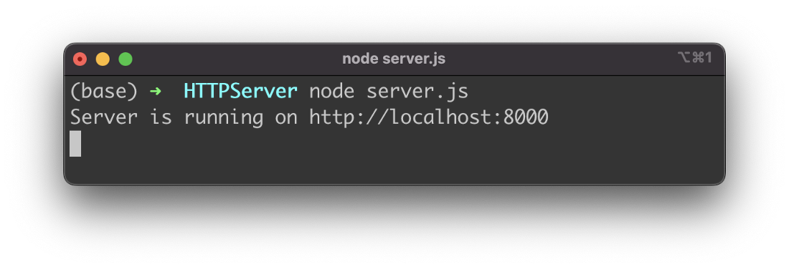
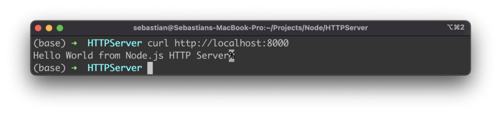

import { Image } from '@astrojs/image/components';
import YouTube from '~/components/widgets/YouTube.astro';
export const components = { img: Image };

## Step 1: Import HTTP module

Let’s start by creating a new empty file server.js and import the Node.js module http with the following line of code:

```js
const http = require(“http”);
```

## Step 2: Create Variables For Host And Port

Next we’re defining two variables which are holding information of host and port on which the HTTP server should be running. Add the following two lines of code to server.js:

```js
const host = ‘localhost’;
const port = 8000;
```

## Step 3: Create A Server Process

In the next step we’re ready to create the server by using method createServer of the http module:

```js
const server = http.createServer(requestListener);
server.listen(port, host, () => {
  console.log(`Server is running on http://${host}:${port}`);
});
```

As you can see we’re heading over a function with name requestListener. This function will be implemented in the next step and is containing the logic to handle incoming HTTP requests.

The created server instance is stored in server. To start the server process we need to call server.listen. This method is receiving three arguments: port, host and a callback function which is executed once the server process is up and running. In the example we’re using this function to output information to the user.

## Step 4: Implement the requestListener function

The requestListener function has been handed over when we created the HTTP server by using method createServer is the previous step. Now we need to add the missing implementation for requestListener into server.js:

```js
const requestListener = function(req, res) {
  res.writeHead(200);
  res.end(“Hello World from Node.js HTTP Server”);
}
```

The requestListener function is expecting to get two arguments: req and res. With req we have access to the request object and with res we have access to the corresponding response object. Inside the method we’re using the res argument to first set the HTTP header status of the response to value 200 (by using method writeHead. Second we’re using the method end to send back a text message to the client.

Finally let’s take a look at the complete implementation in server.js:

```js
const http = require("http");

const host = 'localhost';
const port = 8000;

const requestListener = function(req, res) {
    res.writeHead(200);
    res.end("Hello World from Node.js HTTP Server");
}

const server = http.createServer(requestListener);
server.listen(port, host, () => {
    console.log(`Server is running on http://${host}:${port}`);
});
```

## Step 5: Start And Test The HTTP Server

With the complete implementation in place we’re ready to start the server process with the following command:

```bash
$ node server.js
```

You should then be able to see the following output:



To test if the server process is responding and sending back the text message let’s use the curl command in the following way:


