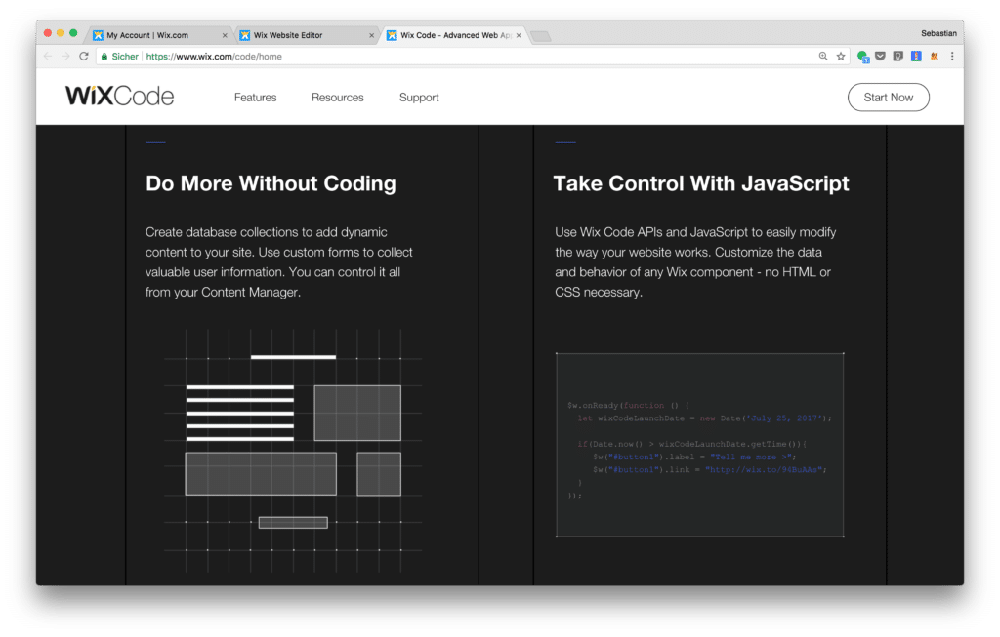
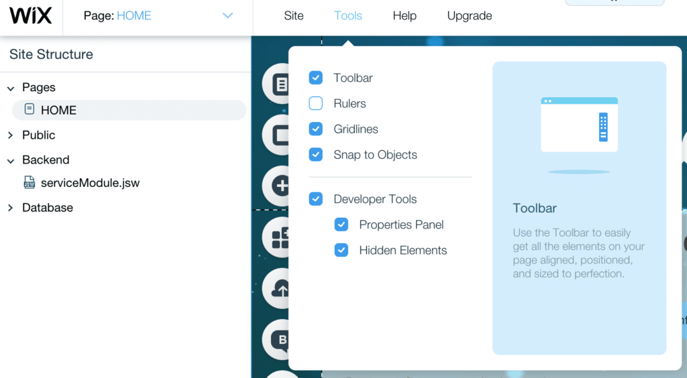
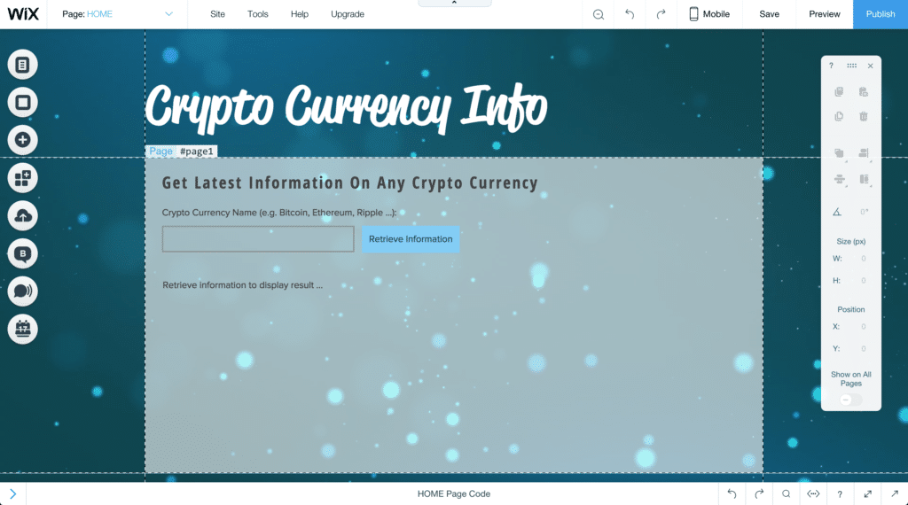
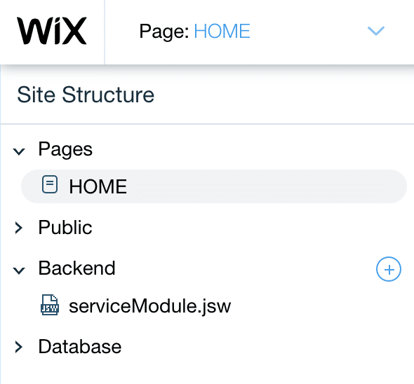
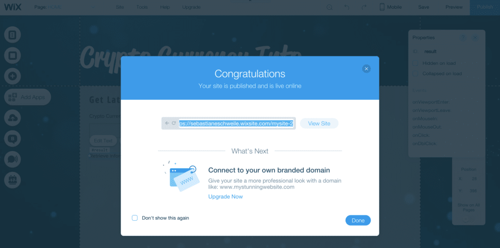

import { Image } from '@astrojs/image/components';
import YouTube from '~/components/widgets/YouTube.astro';
export const components = { img: Image };

<YouTube url="https://youtu.be/aIbB5qVQp9Y" />

Wix.com is a cloud-based website builder that makes it easy to create beautiful, professional website. With the Wix Editor, users are able to arrange and customize any element on their site. Traditionally Wix.com has targeted people who want to create their web presence without coding. Now Wix has added a big new feature to their platform: [Wix Code](https://www.wix.com/code/home?utm_campaign=ma_codingthesmartway.com_wixcode&experiment_id=codingthesmartway.com).

With Wix Code, you can set up database collections to store all your site info, add dynamic pages and repeating layouts and create custom forms to gather user input. Take full control of your site by adding your own JavaScript and connecting to Wix and third-party APIs. They’ve taken care of stuff like security, hosting and maintenance so you don’t have to and everything you create is SEO compatible.

In this tutorial we'll take a first look at Wix Code and go through a practical real-world sample application. You can just follow along by creating your free Wix.com account and follow the step-by-step instructions included.

Visit the [Wix Code Resources page](https://www.wix.com/code/home/resources?utm_campaign=ma_codingthesmartway.com_wixcode&experiment_id=codingthesmartway.com) to learn more about its features, read articles, watch and video tutorials, view sample code, check out API references and more.



## Get Started With Wix Code

To get started with Wix Code you first need to enable the Developer Tools for your Wix Project. You can do so by selecting option _Developer Tools_ from the _Tools_ menu like you can see in the following:



## Wix Code Core Functionality In A Glimpse

Wix Code offers a wide range of functionalities allowing you to take full control of your website. Let's take a quick look at the core features:

### Database Collections

With the database functionality you can set up collections and use them to store visitor details, product info and more. You choose how and where to use this data on your site, and control who can add, edit and view it.

### Repeating Layout

Create a single list or grid layout that automatically updates site pages with unlimited content from your database. Feature all your news stories, business listings and more.

### Dynamic Pages

With dynamic pages you can use a single design style and create 100s of new pages, each with a custom URL and unique content. Organize by category and update content easily from your database.

### User Input

Create application forms, review sections, quizzes and more without writing a single line of code. All the data you collect will be automatically stored in your database and can be used anywhere on your site.

### Using APIs

Build any type of website with a little JavaScript and Wix Code APIs. This combination gives you full control over your site’s functionality, from Wix elements to your databases to backend files, including fetching & routing.

Access 3rd party APIs to further enhance you website with dynamic data.

## Practical Use Case: Creating A Crypto Currency Information App With External API Access

To get a first impression of what you can do with Wix Code let's create a real-word sample application. Let's build a web application which lets you retrieve up to date information for any crypto currency. The application enables the user to type in a crypto currency name and then retrieve information about the currency by clicking on a button in the website. In the background a 3rd party REST API will be used to retrieve the needed information. By using Wix Code we're initiating the web service call and we're making sure the the result is displayed to the user on the website. Let's start ...

## Creating The User Interface

First, let’s design the user interface using the Wix Editor. We’ll drag and drop all the page elements we need and customize their look and feel.

 Of course you're free to design the user interface by yourself. You should make sure that at least the following controls are available on your site, so that the code we're going to implement in the next steps is working.

- User input element, input settings type _Text_, ID _#currencyInput_
- Button element, ID _#button1_
- Text control with ID #_result_ (this is the text element right underneath the input element)

## Implementing The Backend Module

To retrieve crypto currency data we're going to use the free REST API which is provided by Coinmarketcap.com. An overview of the API can be found at https://coinmarketcap.com/api/. For our use case the relevant API endpoint is https://api.coinmarketcap.com/v1/ticker/[CurrencyName].

In order to access this API endpoint and retrieve information about a specific crypto currency we're implementing a backend module for our website.

To create a backend module, go to the Site Structure panel (to the left of the Wix Editor tools), go to Backend and click on the + symbol to add a new .js file. Let’s name it _serviceModule.jsw_. See below:

 Add the following code into that new file:

```js
import {fetch} from 'wix-fetch';  

export function getCryptoCurrencyInfo(currency) {
  const url = 'https://api.coinmarketcap.com/v1/ticker/' + currency + '/';
  console.log("Url: " + url);
  
  return fetch(url, {method: 'get'})
    .then(response => response.json())
}
```

With the first import statement we're making sure that _fetch_ is imported from the _wix-fetch_ package. The _fetch_ method is then used within the service method _getCryptoCurrencyInfo_ to initiate a HTTP GET request to the API endpoint. Therefore we need to pass two parameters to the method call:

- The first parameter is a string containing the URL of the API endpoint.
- The second parameter is a configuration object in JSON format. In our specific case this object is containing the property method which is set to string _'get'_ to define that we're initiating a HTTP GET request.

The build up the URL string which is passed into the fetch method call the service method _getCryptoCurrencyInfo_ is expecting to get the name of the crypto currency as an input parameter. The complete URL is built by concatenating the base URL endpoint _'https://api.coinmarketcap.com/v1/ticker/'_ with the currency name.

## Using The Backend Module

To make use of the service method _getCryptoCurrencyInfo_ in the website open the site's code editor and insert the following import statement first at the very top:

```js
import {getCryptoCurrencyInfo} from 'backend/serviceModule';
```

In the next step we're ready to create a click event handler method for the button's click event.

Insert the following code in the event handler method:

```js
export function button1_click(event, $w) {
    //Add your code for this event here: 
    console.log("Retrieving information for " + $w("#currencyInput").value);
    $w("#result").text = "Retrieving information for " + $w("#currencyInput").value;
    getCryptoCurrencyInfo($w("#currencyInput").value)
          .then(currencyInfo => {
              $w("#result").text =     "Name: " + currencyInfo[0].name + "\n"
                                      + "Symbol: " + currencyInfo[0].symbol + "\n"
                                      + "Rank: " + currencyInfo[0].rank + "\n"
                                      + "Price (USD): " + currencyInfo[0].price_usd + "\n"
                                      + "Market Capitalization (USD): " + currencyInfo[0].market_cap_usd + "\n"
                                      + "Percent Change 1h: " + currencyInfo[0].percent_change_1h + "\n"
                                      + "Percent Change 24h: " + currencyInfo[0].percent_change_24h + "\n"
                                      + "Percent Change 7d: " + currencyInfo[0].percent_change_7d;
              });
}
```

The integrated code editor makes it easy to keep the overview:


 Here we're calling the backend method _getCryptoCurrencyInfo_ and passing in the name of the of the crypto currency the user has provided in the input field currencyInput. To read out the current value of that input field the following code is used: `$w("#currencyInput").value`. If you have been using jQuery before this syntax should look very similar to you.

The _getCryptoCurrencyInfo_ method is returning a Promise so that we're able to connect the call of the _then_ method to wait for the response from the external API. Once the result is available and the function which is passed into then is executed we're making sure that the output is done by setting the _text_ property of the _result_ control.

## Trying It Out

Now we're ready to go! Let's try out the final result by publishing the application. Hit the _Publish_ button in the upper right corner of the Wix website and you should be able to see a popup windows:  



The application is made available in the Internet and you can access the URL by clicking on button _View Site_. Clicking on this button takes you directly to the application's website:

 Now you can enter the name of a crypto currency in the input field, e.g. “Bitcoin” and hit the button Retrieve Information. The result is presented right underneath the input field like you can see in the following screenshot:


## Conclusion

With Wix Code, you get advanced functionality that lets you add your own JS code along with the stunning design features of the Wix Editor. With a built-in database, JavaScript backend and IDE - all hosted in the secure Wix cloud - you have one-click deployment. All you need to start creating is your front-end or backend code, giving you more time to focus on your clients and their websites.

With Wix Code you can start coding immediately. You don't need to care for the infrastructure (like configuring a web server) or setting up a development environment by yourself. Everything is in place and you can start implementing right away. As Wix Code is using JavaScript you're able to apply your existing skills directly. No new language, no new framework to learn!

Combining the power of Wix Code with the traditional functionality of the Wix Editor creates lots of possibilities for the web. Without hassle, you can now create content-rich websites and impressive web Applications with Wix. Set up database, build forms, add custom interactions and change site before with Wix APIs, third-party APIs (like in our demo) and your own JavaScript.
