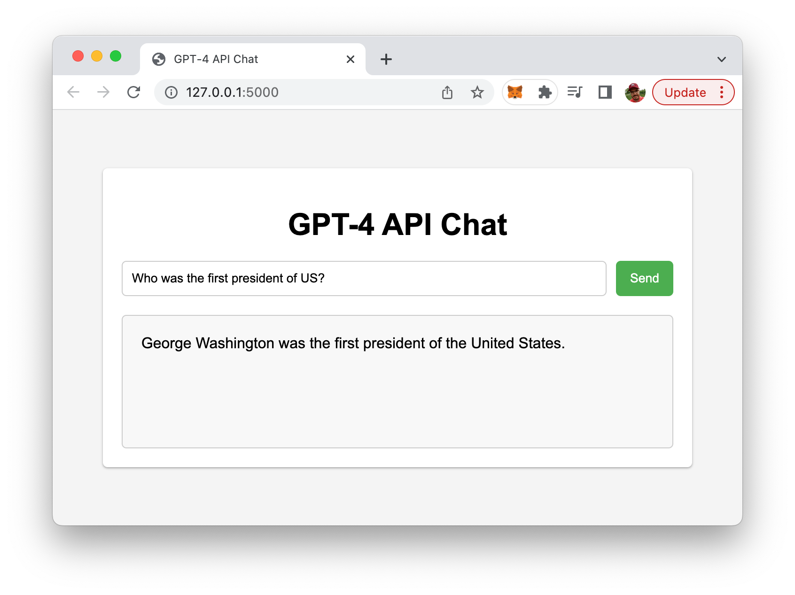

import { Image } from '@astrojs/image/components';
import YouTube from '~/components/widgets/YouTube.astro';
export const components = { img: Image };

Welcome to the future of web development, where artificial intelligence (AI) is revolutionizing the way we create and interact with online applications. In this blog post, we will walk you through the process of creating a cutting-edge, AI-powered Python web app using the Flask web framework and OpenAI's state-of-the-art GPT-4 API.

The GPT-4 API, a powerful natural language processing model developed by OpenAI, opens up a world of possibilities for developers, enabling enhanced user experiences and intelligent automation across various domains. From chatbots to content generation, AI-driven recommendations to sentiment analysis, the GPT-4 API offers a plethora of opportunities to create innovative, interactive, and user-centric web applications.

In the following sections, we'll cover the essential components of developing your own AI-powered web app, including setting up your development environment, integrating the GPT-4 API, and implementing user interactions using Flask. By the end of this post, you'll have a solid foundation for harnessing the power of AI in your Python web applications and be well on your way to exploring the fascinating world of AI-driven development. So, let's dive in and start building the future of web apps, together!

## Setting Up The Flask Project

To create a Flask web application that interacts with the GPT-4 API, you need to install the required packages first. In your terminal, run:

```bash
pip install Flask openai
```

Create a new project folder:

```bash
mkdir flask-gpt4
cd flask-gpt4
```

Inside this folder create a new empty file _app.py_, a new subfolder _templates_ and inside this subfolder a new file _index.html_.

## Implementing The Flask Application

Here is the complete implementation of the Python Flask web application in `app.py`:

```python
import json
from flask import Flask, render_template, request, jsonify
import openai
from openai.error import RateLimitError

app = Flask(__name__)
openai.api_key = os.getenv("OPENAI_API_KEY")

@app.route('/')
def index():
    return render_template('index.html')

@app.route('/gpt4', methods=['GET', 'POST'])
def gpt4():
    user_input = request.args.get('user_input') if request.method == 'GET' else request.form['user_input']
    messages = [{"role": "user", "content": user_input}]

    try:
        response = openai.ChatCompletion.create(
            model="gpt-4",
            messages=messages
        )
        content = response.choices[0].message["content"]
    except RateLimitError:
        content = "The server is experiencing a high volume of requests. Please try again later."

    return jsonify(content=content)

if __name__ == '__main__':
    app.run(debug=True)
```

This Python Flask web application demonstrates how to build an AI-powered chat interface using the state-of-the-art GPT-4 API. The code imports necessary libraries and sets up a simple Flask app with two routes: the index route that renders the main template and the gpt4 route that handles user inputs and GPT-4 API interactions.

Upon receiving user input, the app constructs a message and sends it to the GPT-4 API. The API processes the message and returns a meaningful response, which is then sent back to the user. The app also handles rate-limiting errors gracefully, informing users to try again later if the server is experiencing high traffic.

In essence, this code showcases how to create a user-friendly web application that leverages the power of GPT-4 for natural language processing, offering an interactive and engaging experience for users to communicate with cutting-edge AI technology.

Here's a description of each part of the code:

__1. Import statements:__

* `import json`: Imports the `json` library for working with JSON data.
* `from flask import Flask, render_template, request, jsonify`: Imports necessary Flask components for creating a web application, rendering HTML templates, handling HTTP requests, and returning JSON data.
* `import openai`: Imports the `openai` library for accessing the GPT-4 API.
* `from openai.error import RateLimitError`: Imports the `RateLimitError` exception class for handling rate-limiting errors from the GPT-4 API.

__2. App setup:__

* `app = Flask(__name__)`: Initializes a new Flask web application.
* `openai.api_key = os.getenv("OPENAI_API_KEY")`: Sets the GPT-4 API key using an environment variable.

__3. Route for the main page:__

* `@app.route('/')`: Defines the root route for the application.
* `def index()`: The function that is called when the root route is accessed.
* `return render_template('index.html')`: Renders the 'index.html' template as the response.

__4. Route for the GPT-4 API interaction:__

* `@app.route('/gpt4', methods=['GET', 'POST'])`: Defines the route for GPT-4 API interaction, allowing both GET and POST requests.
* `def gpt4()`: The function that is called when the '/gpt4' route is accessed.
* `user_input = request.args.get('user_input') if request.method == 'GET' else request.form['user_input']`: Retrieves the user input from either the query string (GET request) or form data (POST request).
* `messages = [{"role": "user", "content": user_input}]`: Creates a list of messages containing a single message with the user's input.
* `try` block: Attempts to interact with the GPT-4 API.
* `response = openai.ChatCompletion.create(model="gpt-4", messages=messages)`: Sends a request to the GPT-4 API with the user's message.
* `content = response.choices[0].message["content"]`: Extracts the content of the GPT-4 API's response.
* `except RateLimitError`: Catches rate-limiting errors from the GPT-4 API.
* `content = "The server is experiencing a high volume of requests. Please try again later."`: Sets an error message as the content.
* `return jsonify(content=content)`: Returns the content as a JSON response.

__5. Running the app:__

* `if __name__ == '__main__':`: Checks if the script is being run directly (not imported as a module).
* `app.run(debug=True)`: Starts the Flask web application in debug mode.

## Implement The Front-End

Next, let's implement the template which is being served when the user accesses the application's default route in index.html inside a templates folder:

```html
<!DOCTYPE html>
<html lang="en">
  <head>
    <meta charset="UTF-8" />
    <meta http-equiv="X-UA-Compatible" content="IE=edge" />
    <meta name="viewport" content="width=device-width, initial-scale=1.0" />
    <title>GPT-4 API Chat</title>
    <script src="https://code.jquery.com/jquery-3.6.0.min.js"></script>

    <style>
      body {
        font-family: Arial, sans-serif;
        background-color: #f4f4f4;
        display: flex;
        justify-content: center;
        align-items: center;
        height: 100vh;
        margin: 0;
      }

      .chat-container {
        background-color: #ffffff;
        border-radius: 5px;
        padding: 20px;
        width: 80%;
        max-width: 600px;
        box-shadow: 0 1px 3px rgba(0, 0, 0, 0.12), 0 1px 2px rgba(0, 0, 0, 0.24);
      }

      h1 {
        text-align: center;
        margin-bottom: 20px;
      }

      #chat-form {
        display: flex;
        justify-content: space-between;
        margin-bottom: 20px;
      }

      #user-input {
        flex-grow: 1;
        border: 1px solid #ccc;
        border-radius: 5px;
        padding: 10px;
      }

      #submitBtn {
        background-color: #4caf50;
        color: white;
        border: none;
        border-radius: 5px;
        padding: 10px 15px;
        margin-left: 10px;
        cursor: pointer;
      }

      #submitBtn:hover {
        background-color: #45a049;
      }

      #result {
        border: 1px solid #ccc;
        border-radius: 5px;
        padding: 20px;
        background-color: #f8f8f8;
        min-height: 100px;
        overflow-wrap: break-word;
      }
    </style>
  </head>
  <body>
    <div class="chat-container">
      <h1>GPT-4 API Chat</h1>
      <form id="chat-form">
        <input
          type="text"
          id="user-input"
          name="user_input"
          placeholder="Type your message..."
        />
        <button type="submit" id="submitBtn">Send</button>
      </form>
      <div id="result"></div>
    </div>

    <script>
      window.onload = function () {
        document
          .getElementById("chat-form")
          .addEventListener("submit", function (event) {
            // Prevent the form from submitting and refreshing the page
            event.preventDefault();

            let userInput = document.getElementById("user-input").value;
            let url = `/gpt4?user_input=${encodeURIComponent(userInput)}`;

            fetch(url)
              .then((response) => response.json())
              .then((data) => {
                let content = data.content;
                let resultDiv = document.getElementById("result");
                resultDiv.innerHTML = content;
              })
              .catch((error) => {
                console.error("Error fetching GPT-4 response:", error);
              });
          });
      };
    </script>
  </body>
</html>
```

This HTML template constructs the user interface for an AI-powered chat application utilizing the GPT-4 API. The head section includes essential meta tags for compatibility, viewport settings, and a reference to the jQuery library. Additionally, it contains an embedded CSS block that provides styling for the chat interface, making it visually appealing and easy to use. The CSS ensures a clean layout, responsive design, and interactive elements such as button hover effects.

In the body section, a chat container div houses the chat-related elements, including a heading, a form with an input field for user messages, a submit button, and a result div for displaying the AI-generated responses. The form has an event listener attached to it, which listens for the submit event and prevents the default form submission behavior, ensuring the page doesn't refresh.

When the submit button is clicked, the JavaScript code fetches the user input, constructs a URL with the input as a query parameter, and sends an API request to the server. Upon receiving the response, the code updates the result div with the AI-generated content, creating an interactive chat experience.

## Run The Application

To run the application, execute the following command in your terminal:

```bash
export OPENAI_API_KEY="your_openai_api_key_here"
python app.py
```

Now, visit http://127.0.0.1:5000/ in your browser to interact with the GPT-4 API.



## Conclusion

We've explored the exciting world of AI-powered web development by creating a Python web app using the Flask framework and the GPT-4 API from OpenAI. Throughout this journey, we have discussed setting up your development environment, implementing user interactions, and integrating the powerful GPT-4 API to bring intelligent capabilities to your application.