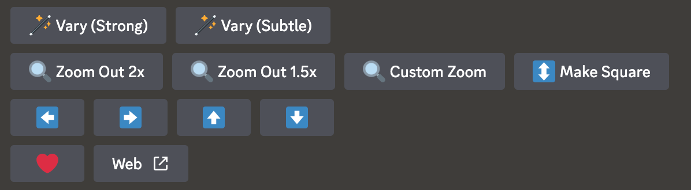
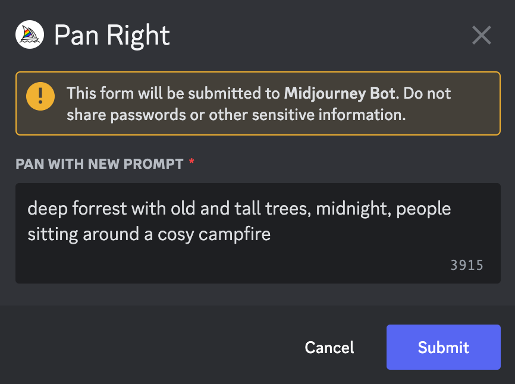
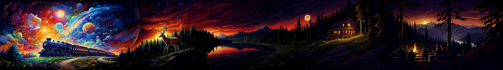
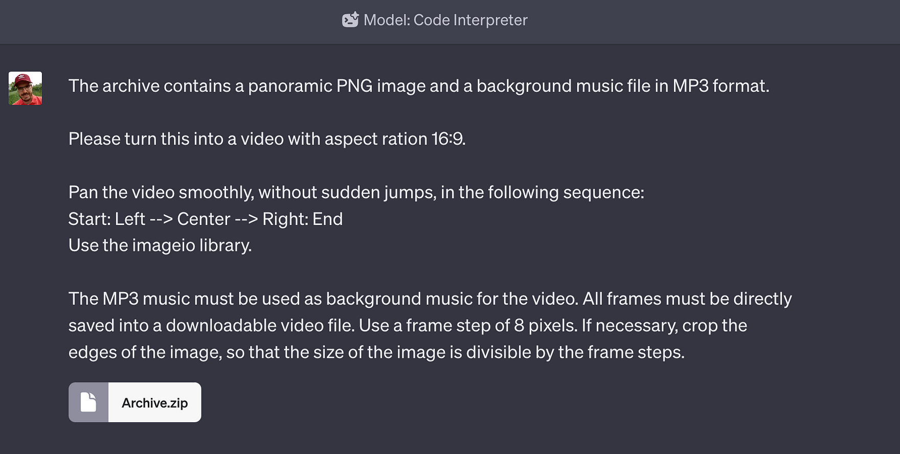
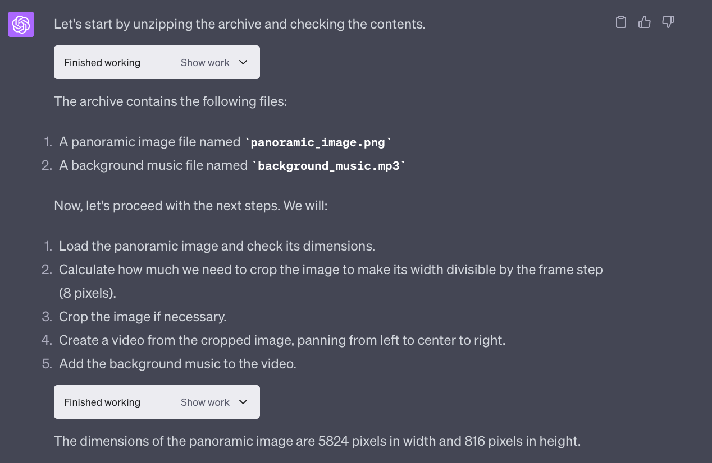
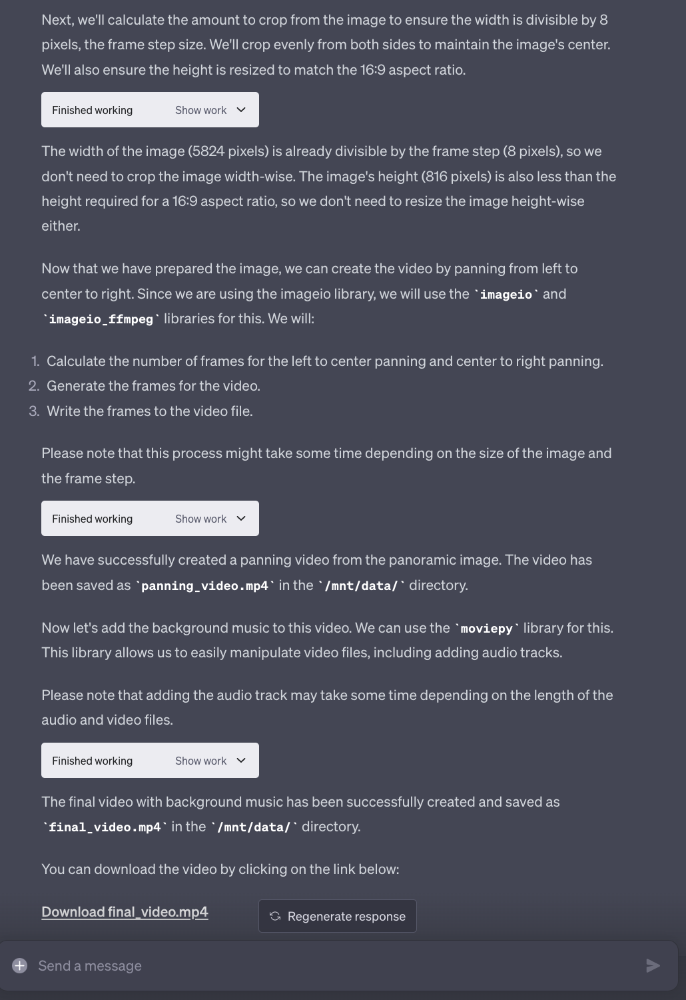

import { Image } from '@astrojs/image/components';
import YouTube from '~/components/widgets/YouTube.astro';
export const components = { img: Image };

Have you ever seen a panoramic image and wished you could just dive right in, immersing yourself in the breathtaking views it offers? Or perhaps you’ve captured a stunning panoramic photo on your latest adventure and wondered how you could bring it to life, adding a new dimension to your storytelling? If you’re nodding along, you’re in for a treat!

Today, I’m incredibly excited to share with you a powerful combination of technologies that can turn your panoramic images into mesmerizing videos: Midjourney’s latest pan feature and ChatGPT’s Code Interpreter. This dynamic duo is redefining visual storytelling, and I can’t wait to walk you through the whole process.

In this post, I’ll guide you on a step-by-step journey of using Midjourney to create panoramic images and then transforming these images into captivating videos using ChatGPT’s Code Interpreter. Whether you’re a content creator, a digital marketer, a photographer, or just someone who loves to experiment with visuals, this guide has got you covered. So, buckle up and let’s dive right in!

## Creating Panoramic Images With Midjourney’s New Pan Function

Alright, let’s dive into the exciting new feature from Midjourney that’s been making waves in the image generation community — the Pan feature. This innovative tool is transforming the way we interact with and expand our images, and I’m here to give you the lowdown on what it’s all about.

The Pan feature, as the name suggests, allows you to pan across your image, expanding it in a chosen direction. This is a game-changer for those of us who love to explore our creations in more depth. The feature works by adding arrow buttons underneath the upscaled images. Clicking on these arrows expands the image in the selected direction, effectively “panning” the image.

One of the most exciting aspects of the Pan feature is its compatibility with the Remix mode. This means you can change your prompts as you pan your images, making it easier to create dynamic panoramic stories. For example, you can add specific objects to one side of the image by adding them to the prompt, creating a seamless and engaging narrative within your image.

However, as with any new feature, there are some limitations to be aware of. Currently, you can only pan an image horizontally or vertically, not both at the same time. Also, variations are not supported on panned images, and zooming out of a panned image reduces its resolution back to its default size. But don’t let these limitations deter you. The Pan feature is still a powerful tool that can significantly enhance your image creation experience.

Now, let’s talk about how to use this feature. First, you need to create an image on Midjourney. Once you’ve upscaled your image, you’ll see a set of four arrow icons — left, right, up, and down. These icons allow you to pan your image in your desired direction. Click on the corresponding arrow icon, and Midjourney will start processing your panning request, generating extended images.

The Pan feature also allows you to increase the image resolution beyond the maximum 1024px x 1024px dimensions in one direction. This means you can create stunning panoramic-style images with higher resolutions than the default size.

By using the Pan feature in Midjourney is easy to create panoramic shots like you can see in the following:

We’ll use this image in the next section to generate a nice atmospheric video by using ChatGPT’s Code Interpreter.

## Creating An Atmospheric Video With ChatGPT’s Code Interpreter

Now it’s time to head over to ChatGPT. In order to create a nice panning and atmospheric video our of the generated panoramic image we need to activate Code Interpreter for a GPT4-based chat window in ChatGPT.

Next we’re able to use the upload function to upload the file which we need to provide to Code Interpreter as input.

As you can see in the screenshot below we’re using a zip file, which contains the image and an audio file.

The prompt which is used here is giving Code Interpreter detailed instructions of how to generate the video and which Python library to use.

If you hit return Code Interpreter is taking over control, structuring the tasks in multiple steps, generated the necessary Python code and executing it.

As a result Code Interpreter is providing a link to the generated MP4 video file which can be used to download it.

## The Result

Having completed the steps from above you’re ready to download the MP4 video file and the result (the original version of the video file is including the background sound as well):

## Conclusion

And that, my friends, wraps up our journey into the world of panoramic videos! By now, you should have a solid understanding of how to use Midjourney’s pan feature to create panoramic images and ChatGPT’s Code Interpreter to bring those images to life in a dynamic video format.

Exploring the intersection of technology and creativity is an exciting adventure, and I hope this guide has inspired you to experiment and create with these powerful tools. Remember, the only limit is your imagination!

Thank you for joining me on this fascinating journey. As always, I’m eager to hear about your experiences and see the stunning panoramic videos you create. Don’t forget to share your creations and thoughts in the comments section below.

Until next time, keep exploring, keep creating, and most importantly, have fun doing it!

