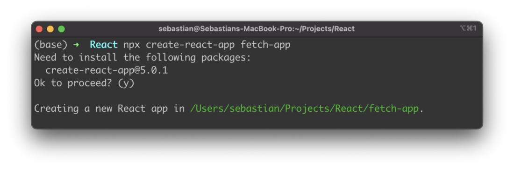
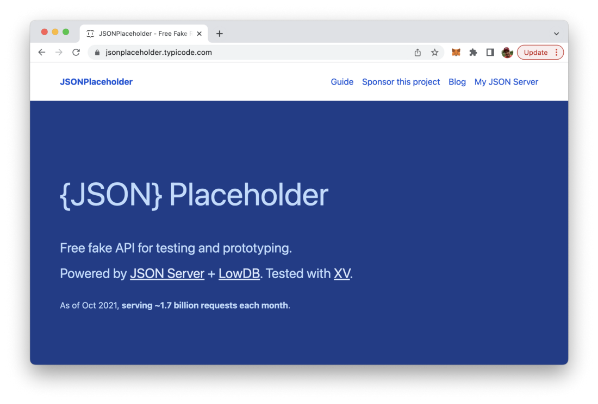
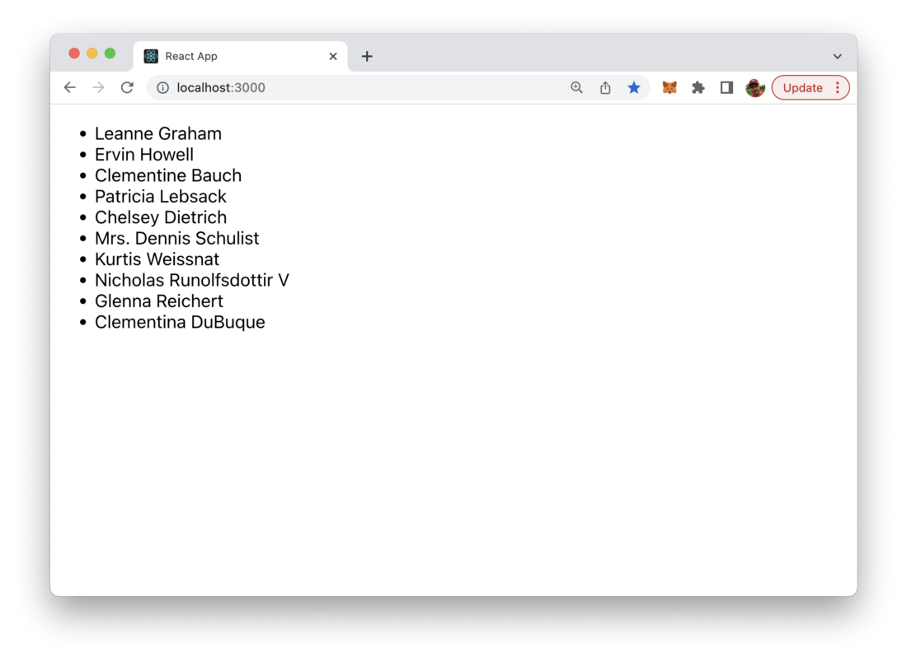

import { Image } from '@astrojs/image/components';
import YouTube from '~/components/widgets/YouTube.astro';
export const components = { img: Image };

Fetching data from third-party RESTful APIs in React application is a common task when creating web application. This task can be solved easily by using the standard JavaScript Fetch API in your React application.

The Fetch API is a new standard to make server requests with Promises, but which also includes additional features. This short tutorial will guide you through the simple steps of using the Fetch API for external data fetching within your React application. Let’s get started …

## Step 1: Create a new React application

The very fist step is to create a new React application. The easiest way to do so, is to use the create-react-app scaffolding script which can be executed with the following command:

```bash
$ npx create-react-app fetch-app
```

This command is creating a new default React project in folder fetch-app.



## Step 2: Select a data source

Next we need an external data source which we can use to retrieve data from. I service which is free to use and is offering multiple endpoints which JSON formatted test data is JSONPlaceholder which is available at https://jsonplaceholder.typicode.com/:



Here we’ll be using the users endpoint to retrieve user sample data for our React application:


## Step 3: Use Fetch API to retrieve data

Let’s return to the newly created React project and add the JavaScript code which is needed to retrieve data from the JSONPlaceholder REST endpoint.

Open file src/App.js and change the default App component implementation to the following:

```js
const App = () => {
  return (
    <div>
      Test
    </div>
  );
}

export default App;
```

Next add the following import statement on top:

```js
import React, { useEffect, useState } from “react”
```

By using this import statement we’re making sure that we’re able to make use of React’s useEffect and useState hook.

Inside App function introduce a new users component state which will later on hold our retrieved user sample data by using the useState hook:

```js
const [users, setUsers] = useState([])
```

Next add a function fetchUserData which uses the Fetch API to retrieve data from the users endpoint of the JSONPlaceholder service:

```js
import React, { useEffect, useState } from "react"

const App = () => {
  const [users, setUsers] = useState([])

  const fetchUserData = () => {
    fetch("https://jsonplaceholder.typicode.com/users")
      .then(response => {
        return response.json()
      })
      .then(data => {
        setUsers(data)
      })
  }
  
  return (
    <div>
      Test
    </div>
  );
}

export default App;
```

If the data is retrieved successfully we’re calling setUsers function in order to set the component user state to the data which was retrieved.

## Step 4: Make sure data fetching is executed everytime your React app loads

Next we need to make sure that fetchUserData is executed. We want it to be executed everytime App component loads. This can be achieved by using the useEffect hook in the following way:

```js
useEffect(() => {
  fetchUserData()
}, [])
```

## Step 6: Output fetched data

Finally we need to show the retrieved data to the user. Change the return statement of App component to what you can see in the following code listing:

```js
import React, { useEffect, useState } from "react"

const App = () => {
  const [users, setUsers] = useState([])

  const fetchUserData = () => {
    fetch("https://jsonplaceholder.typicode.com/users")
      .then(response => {
        return response.json()
      })
      .then(data => {
        setUsers(data)
      })
  }

  useEffect(() => {
    fetchUserData()
  }, [])

  return (
    <div>
      {users.length > 0 && (
        <ul>
          {users.map(user => (
            <li key={user.id}>{user.name}</li>
          ))}
        </ul>
      )}
    </div>
  );
}

export default App;
```

This code iterates to the data which is stored in users state and outputs the name of each user as a list item.

Start the React development web server by typing in

```bash
$ npm start
```

on the command line and you should be able to see the following result in the browser:



Done, that’s it! 6 easy steps and the goal is achieved: user sample data has been retrieved from a third-party service in your React application by using JavaScript’s Fetch API and outputted in the browser. That’s how easy it is to retrieve API data with React!