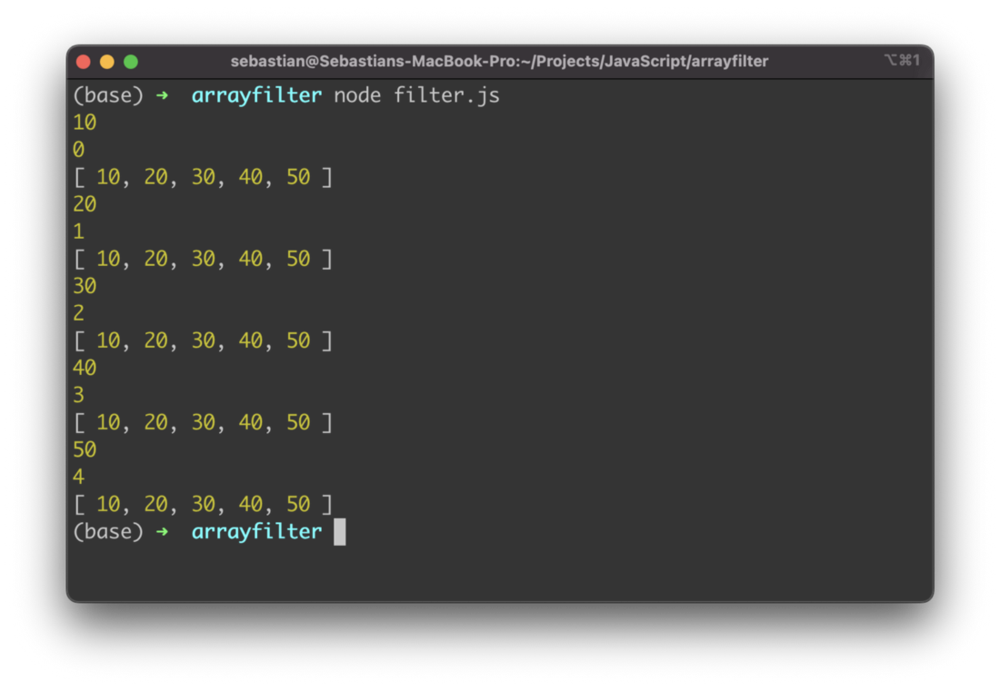
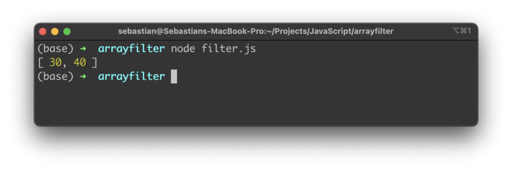
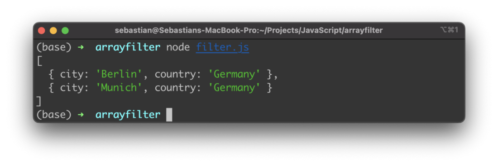

import { Image } from '@astrojs/image/components';
import YouTube from '~/components/widgets/YouTube.astro';
export const components = { img: Image };

JavaScript provides an easy way to filter array. By using the array method filter() you can easily create a new array which only contains elements from the original array that correspond t o your filter criteria. In this short tutorial you’ll learn how to use the filter() method in JavaScript.

## The filter() method in JavaScript

The filter() method is an array method in JavaScript that let’s you filter for specific array elements. The filter() method is able to apply any filter criteria to an existing array to create a new array which only contains elements which satisfy the filter condition. The filter condition is implemented in a function which is passed to the call filter() as an argument. Let’s run through a simple example to see how this works.

Let’s start with a simple code example to get familiar with the filter method:

```js

let array = [10, 20, 30, 40, 50]

let arrayFiltered = array.filter((item, index, array) => {
    console.log(item)
    console.log(index)
    console.log(array)
})
```

An array is initialized with 5 integer values. The filter method is called for that array and you can see that an anonymous callback function is passed as an argument to that array. This function is executed for every element in the original array and is taking 3 arguments:

- item: the current item
- index: the array index of the current item
- array: the complete original array

Here you can see the output when executing this JavaScript program:



The arguments item, index, and array are available for implementing the filter logic inside the callback function. However these arguments are optional. Most of the time you just need to use the item argument. Let’s take a look at the following example which implements a simple filter logic:

```js
let array = [10, 20, 30, 40, 50]

let arrayFiltered2 = array.filter((item) => {
    return item > 20
})

console.log(arrayFiltered2)
```

Here we’re checking if the item value is > 20. If this is the case the current item is returned. Only items which are returned are part of the resulting array. The following screenshot shows the result:


You can apply any filter logic you’d like to use for filtering. Here is a filter logic which is a combination of two constraints (> 20 and < 50):

```js
let array = [10, 20, 30, 40, 50]

let arrayFiltered3 = array.filter((item) => {
    return item > 20 && item < 50
})

console.log(arrayFiltered3)
```

The result will then only contain two array items as you can see in the following:



## Filter An Array Of Objects

So far we’ve only filtered for integer values. In JavaScript array can also consists of more complex data structures like objects. Let’s look into another example:

```js
let objectsArray = [
    { city: "Berlin", country: "Germany" },
    { city: "London", country: "England" },
    { city: "Munich", country: "Germany" },
    { city: "Rome", country: "Italy"},
    { city: "Madrid", country: "Spain"}
]

let objectsArrayFiltered = objectsArray.filter((item) => {
    return item.country === "Germany"
})

console.log(objectsArrayFiltered)
```

The objectsArray contains five objects each consisting of two properties: city and country. In the example we’re applying a filter function which is only returning objects from this array where the country is set to value “Germany”. The resulting array contains two items as you can see in the following:

