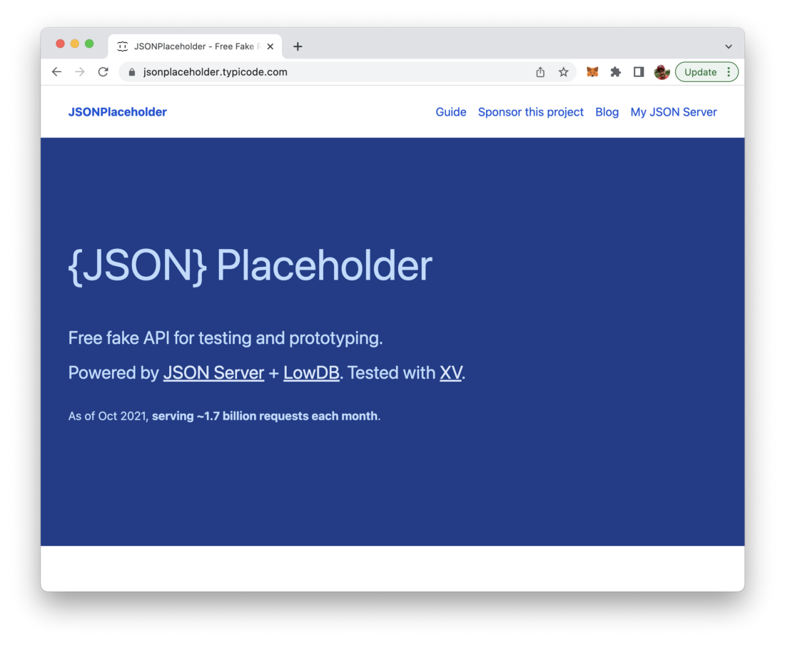
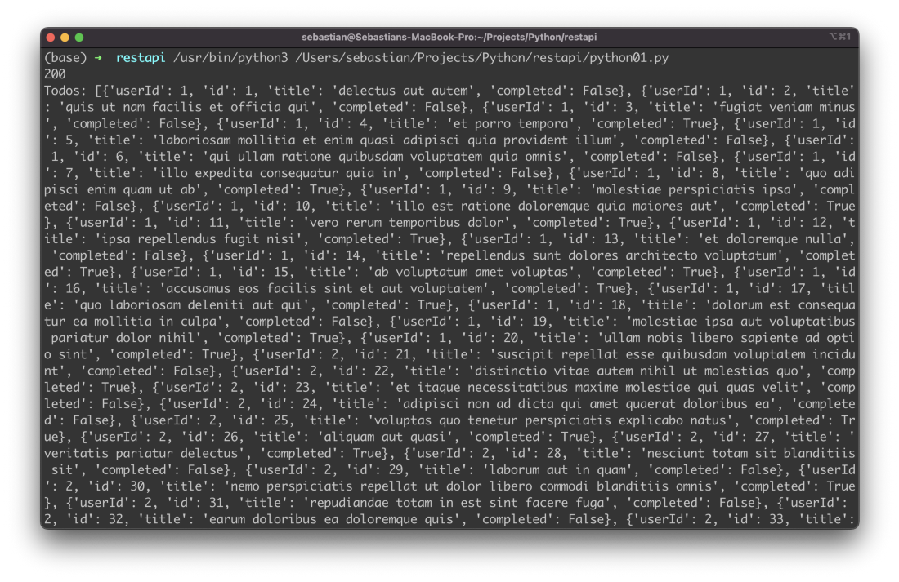

import { Image } from '@astrojs/image/components';
import YouTube from '~/components/widgets/YouTube.astro';
export const components = { img: Image };

Getting data from external REST APIs is a common task when programming in Python. In this short tutorial you’ll learn the fastest and easiest way to read data from a REST API by using the Python programming language. Let’s get started …

If you want to retrieve data from a REST API with Python you need to start importing the requests and the json package by using the following two lines of code:

```python
import requests
import json
```

> Requests is a simple, yet elegant, HTTP library. It can be installed with __python -m pip install requests__

With the requests package available we’re able to use the get method to initiate a HTTP GET request to an existing endpoint of a REST-based API.

```python
api_response = requests.get(‘https://jsonplaceholder.typicode.com/todos')
```

For the following example we’ll use a REST service which is provided by JSONPlaceholder and can be found at https://jsonplaceholder.typicode.com/:



The specific endpoint which we’re using here is the /todos endpoint which is delivering a JSON list of todo items. The complete URL of this endpoint is https://jsonplaceholder.typicode.com/todos. This url is passed as a string argument to the call of requests.get. The result is stored in variable api_response.

With the api_response variable available we’re not ready to get some insights into the response which is returned from the REST API end point. E.g. we’re able to retrieve the HTTP response status code by accessing api_response.status_code.

```python
print(api_response.status_code)
```

And we’re able to retrieve the todo data which are provided by using the text property. By using the json.loads method we’re parsing the returned todo data into a JSON object which is stored in parse_json:

```python
data = api_response.text
parse_json = json.loads(data)
```

Finally the JSON object is printed to the console:

```python
print(“Todos:”, parse_json)
```

You should then be able to see the following output:



Congratulations, now you have retrieved REST API data with Python successfully!

The complete source code can by seen in the following listing:

```python
import requests
import json

api_response = requests.get('https://jsonplaceholder.typicode.com/todos')
print(api_response.status_code)
data = api_response.text
parse_json = json.loads(data)

print("Todos:", parse_json)
```