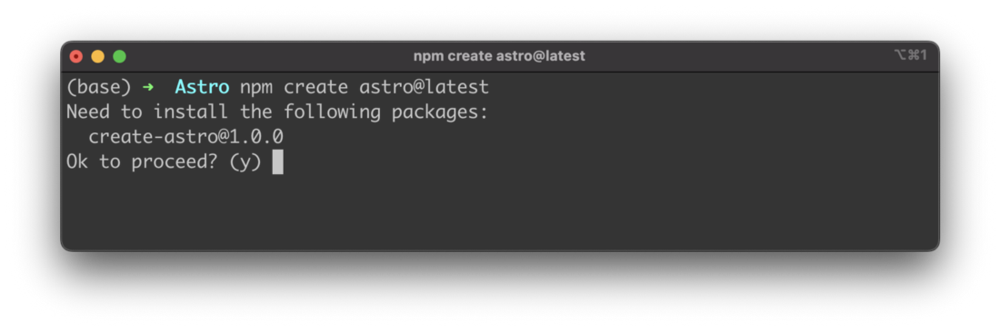
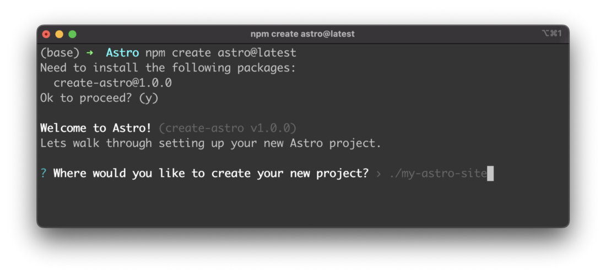
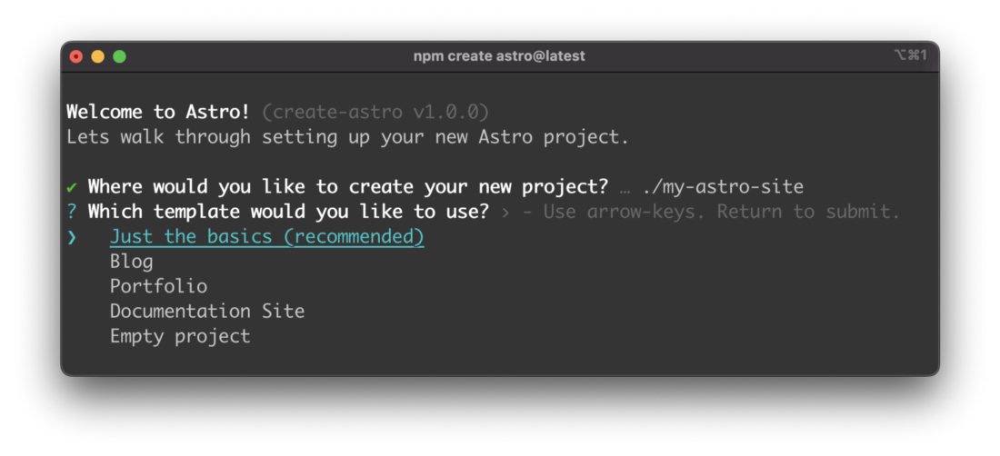
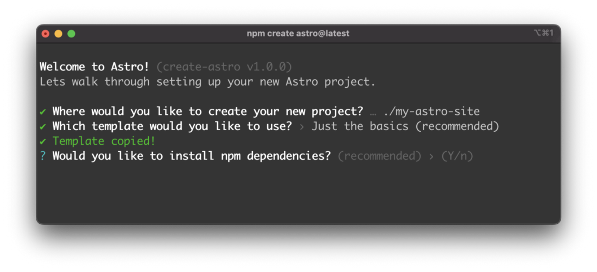
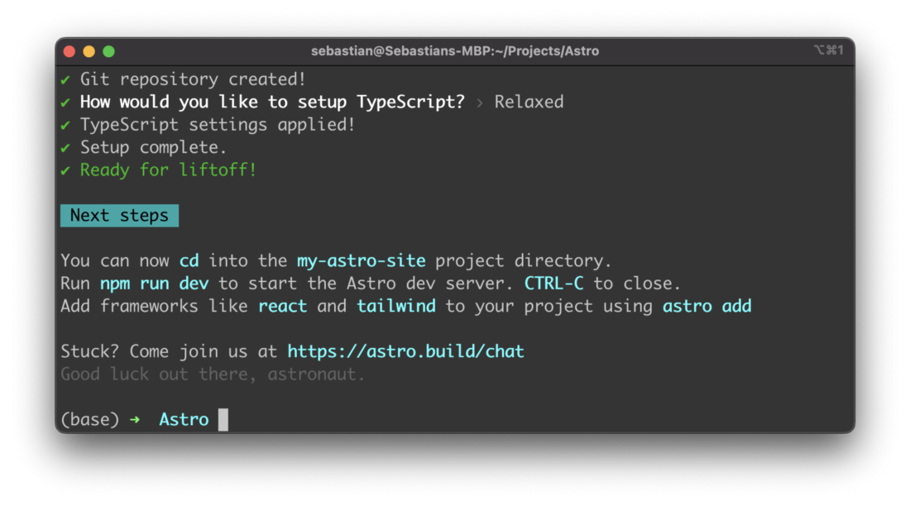
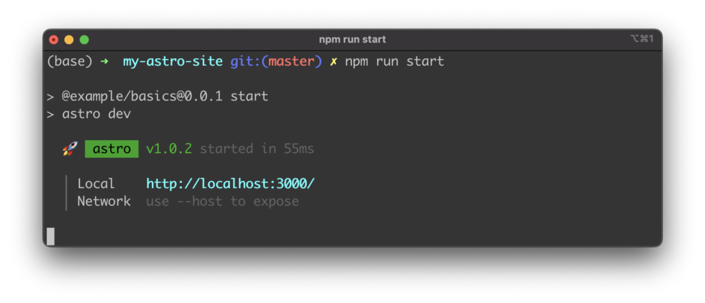
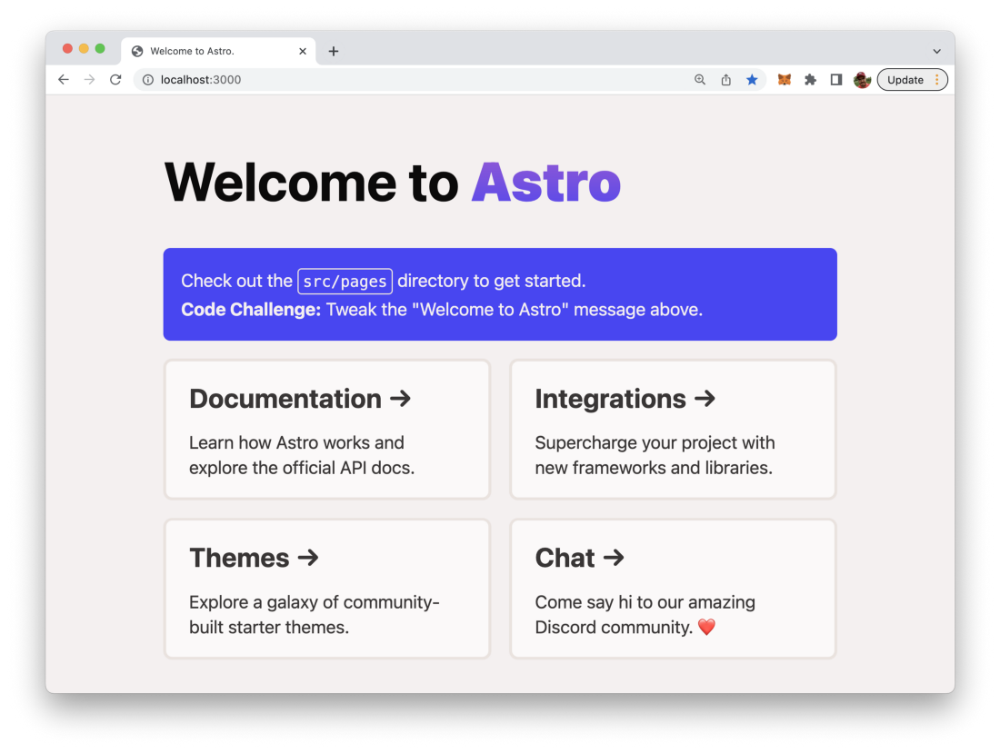

import { Image } from '@astrojs/image/components';
import YouTube from '~/components/widgets/YouTube.astro';
export const components = { img: Image };

Astro is a relatively new web frameworks which helps you to build fast and clean websites with ease. Astro is able to work together with all all major JavaScript front-end frameworks like React, Vue, or Svelte.

Astro describes itself as “an all-in-one web framework for building fast, content-focused websites”. The framework introduces some key features which makes it stand out from the long list of web frameworks available today. Astro works like a static side generator and tries to generate a static version of your website on server side and reduce the amount of code which is send to the client to the smallest amount possible. This helps to make the website very fast.

Here are some of the most important features of Astro:

- Server-side rendering with Zero JS by default: Astro renders your web site server-side as static HTML. By default Astro adds zero JavaScript code to the output which is delivered to the client. This makes your website ultra-fast and reduces bundle sizes as much as possible.
- Bring your own framework: You can use Astro with pure JavaScript or any JavaScript front-end framework which you are used to work with like React, Vue, or Svelte. You can even mix different frameworks for rendering different part of the UI with Astro.
- On demand loading of components: Astro introduces the concept of Component Islands. Those Component Islands refers to an interactive UI component on an otherwise static page of HTML. Multiple islands can exist on a page, and an island always renders in isolation. In order to keep the impact on page speed as low as possible Astro makes it possible to only load those parts of the webpage if needed.

## Step 1: Setup A New Astro Project

In order to create a new Astro project you can use the Node.js Package Manager command line tool NPM in the following way:

```bash
$ npm create astro@latest
```

This command starts up the command line wizard which guides you through the process of setting up a new Astro project from scratch. Here you need to provide answers to a few questions:



First you need to confirm that the create-astro package is being installed. You can simply hit return to confirm this question and proceed with the setup procedure in the following.

In the next step the wizard is asking where to store the new project. The default proposal which is made here is: ./my-astro-site.



If you just hit return a new project folder my-astro-site is created in the current directory.

The next question which needs to be answered is whether you’d like to start with a template or without:



To keep things simple we’ll just use the first option (Just the basics) which is setting up a very small default Astro project without any special template.

Next you need to decide if you want to get NPM dependencies installed. The default option is Yes and you should just hit return to confirm this default option:



In the next step you have the option to automatically initiate a new Git repository for the new project:


Finally you need to decide if you want to have TypeScript enables for the project. The project is then created and the setup procedure is fully completed.



## Step 2: Start Astro

In order to start the Astro web server and access the web application in the browser you first need to change into the newly created project folder by typing in the following command:

```bash
$ cd my-astro-site
```

Now you’re ready to execute the start script by using NPM:

```bash
$ npm run start
```

You should then be able to see the following output on the command line:



Here you’re being told that the server is running on http://localhost:3000. Open the browser and type in this URL to access the output of the default Astro project setup.

The result should look like what you can see in the following screenshot:



## Step 3: Get Familiar With The Project Structure

Now you’ve managed to setup you first Astro project. Let’s dive a little bit into Astro’s project structure. In every Astro project you should at least find the following folder structure:

- src/: That’s the folder where all of your project source code for components, pages, and styles is stored in.
- public/: This folder is used to store your static assets which are not processed by the framework like fonts, icons, or images.

And the following files in the root project folder:

- package.json: file holding the Node.js package manager meta data for the project
- astro.config.mjs: optional Astro configuration file