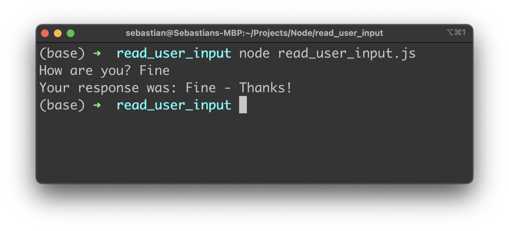

import { Image } from '@astrojs/image/components';
import YouTube from '~/components/widgets/YouTube.astro';
export const components = { img: Image };

How To Get User Input From Command Line With Node.js
Node.js is an open-source, cross-platform, back-end JavaScript runtime environment that runs on a JavaScript Engine and executes JavaScript code outside a web browse. E.g. you can use Node.js to implement command line tools. In this short tutorial you’ll learn how to accept user input in Node.js on the command line by using the Node.js standard module readline.

## Create A New Node Project

To get started we need to create a new Node.js project. This is quite easy, just enter the following command on the command line:

```bash 
$ mkdir read_user_input
$ cd read_user_input
$ npm init
$ touch read_user_input.js
```

First we’re creating a new empty folder called read_user_input. Then we’re changing into the newly created project folder and by executing the npm init command we’re ready a new default package.json file in the project folder. Finally we’re adding a file called read_user_input.js to the project folder. That’s the file where our code will go into.

First open file package.json and add the type configuration property and set it to value module in the following way:

```
“type”: “module”,
```

This addition allows us to use the ES6 module import syntax in our Node application instead of the CommonJS import syntax.

##Use readline Module To Connect To Input And Output Streams
In file *read_user_input.js* start by adding the following import statement:

```js
import { createInterface } from “readline”;
```

Herewith we’re importing the createInterface function from the readline module. This module is a standard Node module, so that we can use it right away without the need to add further dependencies to our project. By using the readline module we’re able to accept user input from the command line.

First we need to use the createInterface function to create a new readline instance and attach the application’s input and output stream by using the following lines of code:

```js
const readline = createInterface({
  input: process.stdin,
  output: process.stdout
});
```

The application’s input stream is available via process.stdin and needs to be assigned to the input property of the configuration object which is passed to the call of createInterface. The application’s output stream is available vis process.stdout and is assigned the output property.

## Use readline Functionality To Get User Input From Command Line

In the next step we’re implementing a function called readLineAsync which is making use of readline’s functionality to collect input from the command line. This function is implemented in an asynchronous way. Therefore we’re creating a new Promise object which is returned from the function. The promise is resolved once the input from the command line is collected:

```js
const readLineAsync = msg => {
  return new Promise(resolve => {
    readline.question(msg, userRes => {
      resolve(userRes);
    });
  });
}
```

Reading from the command line is done by using the question method. This method requires two arguments: First we’re passing in a message text which is outputted on the command line in order to ask the user for input. The second argument is a callback function. This function is invoked once the user enters something on the command line and hits return. The user input is then available via userRes.

Next we’re implementing a startApp function which is bringing everything together: First user input is collected from the command line by using the previously implemented readLineAsync function and collecting user input by asking the question “How are you?” on the command line. The result is stored in userRes.

Second we’re closing the readline interface by calling readline.close(). Finally we’re outputting the result on the command line again by calling console.log.

```js
const startApp = async() => {
  const userRes = await readLineAsync(“How are you? “);
  readline.close();
  console.log(“Your response was: “ + userRes + “ — Thanks!”);
}
```

Last but not least we need to make sure that the startApp function is called and the application logic is being executed as implemented:

```
startApp();
```

In the following screenshot you can see how our command line Node application works after starting it with command

```bash
node read_user_input.js
```

Our Node application is collecting user input from the command line
In the following listing you can see the complete code of read_user_input.js:



