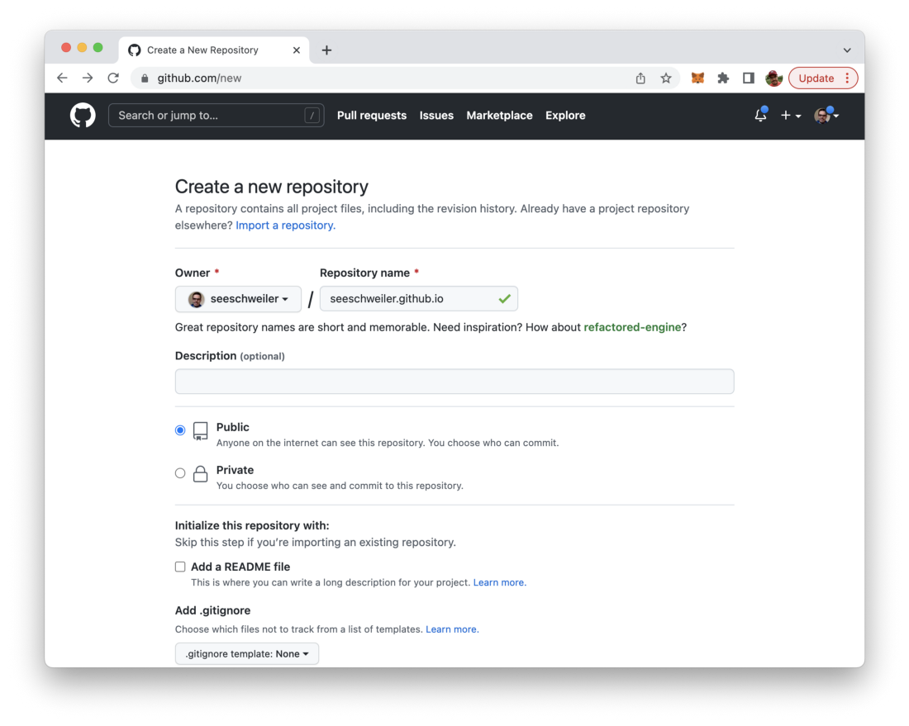
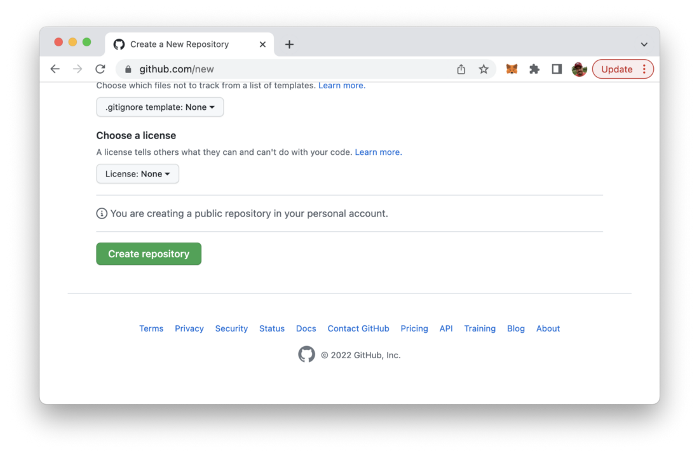
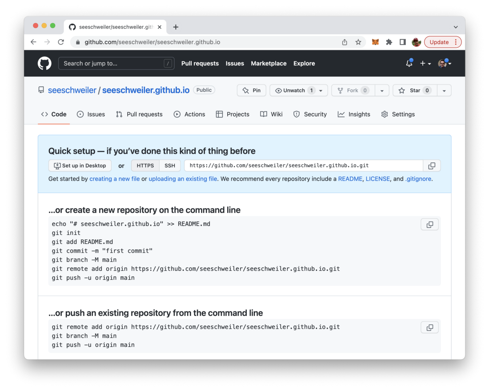
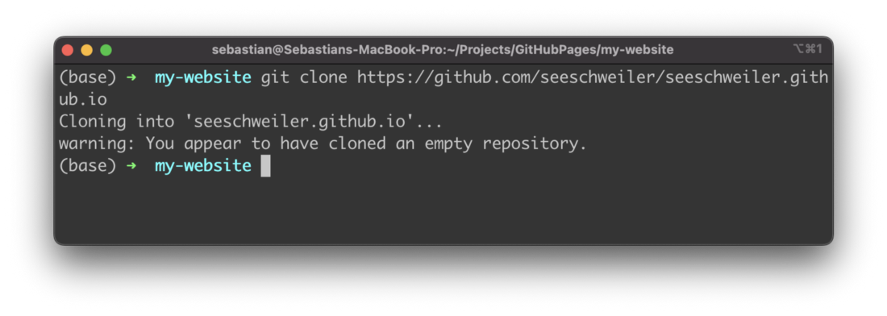
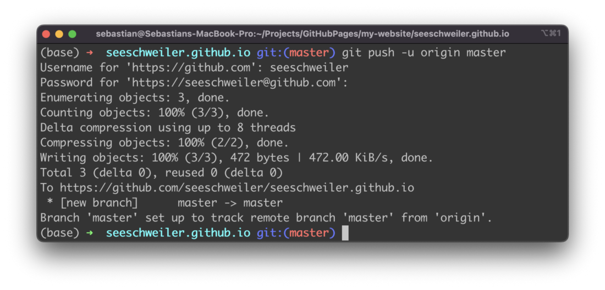
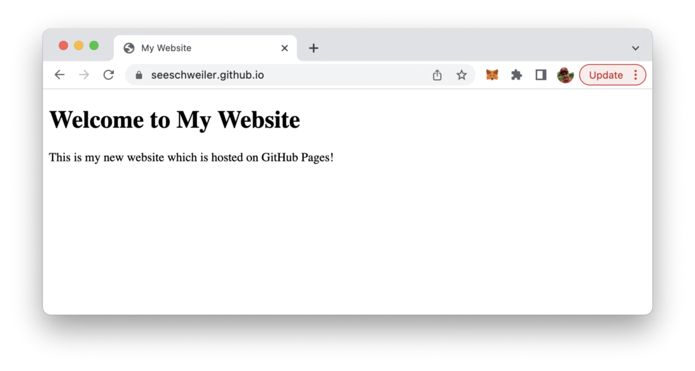

import { Image } from '@astrojs/image/components';
import YouTube from '~/components/widgets/YouTube.astro';
export const components = { img: Image };

*Photo by Christopher Gower on Unsplash.com*

With GitHub Pages you can host your website directly from a GitHub repository. It’s fast, easy, and it’s free. Just follow the steps in this short tutorial.

GitHub Pages is a free service from GitHub which enables you to host your website directly from a GitHub repository and make it available on the internet. GitHub Pages can be found at https://pages.github.com/:


In the following we’ll run through the easy steps to start with GitPages and make your website available online. Let’s get started:

## Step 1: Create your free GitHub account

In order to be able to host your website on GitHub Pages your need a free GitHub account which can be created at https://github.com/.

The account is needed to be able to create your first GitHub repository in the next step. The repository is then used to hold the files of your website which should be published.


## Step 2: Create a GitHub repository

Once you’ve successfully created your free GitHub account you need to create a repository in the next step:



Here you just need to specify the name of the repository and you’re ready go.

__Important__: *The name needs to be username.github.io, where username is your username (or organization name) on GitHub.*

Hit the button “Create repository” and initiate the creation process:



Once the creation is done you’re redirected and should be able to see a website similar to the following:



## Step 3: Create a local folder and clone the remote GitHub repository

With the GitHub repository available we’re switching to the command line and creating a new empty folder which will be used to store the files of the website which should be hosted on GitHub pages.

```bash
$ mkdir my-website
```

Then we’re ready to clone this repository into our local project folder by using the following command:

```bash
$ git clone https://github.com/[username]/[username].github.io
```

Git is telling you that you’re cloning an empty repository. That’s true because we haven’t added any files yet:



Change into the newly created subfolder.

## Step 4: Add your website files to the folder

Now it’s time to add some content to our folder. To keep things simply our test website will just consists of one simple HTML file index.html:

```bash
$ touch index.html
```

Insert the following HTML code into index.html:

```html
<!DOCTYPE html>
<html lang="en">
  <head>
    <meta charset="UTF-8">
    <meta name="viewport" content="width=device-width, initial-scale=1.0">
    <meta http-equiv="X-UA-Compatible" content="ie=edge">
    <title>My Website</title>
  </head>
  <body>
    <main>
        <h1>Welcome to My Website</h1>  
        <p>This is my new website which is hosted on GitHub Pages!</p>
    </main>
  </body>
</html>
```

## Step 5: Push the new files to the remote GitHub repository

Let’s stage, commit and push the new file to the remote GitHub repository by using the following command:

```bash
$ git add — all
$ git commit -m “Initial commit”
$ git push -u origin master
```



## Step 6: Access your deployed website in the browser

By pushing your website files to the GitHub repository the deployment is done automatically. There is not further step needed. The website is online and can be accessed in the browser by using the URL *https://[username].github.io/*:



That’s it, just 6 simple and easy steps to make your website available online by using GitHub Pages.