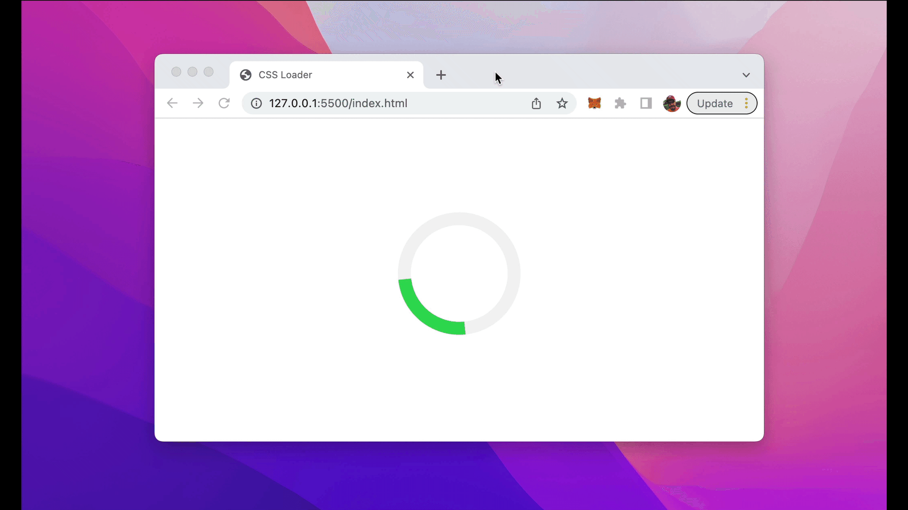

import { Image } from '@astrojs/image/components';
import YouTube from '~/components/widgets/YouTube.astro';
export const components = { img: Image };

A loader or loading indicator is an animated element which is displayed on the website to show that a process is running at the moment and the user needs to wait for it to complete (e.g. loading of data). Such an element can be easily created with pure CSS. Let’s implement a simple animated CSS loader …

First let’s take a look at the final result we’re going to build in this tutorial:



## Step 1: Create A New HTML Document

Let’s start by creating a file index.html and inserting the following simple HTML structure:

```html
<!DOCTYPE html>
<html lang="en">
<head>
    <meta charset="UTF-8">
    <meta http-equiv="X-UA-Compatible" content="IE=edge">
    <meta name="viewport" content="width=device-width, initial-scale=1.0">
    <title>CSS Loader</title>
    <style>

    </style>
</head>
<body>
    <div class="center">
        <div class="loader"></div>
    </div> 
</body>
</html>
```

The body section of the HTML document contains two nested div element. The outer div elements gets assigned the CSS class center and the inner div element gets assigned the CSS class loader. Both CSS classes needs to be implemented in the next steps.

## Step 2: Add Flex Layout To Center Loading Element

Let’s start with adding the definition for the CSS center class in the style element:

```html
<html lang="en">
<head>
    <meta charset="UTF-8">
    <meta http-equiv="X-UA-Compatible" content="IE=edge">
    <meta name="viewport" content="width=device-width, initial-scale=1.0">
    <title>CSS Loader</title>
    <style>
        .center {
            display: flex;
            justify-content: center;
            align-items: center;
            height: 100vh;
        }
    </style>
</head>
<body>
    <div class="center">
        <div class="loader"></div>
    </div> 
</body>
</html>
```

Here you can see that we’re making use of the flex layout system to center the loader both vertically and horizontally.

## Step 3: Add Styling For Loading Indicator

Next we need to add the styling settings for the loader class as well:

```html
<!DOCTYPE html>
<html lang="en">
<head>
    <meta charset="UTF-8">
    <meta http-equiv="X-UA-Compatible" content="IE=edge">
    <meta name="viewport" content="width=device-width, initial-scale=1.0">
    <title>CSS Loader</title>
    <style>
        .center {
            display: flex;
            justify-content: center;
            align-items: center;
            height: 100vh;
        }

        .loader {
            border: 16px solid #f3f3f3; 
            border-top: 16px solid #34db55; 
            border-radius: 50%;
            width: 120px;
            height: 120px;
            animation: spin 2s linear infinite;
        }
    </style>
</head>
<body>
    <div class="center">
        <div class="loader"></div>
    </div> 
</body>
</html>
```

The loader styling is defined by giving it a 16px solid border in light gray color. By setting the border-radius property to 50% we make sure that it is a displayed as a circle. The border on top is set to a green color.

By using the animation property we’re defining a linear spin animation which has an animation duration of 2 second and runs forever.

## Step 4: Add Animation Keyframes

Finally we need to set keyframes for the loader spin animation like you can see in the following:

```html
<!DOCTYPE html>
<html lang="en">
<head>
    <meta charset="UTF-8">
    <meta http-equiv="X-UA-Compatible" content="IE=edge">
    <meta name="viewport" content="width=device-width, initial-scale=1.0">
    <title>CSS Loader</title>
    <style>
        .center {
            display: flex;
            justify-content: center;
            align-items: center;
            height: 100vh;
        }

        .loader {
            border: 16px solid #f3f3f3; 
            border-top: 16px solid #34db55; 
            border-radius: 50%;
            width: 120px;
            height: 120px;
            animation: spin 2s linear infinite;
        }

        @keyframes spin {
            0% { transform: rotate(0deg); }
            100% { transform: rotate(360deg); }
        }
    </style>
</head>
<body>
    <div class="center">
        <div class="loader"></div>
    </div> 
</body>
</html>
```

The first keyframe is defined by a rotation of 0 degrees and the second keyframe is defined with a rotate transformation of 360 degrees.

That’s all what it takes to make the CSS loader animation working.