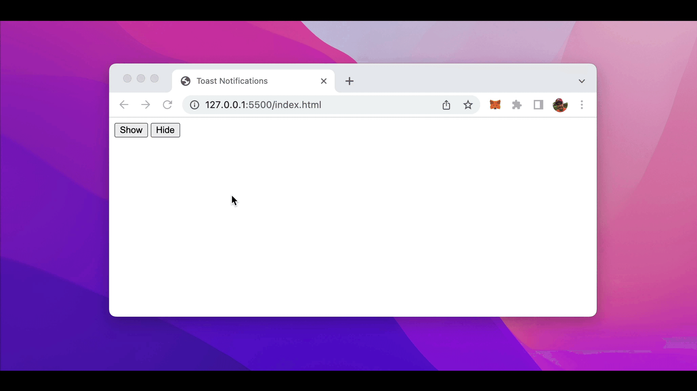

import { Image } from '@astrojs/image/components';
import YouTube from '~/components/widgets/YouTube.astro';
export const components = { img: Image };

A toast notification is a non-modal, unobtrusive UI element displaying just a short message. It automatically appears on the screen when an event occurs. How to implement such a toast notification from scratch with just plain HTML, CSS, and JavaScript is described in this tutorial step by step.

## The Toast Notification We’re Going To Implement

Let’s take a look at how the final toast notification will look like:



We’re going to implement this simple toast notification by only using HTML, CSS, and pure JavaScript.

## Step 1: Create A Basics HTML Document Structure

We start with creating a new file index.html and inserting a basic HTML document structure like you can see in the following listing:

```html
<!DOCTYPE html>
<html lang="en">
<head>
    <meta charset="UTF-8">
    <meta http-equiv="X-UA-Compatible" content="IE=edge">
    <meta name="viewport" content="width=device-width, initial-scale=1.0">
    <title>Toast Notifications</title>

    <style>
    </style>
</head>
<body>
    <button id="showBtn">Show</button>
    <button id="hideBtn">Hide</button>
    
    <div class="toast" id="toast">
        <div class="toast-body">
        </div>
    </div>

    <script>
    </script>
</body>
</html>
```

The HTML structure is very simple and straightforward: We’ve included two buttons, one button which will be used to show the toast notification and one button to hide the toast notification.

The toast notification itself consists of two nested div element. The outer div element gets assigned to CSS class toast and the inner div gets assigned the CSS class toast-body.

## Step 2: Add CSS Code

With the basic HTML structure in place, let’s continue to add the needed CSS code inside the style element:

```html
...
<head>
    ...
    <style>
        .toast {
            position: fixed;
            bottom: 0;
            right: 0;

            transform: translateY(100%);
            opacity: 0;

            transition:
                opacity 500ms,
                transform 500ms;
        }

        .toast.visible {
            transform: translateY(0);
            opacity: 1;
        }

        .toast-body {
            margin: 28px;
            padding: 20px 24px;

            font-size: larger;
            font-family:'Segoe UI', Tahoma, Geneva, Verdana, sans-serif;

            background-color: lightskyblue;
            color: darkblue;

            border-radius: 4px;
        }
    </style>
</head>
...
```

First of all we’re styling the toast notification area itself by adding a definition for the toast class. This class is used to give the toast notification a fixed position and then use transformation to move it out of the visible area of the website by default.

Second, a subclass of toast is defined and named visible. This class is class is applying a translateY transformation again, moving the toast notification back to the visible area of the website. Furthermore opacity is set to value 1, so that the toast element will be fully visible.

Finally we need to define the toast-body class which is containing the the styling for the notification content itself.

## Step 3: Add JavaScript Code

Finally, let’s add the JavaScript code which is needed to toggle the visibility of the toast notification by using the two buttons to the script tag:

```html
...
<body>
...
    <script>
        const toast = document.getElementById('toast');

        document.getElementById('showBtn').addEventListener('click', function() {
            toast.querySelector('.toast-body').innerHTML = "Toast notification is working ...";
            toast.classList.add('visible');
        });
        document.getElementById('hideBtn').addEventListener('click', function() {
            toast.classList.remove('visible');
        });
    </script>
</body>
...
```

At the very beginning we’re retrieving a reference to the toast div element by using the getElementById method.

Then two click event listener functions are registered — one for each button.

When the user clicks on the Show button the message text is set and the visible class is added to the toast element.

In contrast, when the user clicks on the Hide button the visible class is removed, so that the elements is invisible again.

That’s it, now you should see the final result of the toast notification in the browser when opening file index.html.