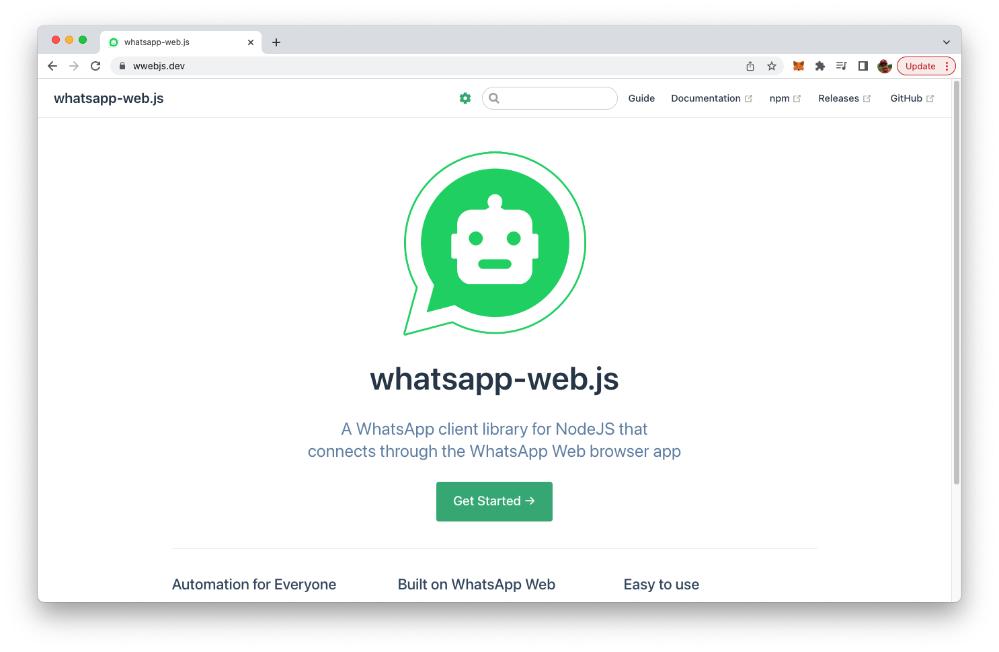
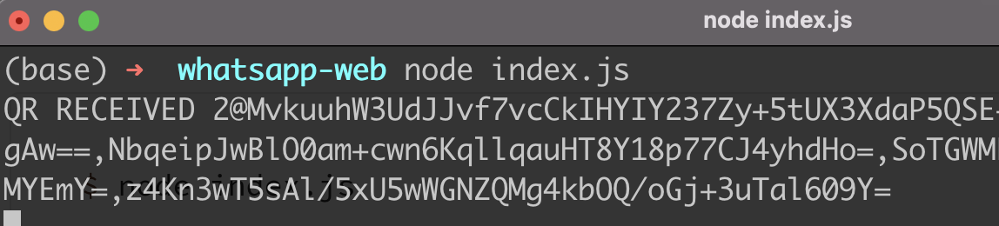
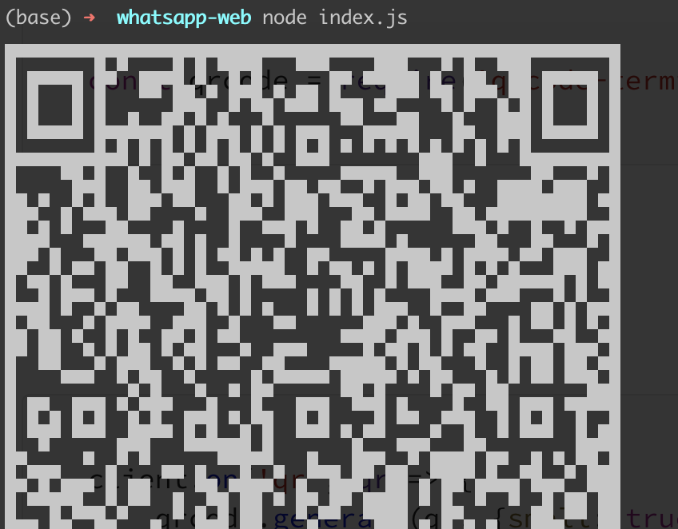
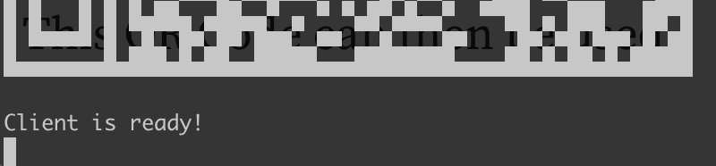
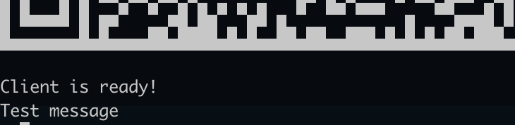

import { Image } from '@astrojs/image/components';
import YouTube from '~/components/widgets/YouTube.astro';
export const components = { img: Image };

The project's website can be found at https://wwebjs.dev/:



Here you can find basic information and additional documentation of whatsapp-web.de. In the following steps we'll use this library to create a simple Node.js sample application from scratch.

## Create A New Node.js Project And Install whatsapp-web.js

Let's start by creating a new Node.js project and install whatsapp-web.js. Enter the following commands:

```bash
$ mkdir whatsapp-web
$ cd whatsapp-web
$ npm init -y
$ npm install whatsapp-web.js
```

Now we're ready to write a Node.js program which is making use whatsapp-web.js. We start by creating a new empty file:

```bash
$ touch index.js
```

Insert the following lines of code:

```js
const { Client } = require('whatsapp-web.js');
const client = new Client();

client.on('qr', (qr) => {
    console.log('QR RECEIVED', qr);
});

client.on('ready', () => {
    console.log('Client is ready!');
});

client.initialize();
```

First we need to require access to the Client class from the whatsapp-web package. Then we're able to create a new class instance. The Client object can then be used to register event handler functions for the qr and ready event.

As whatsapp-web is fully based on the WhatApp web client it requires authentication via QR code. So the qr event is emitted once a QR code was received and is ready to be used for authentication.

The ready event is received once the client is ready and authentication was performed successfully.

Let's run the script by typing in:

```bash
$ node index.js
```

Now you should see something similar to



First you need to notice that we're receiving the message "QR RECEIVED" which is the confirmation that the Node.js program is working correctly and the qr event is received. Unfortunately we're receiving the QR code not as an image which we can use for authentification but instead as a text string. To change this behavior we need to install another package:

```bash
$ npm install qrcode-terminal
```

Include another require statement on top of out index.js:

```bash
const qrcode = require('qrcode-terminal');
```

And then use qrcode.generate inside our event handler function:

```bash
client.on('qr', qr => {
    qrcode.generate(qr, {small: true});
});
```

The output on the command line should then show the QR code correctly:



This QR Code can then be used for authentication via WhatsApp mobile app. After having scanned the QR code you should see the following message:



## Listening For Messages

As the WhatsApp client is ready now, we're able to perform some WhatsApp tasks like sending and receiving messages. Insert the following code at the bottom of index.js:

```js
client.on('message', message => {
 console.log(message.body);

  if(message.body === 'Test message') {
    message.reply('Thanks for sending a test message!');
  }
});
```

Here we're registering on event handler function for the message event type. This event is raised everytime a new message is received. The message is then printed out to the command line:



## Sending Messages

From the last example you could also learn how to send messages as a reply to a received message. The logic which is implemented here is checking if a message text "Test message" has been received. If this is true, we're making use of the message.reply method to send back an answer to the message sender.

We could also send back a normal message (not as a reply) by simple using the client.sendMessage method instead.

```js
client.sendMessage(message.from, 'Thanks for sending a test message!');
```

In this case the method is expecting two parameters: first we need to specify to whom the message should be sent. As the message should be send to the sender of the original message we can simple use message.form here. The second parameter contains the message text as a string.