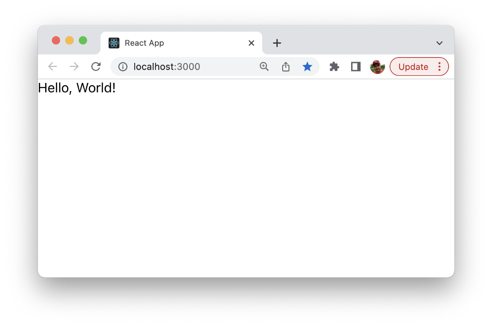
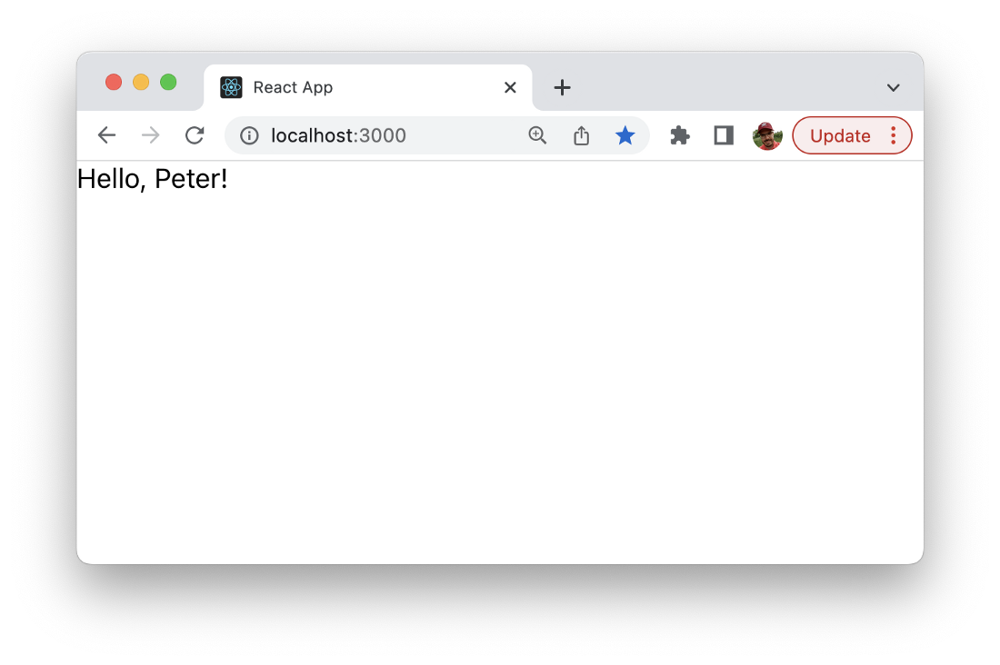

import { Image } from '@astrojs/image/components';
import YouTube from '~/components/widgets/YouTube.astro';
export const components = { img: Image };

Properties (short “props”) are used in React components to pass data from outside into a component. This can be used e.g. to pass data from one component to another component. Working with React component props is a common task when programming with React. This article provides a short and comprehensive introduction to props in React.

In order to get started with a first simple example let’s create a new React project by using the create-react-app script in the following way:

```bash
$ npx create-react-app react-props
```

Change into that newly created project folder:

```bash
$ cd react-props
```

And open the project in your favorite code editor.

Replace the default implementation of App component in src/App.js with the following simple component implementation:

```js
import React, { Component } from "react";
import ReactDOM from "react-dom";

class App extends Component {
  render(){
    return <div>Hello, World!</div>
  }
}

export default App;
```

This component takes no props is just outputting the text “Hello, World!”. After starting the web server with

```bash
$ npm start 
```

You should be able to see the output in the browser:



Let’s make the text output dynamic by adding text which is passed to the component by an component property:

```js

import ReactDOM from "react-dom";

class App extends Component {
  render(){
    return <div>Hello, {this.props.name}!</div>
  }
}

export default App;
```

This component is expecting to get a name passed in by using the name prop. This prop can be accessed from inside the component by using this.props.name.

In order to assign a value to the name property you need to change to file index.js and change it to:

```js
import React from 'react';
import ReactDOM from 'react-dom/client';
import './index.css';
import App from './App';

const root = ReactDOM.createRoot(document.getElementById('root'));
root.render(
  <React.StrictMode>
    <App name="Peter" />
  </React.StrictMode>
);
```

Here you can see that we’re passing the value “Peter” to the App component instance. The output should now look like what you can see in the following screenshot:



## Props With Function Components

So far we’ve used classic class components. React also support function components. Using props with function components is very easy as well. Let’s take a look at the implementation of App component as a function component in the following code listing:

```js
function App(props) {
  return <div>Hello, {props.name}!</div>
}

export default App;
```

The output you should then be able to see in the browser should be the same as before.

In order to to make props accessible in a function component you need to pass the props argument to the function and then you can access props by using the props object inside the function.

## Passing Props Between Components

Let’s extend the our example a little bit by introducing a second component. Let’s say we want to have a component which is called Greeting and is responsible to output the greeting message as seen below:

```js
... 

function Greeting(props) {
  return (
    <div>
      Hello, {props.name}! Nice to meet you!
    </div>
  );
}
```

Inside App component we’re now able to use Greeting component as a child component and pass a value for the name prop:

```js
function App() {
  return <Greeting name="Peter"/>
}

function Greeting(props) {
  return (
    <div>
      Hello, {props.name}! Nice to meet you!
    </div>
  );
}

export default App;
```

The output should then look like you can see in the following:


