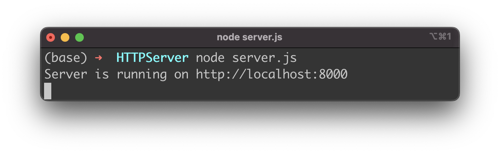
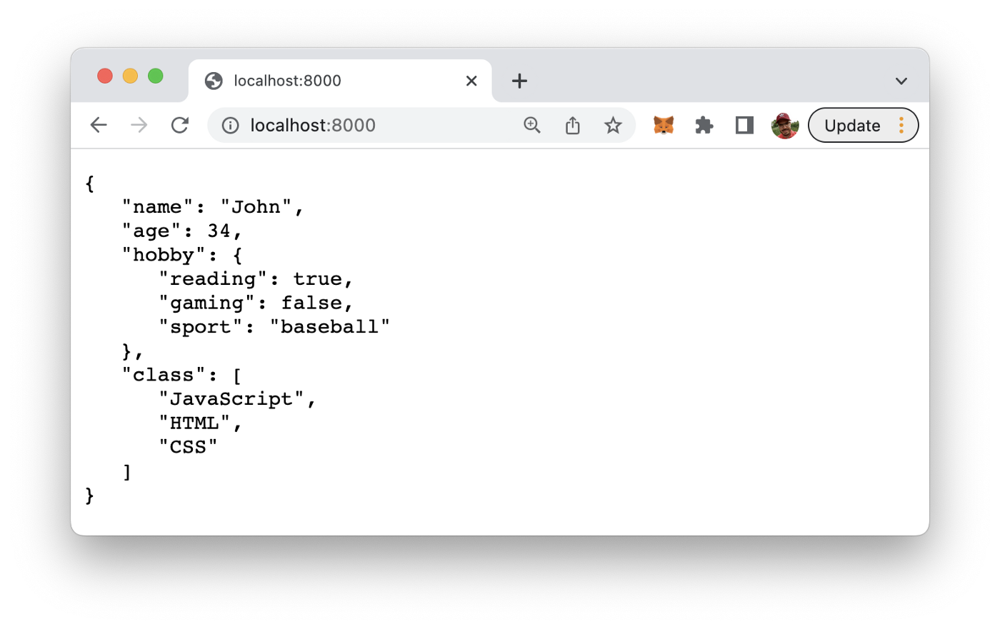

import { Image } from '@astrojs/image/components';
import YouTube from '~/components/widgets/YouTube.astro';
export const components = { img: Image };

JavaScript Object Notation, commonly referred to as JSON, is a text-based data exchange format. In this tutorial you’ll learn how to implement a simple Node.js web server which is able to return data in JSON format as a response to an HTTP request.

We first need to start creating a very simple Node.js web server by using the Node.js http module. Therefore we create a new and empty file server.js and start by insert the following lines of code:

```js
const http = require("http");

const host = 'localhost';
const port = 8000;

const requestListener = function(req, res) {
  // Handling the incoming HTTP request
}

const server = http.createServer(requestListener);
server.listen(port, host, () => {
    console.log(`Server is running on http://${host}:${port}`);
});
```

First we’re importing the http module. In the next two lines of code we’re creating constants holding the values for host and port.

A server instance is created by calling method http.createServer and passing in a handler function which is invoked every time a new request arrivers. The server is started by calling server.listen in the next step. The listen method is expecting to get three parameters: the port number, the host name and a callback function which is invoked once the server is started successfully.

The requestListener function is already implemented by the function body is still empty. This is the place were we need to insert the code which is needed to return a JSON response the the client. Therefore this function received two arguments: req which gives us access to the request object and res which gives us access to the response object.

## Add JSON Data

Next we need to add the JSON data which the server should return to the client. Therefore let’s add the following to the code:

```json
...
const data = {
    "name": "John",
    "age": 34,
    "hobby": {
	"reading" : true,
	"gaming" : false,
	"sport" : "baseball"
    },
    "class" : ["JavaScript", "HTML", "CSS"]
}
...
```

Of course you can change this data constant to any other JSON data structure you’d like to send as a response.

## Return JSON Data

In order to return the JSON data we now need to complete the implementation of the function requestListener:

```js
const requestListener = function(req, res) {
    res.setHeader("Content-Type", "application/json");
    res.writeHead(200);
    res.end(JSON.stringify(data, null, 3));
}
```

In order to return JSON data the res.setHeader method is used to set the Content-Type header field of the response to the value application/json.

The JSON data object is then returned by using the res.end function. In order to output it as an formatted string the JSON.stringify method is used.

Now we’re ready to start the Node.js server by using the following command:

```bash
$ node server.js
```

If the server is started up successfully you’ll receive the following confirmation message on the console:



Sending an HTTP GET request by accessing the URL http://localhost:8000 in the browser will provide the JSON data as a response like you can see in the following screenshot:



Finally, let’s take a look at the complete source code of server.js in the following listing:

```js
const http = require("http");

const host = 'localhost';
const port = 8000;

const data = {
    "name": "John",
    "age": 34,
    "hobby": {
	"reading" : true,
	"gaming" : false,
	"sport" : "baseball"
    },
    "class" : ["JavaScript", "HTML", "CSS"]
}

const requestListener = function(req, res) {
    res.setHeader("Content-Type", "application/json");
    res.writeHead(200);
    res.end(JSON.stringify(data, null, 3));
}

const server = http.createServer(requestListener);
server.listen(port, host, () => {
    console.log(`Server is running on http://${host}:${port}`);
});
```
