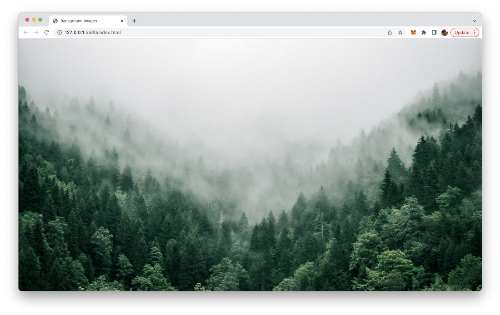

import { Image } from '@astrojs/image/components';
import YouTube from '~/components/widgets/YouTube.astro';
export const components = { img: Image };

Adding images to the background of a website is often essential to achieve good and outstanding web designs. By using pure HTML and CSS you can control how a background image of your website is displayed. Let’s learn how to handle background images step by step in this short tutorial.

In modern browsers you can use use images of different formats like PNG, JPEG, GIF, or SVG for being displayed in the background of your website. Background images of your HTML website can be controlled in detail by using some CSS properties. In the following we’ll go through some practical examples of how to control the background image. Let’s first start with a very simply HTML website structure. Create a new file index.html and insert the following basic HTML document:

```html
<!DOCTYPE html>
<html lang="en">
<head>
    <meta charset="UTF-8">
    <meta http-equiv="X-UA-Compatible" content="IE=edge">
    <meta name="viewport" content="width=device-width, initial-scale=1.0">
    <title>Background Images</title>
    <style>

    </style>
</head>
<body>

</body>
</html>
```

In order to add a background image to this website we first of all need an image file which is placed in the same folder as index.html or within a subfolder. For the following example we’re assuming that a background image file with name bg-image.jpg is available:


Next we’re attaching a custom CSS class to the body element of the HTML side in the following way:

```html
<body class=”bg-image”>
</body>
```

The bg-image class can now be added and defined within the style element:

```html
<style>
  .bg-image {
    background-image: url(“bg-image.jpg”);
    background-size: cover;
}
</style>
```

When now accessing index.html in the browser you should be able to see a result like the following:



The two CSS properties we’re using here are: background-image and background-size:

- *background-image*: With this property you can attach a background image to a specific element of the page or (like we do it in our example here) to the entire page by using this property on the body element of the page. In order to be able to select the image file which should be used for the background we’re using the url function and pass in the relative path to the image file as string.
- *background-size*: By using this property we’re able to control the size of the background image.
  
You can assign different values to the CSS property background-size.

You can directly assign a size in pixel values:

```css
background-size: 20px 40px;
```

And you can use the specific values cover and contain:

```css
background-size: cover;
```

or

```css
background-size: contain;
```

By using the cover value we’re resizing the background image size so that it covers the complete space. If the image is too big and has a larger ratio to the tag it is in, this means the image will get cropped at its edges.

The contain value in contrast is making sure that always the complete image is shown in the background and that cropping is avoided. If the image is to small and there is space left, the background image will be repeated.

The repeat behavior of the background image can be further controlled with the background-repeat property. If you do not want that the background image is repeated you can set this property to value no-repeat.

```css
background-repeat: no-repeat;
```