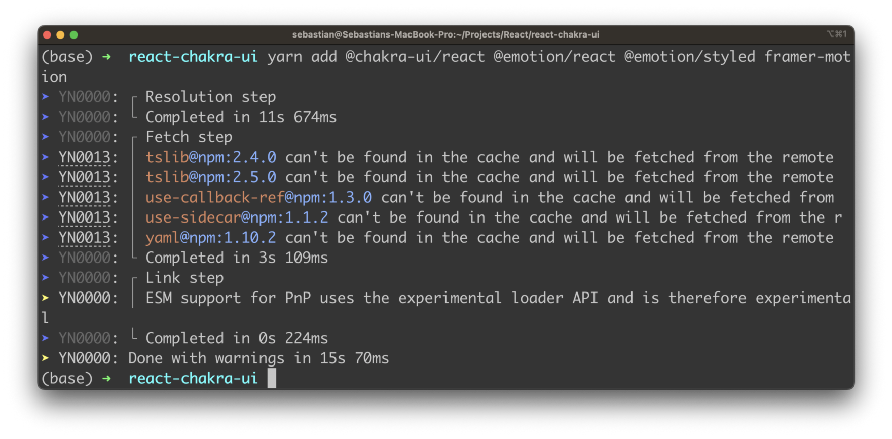

import { Image } from '@astrojs/image/components';
import YouTube from '~/components/widgets/YouTube.astro';
export const components = { img: Image };  

Chakra UI is a UI library for React that provides a simple, modular, and accessible set of components for building fast and beautiful user interfaces. It's designed to be highly customizable and provides a great developer experience, with the ability to use JavaScript-based styling, a focus on accessibility, and a wide range of built-in components for common use cases. Let's explore how to setup a React project and get Chakra UI installed.

## Create A New React Project From Scratch

The easiest and best option to create a new React project from scratch is to use Vite. Vite is a lightweight build tool that offers several advantages over other popular tools like create-react-app. In order to be able to use Vite on your system you need to install the following:

* Node.js
* Yarn

The new React project is then cerated by using Vite in the following way:

```bash
$ yarn create vite
```

If you need a more detailed explanation take a look at: [Vite + React: The Ultimate Combination for Fast Project Setup](https://www.codingthesmartway.com/vite-react-the-ultimate-combination-for-fast-project-setup/).
For the following instructions it is assumed that a new React project with name react-chakra-ui has been created. Use the following command to enter the project and install all default dependencies:

```bash
$ cd react-chakra-ui
$ yarn
```

## Install Chakra UI

Let's add Chakra UI to the new React project by using yarn to install the following needed dependencies:

```bash
$ yarn add @chakra-ui/react @emotion/react @emotion/styled framer-motion
```

In the screenshot you can see that Yarn is added the listed packages to the project and resolving all further dependencies:



After installing Chakra UI, you need to set up the ChakraProvider at the root of your application which is located in src/main.tsx.

First add the corresponding import statement on top:

```js
import { ChakraProvider } from '@chakra-ui/react'
```

Next make sure to surround `<App/>` element with `<ChakraProvider></ChakraProvider>` as you can see in the following listing:

```js
ReactDOM.createRoot(document.getElementById('root') as HTMLElement).render(
  <React.StrictMode>
    <ChakraProvider>
      <App />
    </ChakraProvider>
  </React.StrictMode>,
)
```

## Use Chakra's Components To Style Your Application

Now we're ready to go to make use of some of Chakra's UI components to implement and style our web app.

Go to file src/App.tsx and get rid of most of the default code and insert the following implementation:

```js
import { Heading, Text, Box, Flex } from "@chakra-ui/react";
import "./App.css";

function App() {

  return (
    <Flex
      width={"100vw"}
      height={"100vh"}
      alignContent={"center"}
      justifyContent={"center"}
    >
      <Box maxW="2xl" m="0 auto">
        <Heading as="h1" textAlign="center" fontSize="5xl" mt="100px">
          Welcome Everybody!
        </Heading>
        <Text fontSize="xl" textAlign="center" mt="30px">
          Tutorials and step-by-step guides from CodingTheSmartWay. Learn how to
          build web applications!
        </Text>
        <Text
          w="fit-content"
          p="4"
          px="50px"
          bg="blue.300"
          borderRadius="10px"
          m="0 auto"
          mt="8"
          fontWeight="bold"
          color="white"
          fontSize="xl"
        >
          Get Started
        </Text>
      </Box>
    </Flex>
  );
}

export default App;
```

Here the complete UI of App component is built with Chakra UI components. It uses the Flex component to create a full-screen flex container that aligns its content in the center, both horizontally and vertically. Within the flex container, a Box component is used to wrap the heading, text and text. The Heading and Text components display text, with properties such as font size, text alignment, and margin being set to control their appearance. The text with a button-like appearance is created using a Text component with specific styles set through its props. The styles include background color, border radius, padding, font size, font weight, and text color.

To check the result in the browser start the development web server with the following command:

```bash
$ yarn dev
```

Clicking on the link which is provided on the command line should take you to the browser showing the output of our React application:


## Conclusion

Implementing great app styling in React can be made significantly easier by using Chakra UI components.

Chakra UI is a React-based UI library that provides a set of pre-built, customizable and accessible components for building beautiful and functional user interfaces.

With Chakra UI, developers can quickly and easily create visually appealing and responsive layouts by combining its various components such as Flex, Box, Heading, and Text. These components provide a comprehensive set of styling options, which can be easily controlled through their props.

By using Chakra UI, developers can save time and effort that would have been spent on manual styling, and focus more on developing the core functionality of their applications.

As a result, Chakra UI is a valuable tool for anyone looking to build great-looking and well-structured React applications.