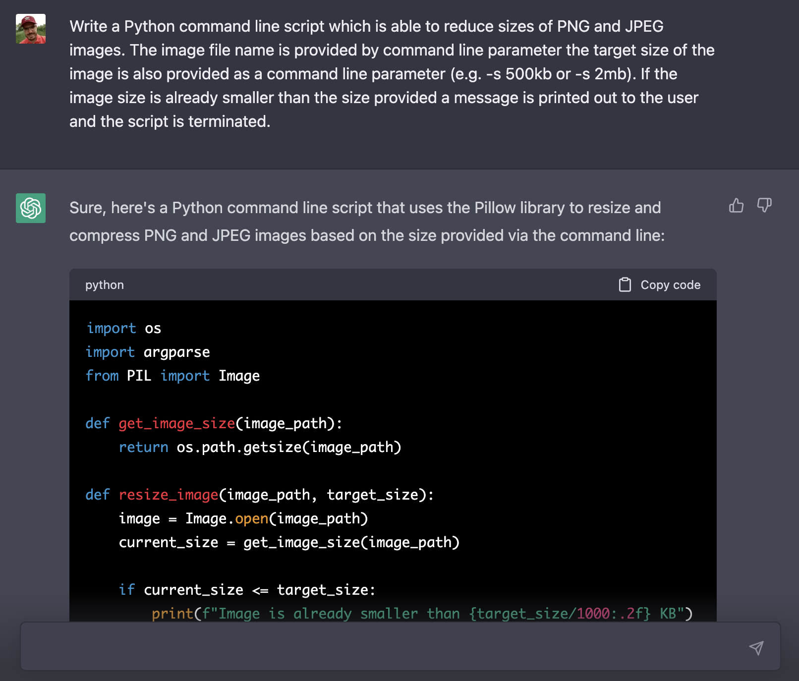
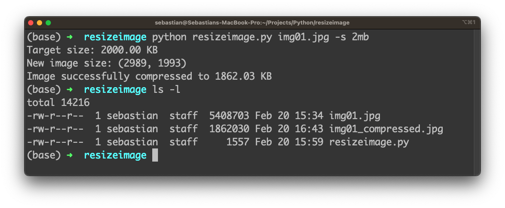
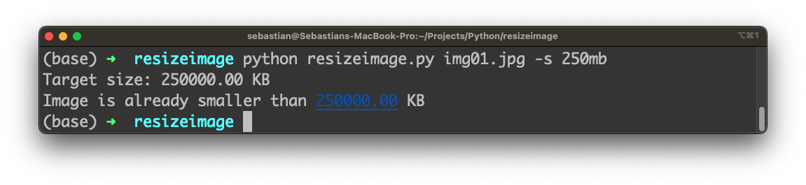
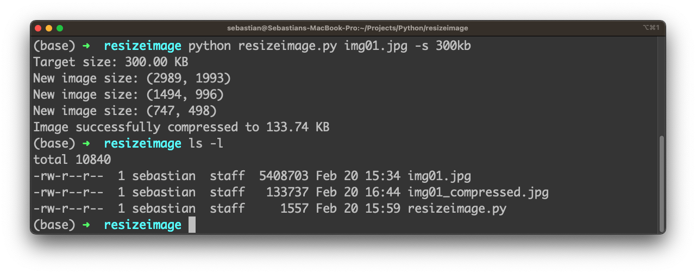
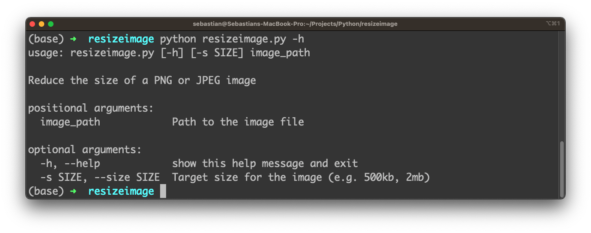

import { Image } from '@astrojs/image/components';
import YouTube from '~/components/widgets/YouTube.astro';
export const components = { img: Image };

Resizing images is a common task that many of us face in our day-to-day work. While there are many tools and libraries available for image resizing, creating a customized solution can often be a more efficient and streamlined approach. But what if you could leverage the power of artificial intelligence to generate the code for you? That's where ChatGPT comes in.

ChatGPT is a large language model trained by OpenAI that can assist with a wide range of natural language processing tasks. And it's now capable of generating complete Python code for a variety of applications, including image resizing. In this blog post, we'll explore how to use ChatGPT to generate a Python script for image resizing that is both powerful and flexible. You don't need to write any code yourself - instead, you can simply provide a few basic inputs and let ChatGPT handle the rest.

So let's provide our requirements with the following prompt into ChatGPT:

_"Write a Python command line script which is able to reduce sizes of PNG and JPEG images. The image file name is provided by command line parameter the target size of the image is also provided as a command line parameter (e.g. -s 500kb or -s 2mb). If the image size is already smaller than the size provided a message is printed out to the user and the script is terminated."_

ChatGPT is starting to generate the response immediately and part of the response the is generated Python code as you can see in the following screenshot:



The following code listing is containing the complete code which is generated by ChatGPT:

```py
import os
import argparse
from PIL import Image

def get_image_size(image_path):
    return os.path.getsize(image_path)

def resize_image(image_path, target_size):
    image = Image.open(image_path)
    current_size = get_image_size(image_path)

    if current_size <= target_size:
        print(f"Image is already smaller than {target_size/1000:.2f} KB")
        return

    while current_size > target_size:
        width, height = image.size
        new_width, new_height = width // 2, height // 2
        if new_width == 0 or new_height == 0:
            break
        image = image.resize((new_width, new_height), resample=Image.Resampling.LANCZOS)
        print(f"New image size: {image.size}")

        new_image_path = f"{os.path.splitext(image_path)[0]}_compressed{os.path.splitext(image_path)[1]}"
        image.save(new_image_path, optimize=True, quality=85)
        current_size = get_image_size(new_image_path)

    print(f"Image successfully compressed to {get_image_size(new_image_path)/1000:.2f} KB")

if __name__ == "__main__":
    parser = argparse.ArgumentParser(description="Reduce the size of a PNG or JPEG image")
    parser.add_argument("image_path", type=str, help="Path to the image file")
    parser.add_argument("-s", "--size", type=str, help="Target size for the image (e.g. 500kb, 2mb)")
    args = parser.parse_args()

    target_size = int(args.size[:-2]) * 1000 if args.size.endswith("kb") else int(args.size[:-2]) * 1000000
    print(f"Target size: {target_size/1000:.2f} KB")
    resize_image(args.image_path, target_size)
```

1. The `get_image_size` function returns the size of an image file in bytes.

2. The `resize_image` function takes an image path and a target size (in bytes) as arguments. It opens the image using the Pillow library, checks if the current size of the image is already smaller than the target size, and if so, prints a message to the user and returns without further action. Otherwise, it resizes the image by a factor of 2 in each dimension until the size is smaller than or equal to the target size. The new image is saved with a `_compressed` suffix in the file name and the file extension preserved. The `optimize=True` and `quality=85` arguments ensure that the compressed image is optimized for web use.

3. The script uses the `argparse` module to parse the command line arguments. The `image_path` argument is a required positional argument, and the size argument is an optional argument that takes a string of the form "500kb" or "2mb" and is used to set the target size for the image. The `args.size[:-2]` expression extracts the numeric portion of the size string, and the if statement converts the size from kilobytes to bytes if the size string ends with "kb" or converts from megabytes to bytes if it ends with "mb".

4. The script calls the `resize_image` function with the image path and target size as arguments.

The Python program is marking use of the Pillow library and the argparse library. If you've not installed those Python libraries already you need to complete the installation first:

```bash
$ pip install Pillow
$ pip install argparse
```

The code from ChatGPT's answer has to be copied and paste into a new file, e.g. resizeimage.py.

## Test The Python Program

Now that we have everything in place we're ready to execute the Python script on the command line. Therefore we do need to have an image file available which we can use. In the following examples we assume that the image file img01.jpg is available in the same folder as the python script.

Let's run a first test and execute

```bash
$ python resizeimage.py img01.jpg -s 2mb
```

According to our requirements we're using the -s parameter to specify that the image size should be reduced to a size less than 2 megabytes. The following screenshot shows what happens when the command is executed:



The image img01.jpg has a original image size of 5.4 megabytes. The Python script creates a new image file with the name img01_compressed.jpg which has a size of less than 2 megabytes (1.86 megabytes). The script is working as expected.

Let's specify that the target size should be greater than the original image size:



In this case the user receives the message that the image is already of a smaller size, the script stops without doing any resizing.

Let's run another test and specify the target size in kilobytes:



Finally we are also able to use option -h to output usage information:



That's great because this feature has not been described in the prompt we have been provided to ChatGPT. However ChatGPT has added this very useful feature by itself to further complete the implementation of the command line tool.

## Conclusion

Leveraging the power of AI to generate Python code is an exciting development that can streamline the development of a variety of applications. In this blog post, we've explored how to use ChatGPT to build an efficient image resizing script that can be customized to meet your specific needs. By following the step-by-step guide, you can create a command-line tool that can resize images according to user-specified parameters with minimal coding effort.

This approach offers both power and flexibility, making it ideal for a wide range of applications in web development, data science, and image processing. The ability to use ChatGPT to generate Python code is just one example of how artificial intelligence is revolutionizing the world of software development, and we can expect to see even more exciting developments in the years to come. So why not explore the power of ChatGPT today and see what new possibilities it can unlock for your work?