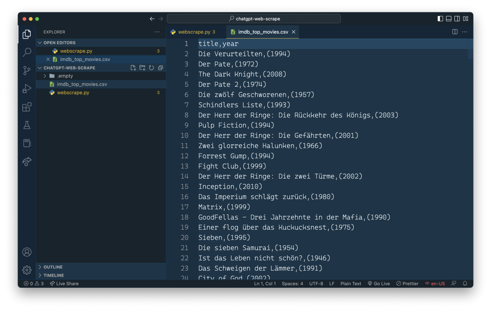

import { Image } from '@astrojs/image/components';
import YouTube from '~/components/widgets/YouTube.astro';
export const components = { img: Image };

Web scraping is the process of automatically extracting data from websites using scripts. ChatGPT is able to generate the web scraping script code for you. Let's see how this works …

IMDb is a website that provides information about movies, TV shows, and other forms of entertainment, including a chart of the top rated movies, The website `https://www.imdb.com/chart/top/?ref_=nv_mv_250` displays a list of the top 250 rated movies on IMDb, including their title, cast, director, and IMDb rating:


Let's say we'd like to use web scraping to extract movie information from this website with Python and it's web scraping library BeautifulSoup. Maybe ChapGPT is able to help us to write the needed code. Let's simple ask ChatGPT to perform this task by entering the following request:

`Web scrape https://www.imdb.com/chart/top/?ref_=nv_mv_250 with Python and BeautifulSoup`

ChatGPT is then responding with the specific implementation steps and the corresponding source code in Python like you can see in the following screenshot:


Ok, that is already a great result and helps us understanding how the source code is performing its task. However, we want to have the implementation in just one file, so that we only need to copy and paste it. Let's ask ChatGPT again to provide the Python web scraping script in just one file:

`Please provide the code in one file.`

Great ChatGPT is responding with the full and complete source code right away:


In the following listing you can see the complete Python code which was generated by ChatGPT:

```python
import requests
from bs4 import BeautifulSoup
import pandas as pd

# Retrieve the HTML content of the website
url = 'https://www.imdb.com/chart/top/?ref_=nv_mv_250'
response = requests.get(url)

# Parse the HTML content
soup = BeautifulSoup(response.text, 'html.parser')

# Find all movie elements
movies = soup.find_all('td', class_='titleColumn')

# Extract the desired information
data = []
for movie in movies:
    title = movie.find('a').text
    year = movie.find('span', class_='secondaryInfo').text
    data.append({'title': title, 'year': year})

# Create a dataframe and save it to a csv
df = pd.DataFrame(data)
df.to_csv('imdb_top_movies.csv', index=False)
```

Let's try out if the code is working as expected. Therefore we first need to create a new file:

```bash
$ mkdir chatgpt-web-scrape
$ cd chatgpt-web-scrape
$ touch webscrape.py
```

And then we can copy and paste the code into webscrape.py:


Let's start the python script by entering the following command on the command line:

```bash
$ python webscrape.py
```

The script is running and after a few secods you can notice that a new file imdb_top_movies.cvs has been created and is containing the extracted movie information in CSV format.



ChatGPT has generated a web scraping script which is working out of the box. No need to adapt the code manually. That's a great result.

In our original request to ChatGPT we have not specified which movie information should be extracted from the website. ChatGPT decided to extract the movie name and the year of publication. Let's say we'd like to also include the rating. Type in the following into ChatGPT:

`Also retrieve the IMDb rating for each film`

ChatGPT provides you with detailed instructions and code snippets for changing the existing code to also include and extract the rating information:


We can now ask ChatGPT again to incorporate this changes into the script:

`Please give me the full code in one with, with the try-except block`

This is then generating the complete Python script again, including the changes for extracting the addtional information from the website:


## Conclusion

The example of this tutorial showed that ChatGPT is a great help when generating script for web scraping. In fact, we were able to just input our simple requirements into ChatGPT and as a result we received a Python script which is able to perform the task without the need of any adaptions. That is making web scraping a lot easier and gets you started in no time.