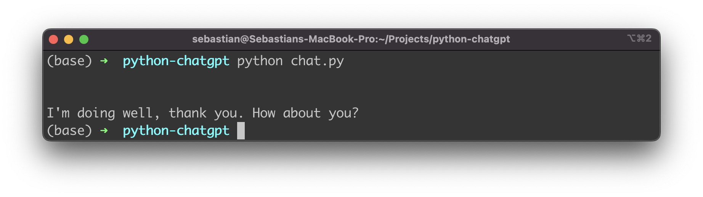

import { Image } from '@astrojs/image/components';
import YouTube from '~/components/widgets/YouTube.astro';
export const components = { img: Image };

<YouTube url="https://youtu.be/5MvYe44zen4" />

ChatGPT is a variant of the GPT-3 language model, specifically designed for conversational language generation. To use ChatGPT in Python, you will need to install the OpenAI API client and obtain an API key. In this article we'll setup a simple example teaching you the exact steps which are needed to make use of ChatGPT in your Python program.

Let's get started. First create a new empty project folder:

```bash
$ mkdir python-chatgpt
$ cd python-chatgpt
```

In the next step we need to install the OpenAI API client library for Python.

## Installing OpenAI API client library for Python

To install the OpenAI API client library for Python, you will need to have Python and pip, the Python package manager, installed on your system.

To install the library, open a terminal or command prompt and type the following command:

```bash
$ pip install openai
```

This will install the OpenAI API client and all of its dependencies.

Once the installation is complete, you can import the library in your Python code by adding
the following line at the top of your script:

```python
import openai
```

Let's do so: Create a new file chat.py in the project folder and start by insert the import statement on top of the file.

Let's extend the Python code further and use the OpenAI client library to interact with the artificial intelligence:

```python
import openai

# Set up the OpenAI API client
openai.api_key = "YOUR_API_KEY"

# Set up the model and prompt
model_engine = "text-davinci-003"
prompt = "Hello, how are you today?"

# Generate a response
completion = openai.Completion.create(
    engine=model_engine,
    prompt=prompt,
    max_tokens=1024,
    n=1,
    stop=None,
    temperature=0.5,
)

response = completion.choices[0].text
print(response)
```

This will generate a response to the prompt *Hello, how are you today?* using the ChatGPT model. The response will be returned as a string in the response variable.

You can customize the behavior of the model by adjusting the temperature parameter, which controls the level of randomness in the generated text. A higher temperature will result in more varied and potentially less coherent responses, while a lower temperature will produce responses that are more predictable and potentially more coherent.

You can also use the stop parameter to specify a string or sequence of strings that, if encountered in the generated text, will cause the model to stop generating further text. This can be useful for controlling the length of the generated text or for ensuring that the model does not generate inappropriate content.

YOUR_API_KEY is a placeholder for your actual API key.

To use the OpenAI API, you will need to sign up for an account and obtain an API key. You can do this by visiting the OpenAI website and clicking on the *Get an API key* button.

Once you have obtained your API key, you will need to replace YOUR_API_KEY in the Python code with your actual API key. This will allow the API client to authenticate your requests to the OpenAI API.

Let's try it out. Change to the command line again and execute the Python script by typing in:

```bash
$ python chat.py
```

In the following screenshot you can see that ChatGPT is responding with an answer to the question *Hello, how are you today?* which we have submitted:



That is how easy it is to use ChatGPT functionality from within your Python program. Feel free to extend this example and adapt it to your requirements. Have much fun!