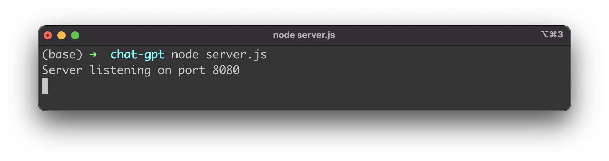
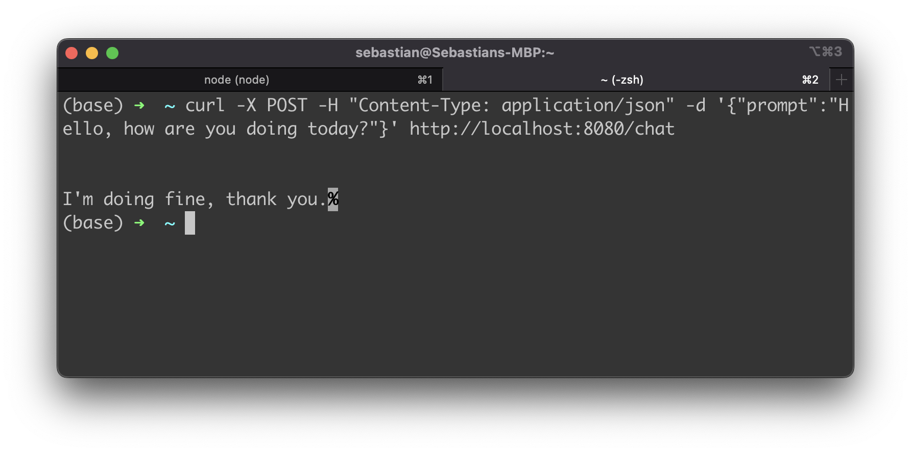
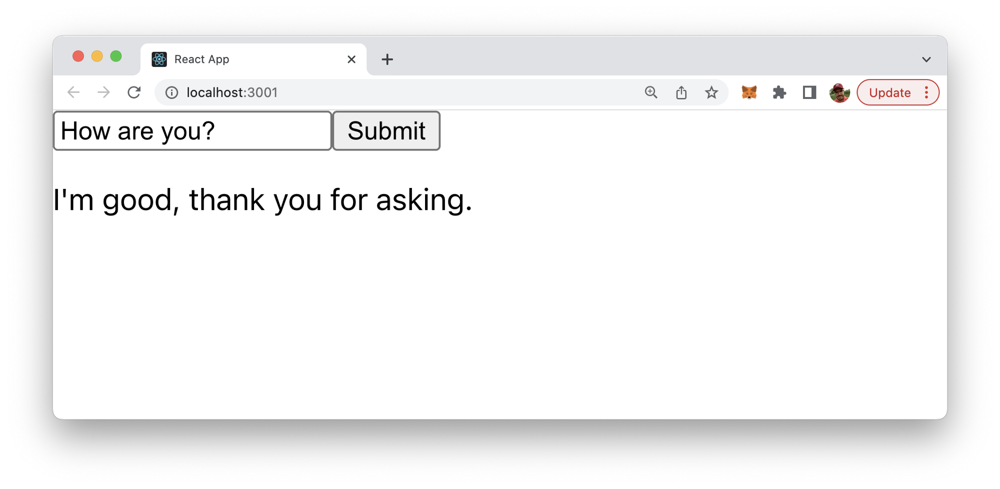

import { Image } from '@astrojs/image/components';
import YouTube from '~/components/widgets/YouTube.astro';
export const components = { img: Image };

ChatGPT is a variant of the GPT (Generative Pre-training Transformer) language model that is specifically designed for generating human-like text in chatbot applications. To use ChatGPT with React, you will need to set up a server that can handle requests from the React application and use the OpenAI API to generate responses with ChatGPT.

Here is an outline of the steps you can follow to use ChatGPT with React:

## Implement the Express server

For setting up the server we're using the Node.js Express framework. Install the following dependencies:

```bash
npm install openai express body-parser cors
````

In your server, use the openai library to set up the ChatGPT model and handle requests from the React application. For example, you could create an endpoint that accepts a prompt and returns a response generated by ChatGPT.

Create a new file server.js and insert the following JavaScript code:

```js
const express = require("express");
const cors = require("cors");
const bodyParser = require("body-parser");

const { Configuration, OpenAIApi } = require("openai");

const configuration = new Configuration({
  apiKey: "YOUR_API_KEY",
});
const openai = new OpenAIApi(configuration);

// Set up the server
const app = express();
app.use(bodyParser.json());
app.use(cors())

// Set up the ChatGPT endpoint
app.post("/chat", async (req, res) => {
  // Get the prompt from the request
  const { prompt } = req.body;

  // Generate a response with ChatGPT
  const completion = await openai.createCompletion({
    model: "text-davinci-002",
    prompt: prompt,
  });
  res.send(completion.data.choices[0].text);
});

// Start the server
const port = 8080;
app.listen(port, () => {
  console.log(`Server listening on port ${port}`);
});
```

This code sets up an endpoint at /chat that accepts a POST request with a JSON body containing a prompt field. The server then uses the openai.createCompletion() method to generate a response with ChatGPT and sends it back to the client in the response.

You will need to replace YOUR_API_KEY with your own API key, which you can obtain by creating an account on the OpenAI website and following the instructions to obtain an API key.

Start the server by running the following command in the terminal:

```bash
node server.js
```

This will start the server and make it listen for requests at the specified port 8080.



Test the server by sending a POST request to the /chat endpoint with a prompt in the request body. You can use a tool like Postman or curl to send the request. For example, using curl:

```bash
curl -X POST -H "Content-Type: application/json" -d '{"prompt":"Hello, how are you doing today?"}' http://localhost:8080/chat
```

This will send a request with the prompt "Hello, how are you doing today?" to the server, and the server will respond with a text response generated by ChatGPT.



## Set up the React application

Now that the server endpoint is available it's time to setup the React front-end application which is making use of that endpoint. Create a new React project by using the create-react-app script in the following way:

```bash
$ npx create-react-app react-chatgpt
```

Change into the newly created react-chatgpt project folder:

```bash
$ cd react-chatgpt
```

Install the axios library:

```bash
$ npm install axios
```

In your React application, you can use axios or another HTTP client library to send requests to the server and display the responses. For example insert the following React code in a file called src/App.js:

```js
import axios from "axios";

function App() {
  const [prompt, setPrompt] = useState("");
  const [response, setResponse] = useState("");

  const handleSubmit = (e) => {
    e.preventDefault();

    // Send a request to the server with the prompt
    axios
      .post("/chat", { prompt })
      .then((res) => {
        // Update the response state with the server's response
        setResponse(res.data);
      })
      .catch((err) => {
        console.error(err);
      });
  };

  return (
    <div>
      <form onSubmit={handleSubmit}>
        <input
          type="text"
          value={prompt}
          onChange={(e) => setPrompt(e.target.value)}
        />
        <button type="submit">Submit</button>
      </form>
      <p>{response}</p>
    </div>
  );
}
```

This is just a basic example, and you can customize the implementation to fit your needs. For example, you might want to add a text input for the user to enter the prompt and a display area for the response.

Start the development server by running the following command in the terminal:

```bash
npm start
```

This will start the development server and open the React application in your default web browser.

Test the application by entering a prompt in the text input and submitting the form. The server will generate a response with ChatGPT and display it in the application.




