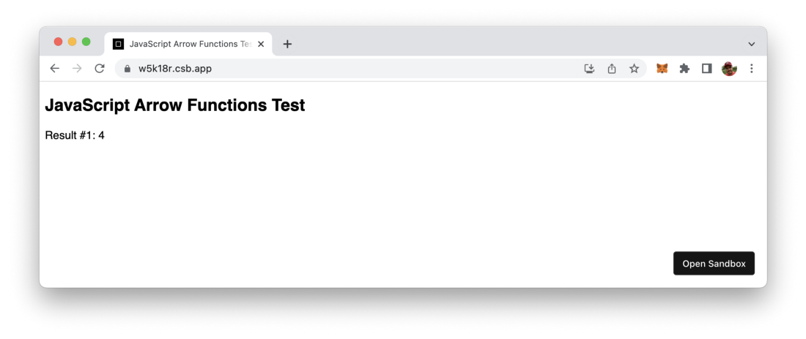
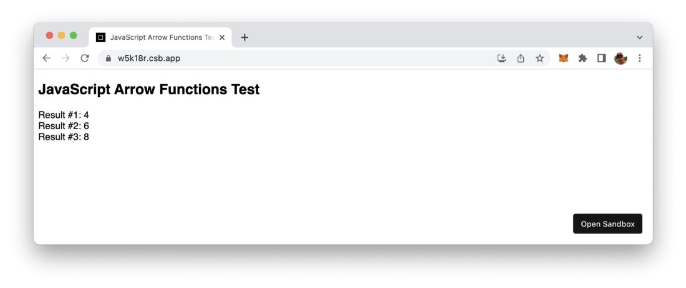
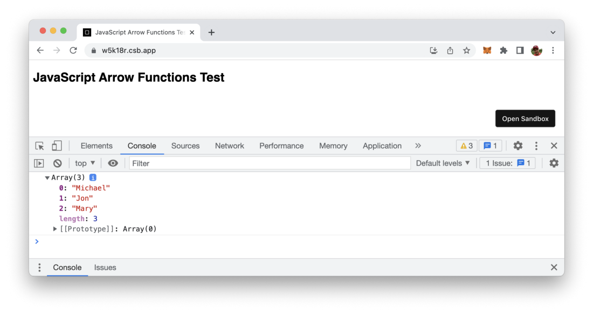

import { Image } from '@astrojs/image/components';
import YouTube from '~/components/widgets/YouTube.astro';
export const components = { img: Image };

Arrow functions are a way of writing anonymous function expressions in JavaScript which has been introduced in the 2015 version of the ECMAScript language specification (ES6). This article gives you a quick overview of how you can use JavaScript arrow functions which ease.

Being able to write anonymous function expressions could streamline and shorten your code a lot. Many modern programming languages have introduced this possibility recently, like Python did when introducing Lambda functions.

In JavaScript the concept of writing anonymous function expression is called Arrow functions. This concept differs from the traditional way of writing functions in JavaScript. Let’s explore this concept …

## From Traditional JavaScript Functions To Arrow Functions

Let’s start with a simple JavaScript project to explore how arrow functions differ from traditional functions.

Create an empty project folder and inside this folder create a new file index.html and insert the following HTML code:

```html
<!DOCTYPE html>
<html>
  <head>
    <title>JavaScript Arrow Functions Test</title>
    <meta charset="UTF-8" />
  </head>

  <body>
    <div id="app"></div>

    <script src="src/index.js"></script>
  </body>
</html>
```

This points to the JavaScript file src/index.js, so let’s create this file as well in the project folder and insert the following code:

```js
document.getElementById("app").innerHTML = `
  <h2>JavaScript Arrow Functions Test</h2>
  <div>
  </div>
`;
```

Let’s add a simple function which is just adding to values:

```js
// Traditional Function Implementation
function sum01(a, b) {
  return a + b;
}

document.getElementById("app").innerHTML = `
<h2>JavaScript Arrow Functions Test</h2>
<div>
  Result #1: ${sum01(1, 3)}<br/>
</div>
`;
```

The sum01 function is implemented in the traditional way by using the function keyword followed by the name of the function and the list of parameters in parentheses. The output us added to the HTML code, so that you should see the following result in the browser:



Let’s add another function with a slightly different syntax:

```js
// Traditional Function Implementation
function sum01(a, b) {
  return a + b;
}

// Anonymous Function Expression
const sum02 = function (a, b) {
  return a + b;
};

document.getElementById("app").innerHTML = `
<h2>JavaScript Arrow Functions Test</h2>
<div>
  Result #1: ${sum01(1, 3)}<br/>
  Result #2: ${sum02(2, 4)}<br/>
</div>
```

sum02 is performing the same task as function sum01 but is defined in an anonymous way. No function name is specified, instead a reference to the function is assigned to const sum02. If you’re defining the function in this anonymous way you can only call this function after it has been assigned to the constant.

The result should then look like what you can see in the following screenshot:


Now let’s take it one step further and use JavaScript’s arrow function syntax to define a third variant of the sum function:

```js
// Traditional Function Implementation
function sum01(a, b) {
  return a + b;
}

// Anonymous Function Expression
const sum02 = function (a, b) {
  return a + b;
};

// Anonymous Function Expression With Arrow Function Syntax
const sum03 = (a, b) => {
  return a + b;
};

document.getElementById("app").innerHTML = `
<h2>JavaScript Arrow Functions Test</h2>
<div>
  Result #1: ${sum01(1, 3)}<br/>
  Result #2: ${sum02(2, 4)}<br/>
  Result #3: ${sum03(3, 5)}<br/>
</div>
`;
```

To define the anonymous array function, we do not use the function keyword anymore. Instead the definition is done by just listing the parameters followed by the fat arrow symbol (=>) followed by the function body.

The output should then look like the following:



## Arrow Function With Just One Parameter

By implementing sum03 you’ve seen an example of an arrow function with multiple parameter. If the function only requires one parameter the syntax can be further shortened, parenthesis can be omitted.

```js
const square = x => {
  return x * x
}
```

## Arrow Function With No Parameter

However if your arrow function is not requiring any parameters, you need to use parenthesis:

```js
const helloWorld = () => {
  return 'Hello!'
}
```

## Arrow Functions With Implicit Return

If your arrow function body just consists of a return statement you can further reduce the syntax and make use of implicit return like you can see in the following:

```js
const square = x => x * x
```

## Use Case: Arrow Functions As Parameters

By using arrow functions in JavaScript you now have a very compact syntax available for writing function expressions. Oftentimes this syntax is used in cases were you need to pass in a function as parameter. Just take a look at the following example:

```js
// Capitalize first character of each name
var names = ["michael", "jon", "mary"];
var result = names.map((name) => {
  var modified = name.charAt(0).toUpperCase() + name.substr(1);
  return modified;
});

console.log(result);
```

Here we’re using the Array map function to iterate over the elements of the names array. An anonymous arrow function is passed into the call of map. This function is executed for each single array element and capitalize the first letter of each name:



## Arrow Functions Use Lexical This

Another important aspect to know about arrow functions: these type of functions do not have their own scope of this. The value of this in an arrow function is inherited from the enclosing scope. This concept is called lexical this and enables you to access the outside scope of the function easily.