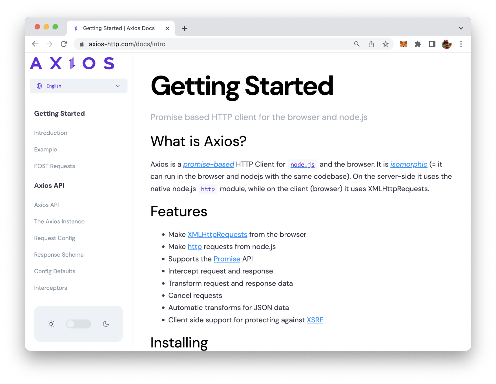
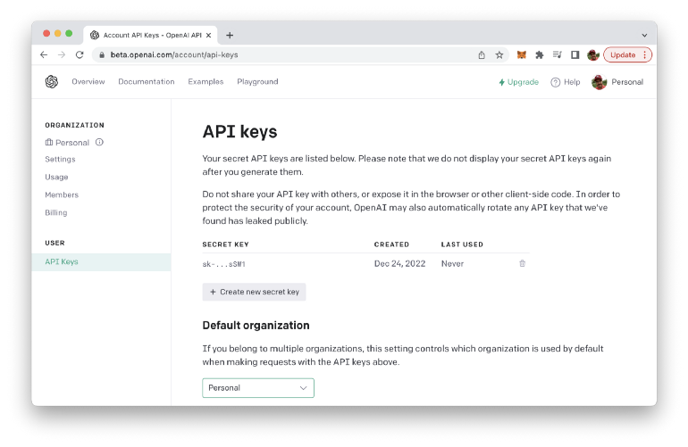
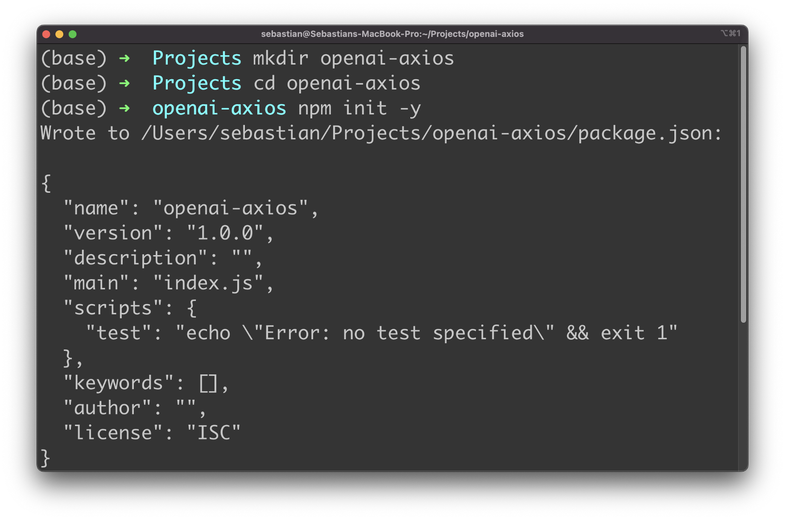
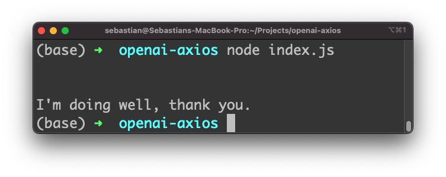

import { Image } from '@astrojs/image/components';
import YouTube from '~/components/widgets/YouTube.astro';
export const components = { img: Image };

<YouTube url="https://youtu.be/4lLL5F3TA50" />

OpenAI, a leading AI research lab, has created a powerful API that allows developers to tap into cutting-edge AI capabilities and make use of generative language models like GPT3. In this tutorial, we will show you how to use the OpenAI API with Axios and JavaScript, giving you a glimpse of the future of web development powered by AI.

Axios is a popular JavaScript library for making HTTP requests and integrating with APIs, making it the perfect tool for accessing the OpenAI API. Whether you’re a seasoned developer or just starting out, this guide will provide a step-by-step walkthrough of using the OpenAI API with Axios and JavaScript, so you can start creating innovative AI-powered applications today.

You can find more information about the Axios library at: https://axios-http.com/:



## Retrieving An OpenAI API Key

To obtain an API key for the OpenAI API, you will need to sign up for a free OpenAI account on the OpenAI website (https://openai.com/):


To sign up for an account, click the "Sign Up" button in the top right corner of the homepage, and then follow the prompts to create a new account. Once you have created an account, you can obtain an API key by visiting the "API" section of your account settings.

In the "API" section, you will find a button labeled "Generate API Key". Click this button to generate a new API key, which you can then use to make requests to the OpenAI API from your web application. Be sure to keep your API key secure and do not share it with anyone else.



## Setting Up The Project

Let's setup the JavaScript project by first creating a new project folder:

```bash
$ mkdir openai-axios
$ cd openai-axios
```

Inside that new project folder use the Node.js Package Manager (NPM) to create a new initial package.json file. This is a prerequisite, so that we're able to use NPM to install further dependencies:

```bash
$ npm init -y
```

When running this command you should be able to see the content which is written to package.json also on the console:




Next, use NPM to install the packages dotenv and axios.

```bash
$ npm install dotenv axios
```

Dotenv is a zero-dependency module that loads environment variables from a .env file into process.env. We'll use an environment variable to store the API key which we have retrieved from the OpenAI dashboard.

Next we do need to create two files within the project folder:

```bash
$ touch index.js .env
```

## Accessing OpenAI API With Axios

First let's create an environment variable in .env:

```
OPENAI_API_KEY=[INSERT YOUR OPENAI API KEY HERE]
```

Next switch to file index.js and start with the following line of code:

```js
const axios = require("axios");
```

This require statement is needed to include the Axios library. Another require statement is needed in order to activate the dotenv library and make the environment variable accessible via process.env.

```js
const apiKey = process.env.OPENAI_API_KEY;
```

Next we're creating an Axios client instance by using the axios.create method. At the same time we're setting an Authorization header which is containing the OpenAI API key:

```js
const client = axios.create({
  headers: {
    Authorization: "Bearer " + apiKey,
  },
});
```

Let's use the Axios client object to send an HTTP POST request to one of the OpenAI API endpoints:

```js
const params = {
  prompt: "How are you?",
  model: "text-davinci-003",
  max_tokens: 10,
  temperature: 0,
};

client
  .post("https://api.openai.com/v1/completions", params)
  .then((result) => {
    console.log(result.data.choices[0].text);
  })
  .catch((err) => {
    console.log(err);
  });
```

This code sends an HTTP POST request to the OpenAI API using the Axios library. The request is made to the endpoint "https://api.openai.com/v1/completions". This endpoint of the OpenAI API allows developers to generate text completions for a given prompt.

The params object is a JavaScript object that contains the parameters for the API request, including the prompt to be completed, the model to use, the maximum number of tokens to generate, and the temperature to use during generation.

The request is made using the .post() method of the client object. The .post() method takes two arguments: the URL endpoint and the parameters object.

The response to the request is handled using the Promise .then() method, which is called when the request is successful. The result object returned by the API is logged to the console, along with the text of the first choice in the choices array of the response data.

In case of an error, the Promise .catch() method is called. It logs the error message to the console, allowing the developer to diagnose any issues with the API request.

The following listings contains the complete source code of index.js:

```js
const axios = require("axios");

require("dotenv").config();

const apiKey = process.env.OPENAI_API_KEY;

const client = axios.create({
  headers: {
    Authorization: "Bearer " + apiKey,
  },
});

const params = {
  prompt: "How are you?",
  model: "text-davinci-003",
  max_tokens: 10,
  temperature: 0,
};

client
  .post("https://api.openai.com/v1/completions", params)
  .then((result) => {
    console.log(result.data.choices[0].text);
  })
  .catch((err) => {
    console.log(err);
  });
```

Let's run the application by using the node command:

```bash
$ node index.js
```

As the output you should be able to see the response which was generated and returned by OpenAI:



## Conclusion

This tutorial has provided a comprehensive guide on how to get started with the OpenAI API and Axios in JavaScript, from setting up your environment to making your first API call. We hope this guide has been helpful in showing you how to harness the power of AI and drive innovation in your projects.