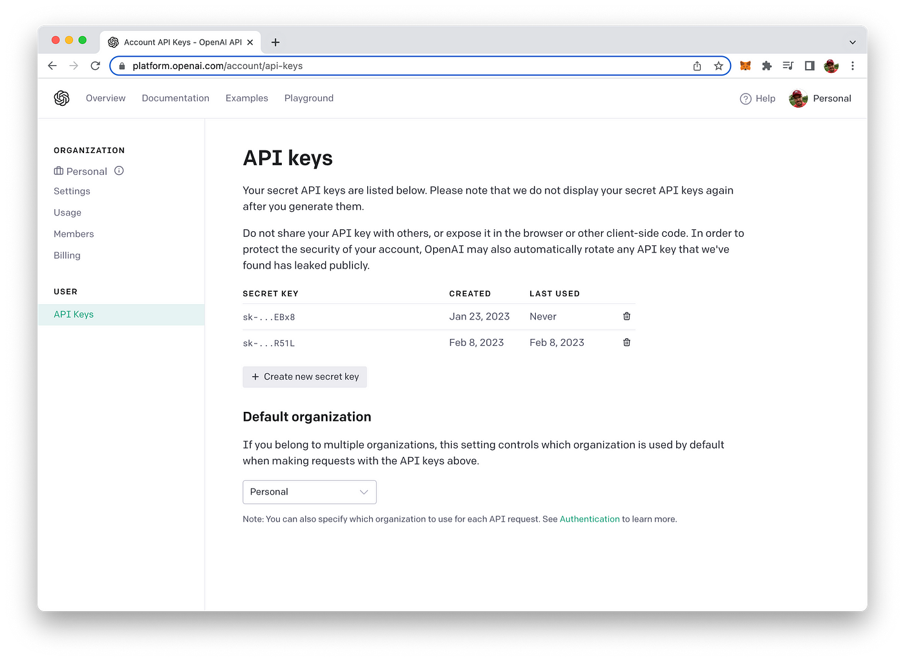
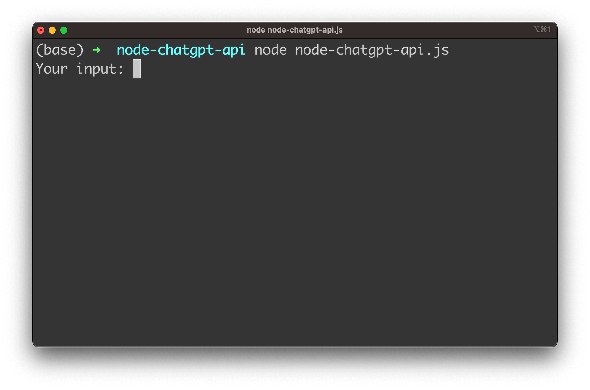
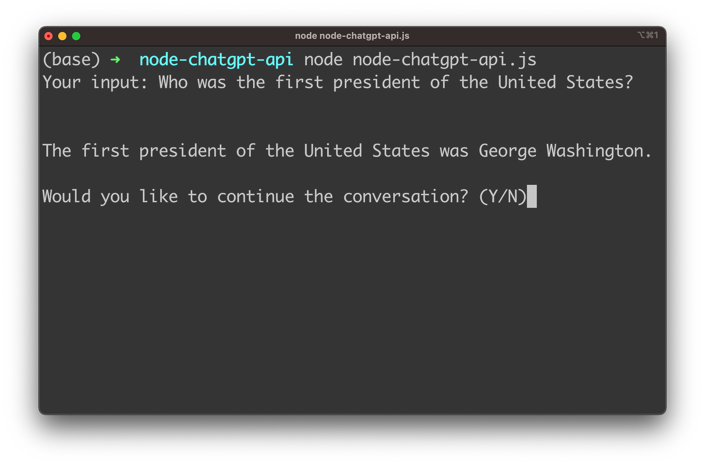
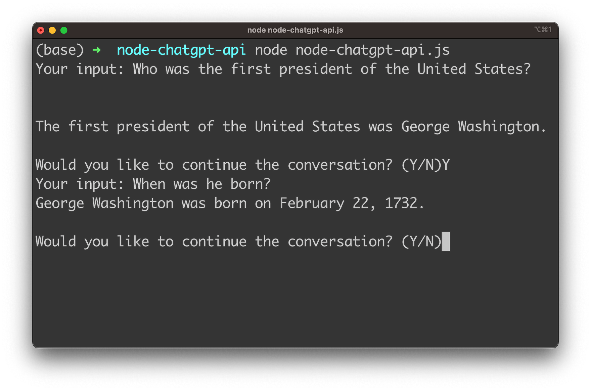

import { Image } from '@astrojs/image/components';
import YouTube from '~/components/widgets/YouTube.astro';
export const components = { img: Image };

Artificial Intelligence (AI) has been revolutionizing the way we interact with technology, and chatbots are one of the most prominent examples of this trend. With the increasing need for chatbots that can understand natural language and provide useful responses, OpenAI's ChatGPT API has become a popular choice among developers. In this blog post, we will explore how to use OpenAI's ChatGPT API in Node.js, a popular backend language used for building web applications.

We will go through the process step-by-step, starting from setting up the API credentials, to building a chatbot that can understand and respond to user queries in natural language. Whether you are a seasoned developer or just starting with Node.js and AI, this blog post will provide you with a comprehensive guide to getting started with OpenAI's ChatGPT API.

## Creating A New Node.js Project

Let's start by creating a new project folder:

```bash
$ mkdir node-chatgpt-api
$ cd node-chatgpt-api
```

Inside this new project folder create a new package.json file by using the npm command in the following way:

```bash
$ npm init -y
```

Next we need to add two packages:

* _openai_: The OpenAI Node.js library provides convenient access to the OpenAI API from Node.js applications.
* _readline-sync_: Provides synchonous functions for reading user input from the command line:

```bash
$ npm i openai readline-sync
```

Finally let's also add the dotenv package to the project:

```bash
$ npm i dotenv --save
```

By using the dotenv package we'll be able to manage environment variables in a .env file in our project.

## Retrieve The OpenAI API Key

In order to be able to make use of OpenAI's API from within a Node.js application we need to retrieve an API key first from the OpenAI dashboard.

To retrieve your OpenAI API key you need to create a user account at https://openai.com/ and access the API Keys section in the OpenAI dashboard to create a new API key.



This key is secret and must not shared with anybody else. We'll need to use this key later on when implementing the Node.js program to access OpenAI`s API.

Let's assign this API key to an environment variable in our Node.js application. Create a new file:

```bash
touch .env
```

Inside that file create the OPENAI_API_KEY variable and assign the value of your key:

```
OPENAI_API_KEY="YOUR OPEN AI API KEY"
```

## Implement The Node.js Application

Create a new file node-chatgpt-api.js and insert the following code:

```js
const { Configuration, OpenAIApi } = require("openai");
const readlineSync = require("readline-sync");
require("dotenv").config();

(async () => {
  const configuration = new Configuration({
    apiKey: process.env.OPENAI_API_KEY,
  });
  const openai = new OpenAIApi(configuration);

  const history = [];

  while (true) {
    const user_input = readlineSync.question("Your input: ");

    const messages = [];
    for (const [input_text, completion_text] of history) {
      messages.push({ role: "user", content: input_text });
      messages.push({ role: "assistant", content: completion_text });
    }

    messages.push({ role: "user", content: user_input });

    try {
      const completion = await openai.createChatCompletion({
        model: "gpt-3.5-turbo",
        messages: messages,
      });

      const completion_text = completion.data.choices[0].message.content;
      console.log(completion_text);

      history.push([user_input, completion_text]);

      const user_input_again = readlineSync.question(
        "\nWould you like to continue the conversation? (Y/N)"
      );
      if (user_input_again.toUpperCase() === "N") {
        return;
      } else if (user_input_again.toUpperCase() !== "Y") {
        console.log("Invalid input. Please enter 'Y' or 'N'.");
        return;
      }
    } catch (error) {
      if (error.response) {
        console.log(error.response.status);
        console.log(error.response.data);
      } else {
        console.log(error.message);
      }
    }
  }
})();
```

This Node.js code defines an interactive chatbot that uses the OpenAI ChatgPT API (gpt-3.5-turbo model) to generate responses to user input. Here's a detailed breakdown of what each part of the code does:

__1. Importing Dependencies:__

```js
const { Configuration, OpenAIApi } = require("openai");
const readlineSync = require("readline-sync");
require("dotenv").config();
````

* The `Configuration` and `OpenAIApi` classes are imported from the `openai` package, which is used to connect to and use the OpenAI API.
* The `readline-sync` package is used to prompt the user for input.
* The `dotenv` package is used to load environment variables from a `.env` file.

__2. Asynchronous Function:__

```js
(async () => {
  // Code here
})();
```

* The entire code is wrapped inside an immediately invoked asynchronous function, which allows the use of await inside the function body.

__3. Setting up Configuration and API:__

```js
const configuration = new Configuration({
  apiKey: process.env.OPENAI_API_KEY,
});
const openai = new OpenAIApi(configuration);
```

* A new `Configuration` instance is created with an API key obtained from the `OPENAI_API_KEY` environment variable.
* An `OpenAIApi` instance is created using the `Configuration` instance.

__4. Chat History:__

```js
const history = [];
```

* An empty array is created to store the chat history, which is used to provide context to the AI model for generating responses.

__5. Chat Loop:__

```js
while (true) {
  // Code here
}
```

* A `while` loop is used to continuously prompt the user for input and generate responses until the user decides to end the conversation.

__6. User Input:__

```js
const user_input = readlineSync.question("Your input: ");
```

* The `readlineSync` package is used to prompt the user for input, which is stored in the `user_input` variable.

__7. Chat History for Context:__

```js
const messages = [];
for (const [input_text, completion_text] of history) {
  messages.push({ role: "user", content: input_text });
  messages.push({ role: "assistant", content: completion_text });
}
messages.push({ role: "user", content: user_input });
```

* A _for_ loop is used to iterate through the chat history and create a list of messages in the format expected by the OpenAI ChatGPT API.
* Each message consists of a _role_ (either "user" or "assistant") and content (the text of the message).
* The current _user_input_ is added to the end of the _messages_ array.

__8. AI Model:__

```js
const completion = await openai.createChatCompletion({
  model: "gpt-3.5-turbo",
  messages: messages,
});
```

* The `openai.createChatCompletion` method is used to generate a response from the OpenAI API.
* The model parameter specifies which AI model to use for generating the response.
* The `messages` parameter provides context for the AI model to generate the response.

__9. Response from AI Model:__

```js
const completion_text = completion.data.choices[0].message.content;
console.log(completion_text);
```

* The response generated by the AI model is extracted from the `completion` object and stored in the `completion_text` variable.
* The response is then printed to the console.

__10. Chat History Update:__

```js
history.push([user_input, completion_text]);
```

The current `user_input` and the response generated by the AI model (`completion_text`) are added to the end of the history array.

__11. Should Conversation be continued?__

```js
const user_input_again = readlineSync.question(
  "\nWould you like to continue the conversation? (Y/N)"
);
if (user_input_again.toUpperCase() === "N") {
  return;
} else if (user_input_again.toUpperCase() !== "Y") {
  console.log("Invalid input. Please enter 'Y' or 'N'.");
  return;
}
```

* The user is prompted to either continue or end the conversation.
* The `readlineSync.question` method is used to read the user's input.
* If the user inputs "N", the `return` statement exits the `while` loop and ends the program.
* If the user inputs anything other than "Y" or "N", an error message is printed to the console and the program ends.

__12. Error Handling:__

```js
} catch (error) {
  if (error.response) {
    console.log(error.response.status);
    console.log(error.response.data);
  } else {
    console.log(error.message);
  }
}
```

* If an error occurs during the API request, the `catch` block is executed.
* If the error has a `response` property, the HTTP status code and response data are printed to the console.
* Otherwise, the error message is printed to the console

## Run The Application

In order to start the Node.js application you need to execute the following command:

```bash
$ node node-chatgpt-api.js
```

You're being asked for your first input:



Start by entering your first question and hit return:



After every response you're being asked if the conversation should be continued. If you want to continue you need to input "Y". You're then being asked to provide the next input.

As the `gpt-3.5-turbo` model is able to also take the history of the conversation into account you can ask subsequent questions which are based on the context of the conversation which has taken place so far.



## Conclusion

OpenAI's ChatGPT API is an incredibly powerful tool for building intelligent chatbots that can understand and respond to natural language. With the help of Node.js, developers can easily integrate this API into their web applications and provide users with an exceptional experience. In this blog post, we have walked through the process of setting up the API credentials, creating a chatbot, and testing it out in real-time. By following these steps, you can create your own chatbot that can interact with users and provide them with personalized responses. With the continuous development of AI, we can only expect chatbots to become even more sophisticated and effective in the years to come. By learning how to use OpenAI's ChatGPT API in Node.js, you are setting yourself up for success in the future of AI-powered chatbots.