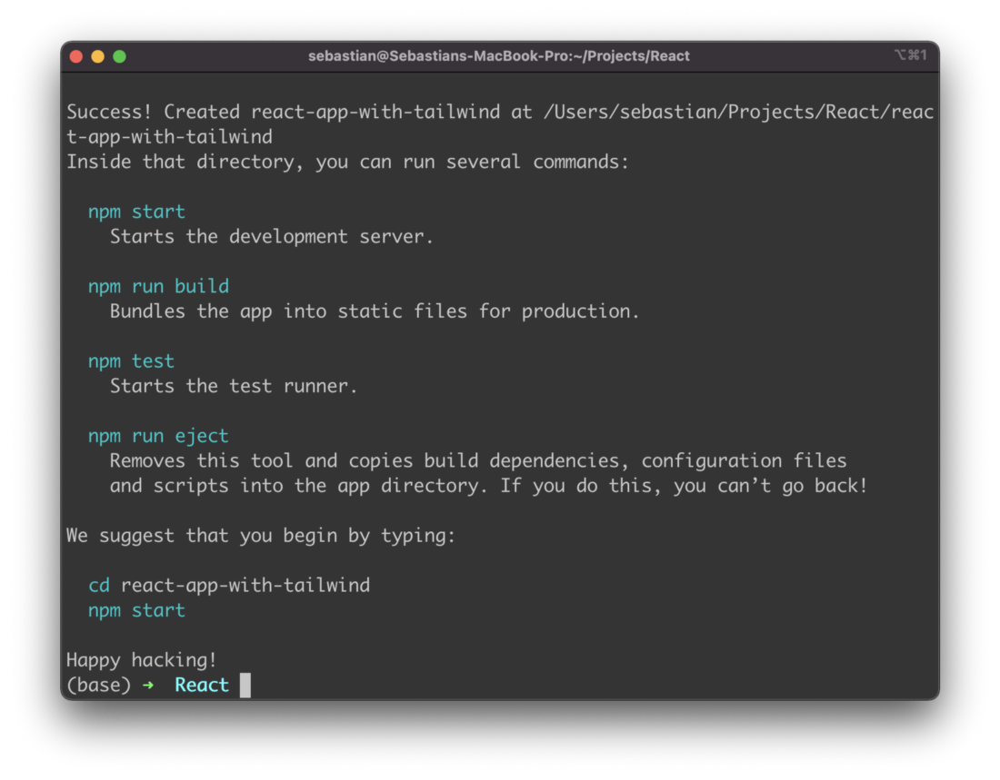
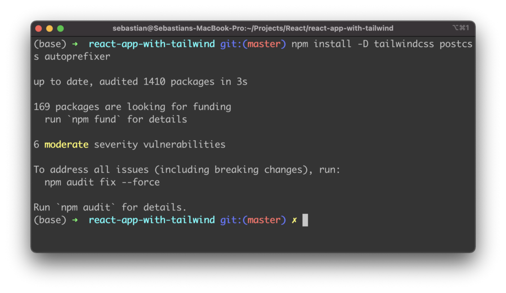
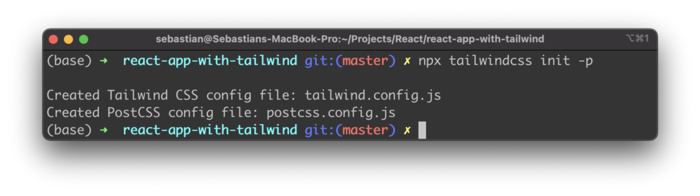
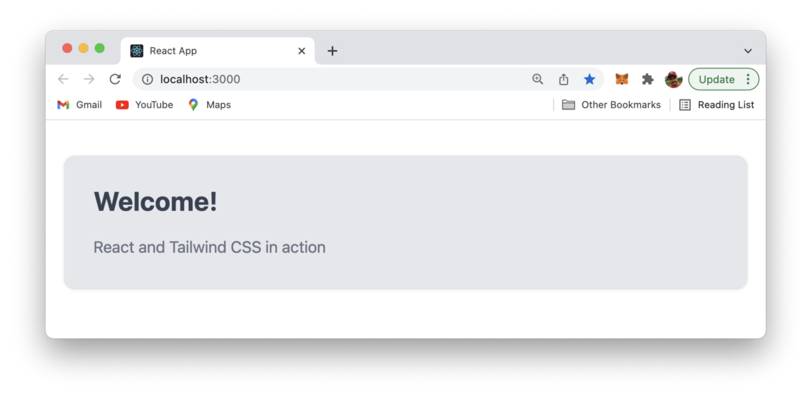

import { Image } from '@astrojs/image/components';
import YouTube from '~/components/widgets/YouTube.astro';
export const components = { img: Image };

Tailwind CSS is a utility-first CSS framework which makes it very easy to apply great styling to your React web application by choosing from the framework’s ready-made CSS classes. This easy approach makes Tailwind CSS very popular among today’s CSS frameworks and speeds up the development & styling process significantly. If you’re new to Tailwind CSS you can find a good starting point at the project’s homepage at https://tailwindcss.com/.


Setting up your React project to be able to make use of Tailwind CSS is very easy and comprises only very few steps. In the following tutorial you can find the step-by-step approach of installing Tailwind CSS into your React project and get started using Tailwind’s CSS classes for styling.

## Step 1: Creating Your React Project

Creating your new React project is the very first step. The easiest way to do so is to use the create-react-app script on the command line:

```bash
$ npx create-react-app react-app-with-tailwind
$ cd react-app-with-tailwind
```

If everything works fine, you should be able to see the following output after running the create-react-app script via the npx command:



## Step 2: Install Tailwind CSS

Now that you have entered the newly created project folder react-app-with-tailwind you can start adding the Tailwind CSS library and it’s peer dependencies postcss and autoprefixer by using the Node Package Manager (NPM) in the following way:

```bash
$ npm install -D tailwindcss postcss autoprefixer
```



Next, we’re ready to create the default configuration files for Tailwind in the project folder.

## Step 3: Generate Configuration Files

In order to configure everything we need for Tailwind in our React project we do need two configurations files:

- *tailwind.config.js*
- *postcss.config.js*

Luckily those two files can be generated by executing the following command in the project folder:

```bash
$ npx tailwindcss init -p
```



This makes sure that not only the files are created but also that a default configuration structure in is already available within these files.

## Step 4: Configure Path To Template Files

Inside tailwind.config.js we need to specify the path to our React template files by adding the following configuration setting:

```js
module.exports = {
   content: [
     "./src/**/*.{js,jsx,ts,tsx}",
   ],
   theme: {
     extend: {},
   },
   plugins: [],
 }
```

Herwith we’re making sure that all template files with file extension js, jsx, ts, and tsx are covered within the src subfolder.

## Step 5: Add Tailwind Directives

```
@tailwind base;
@tailwind components;
@tailwind utilities;
```

That’s it. We’re ready to go! Let’s make use of Tailwind’s CSS classes within our main React component in App.js.

## Step 6: Use Tailwind CSS In Your React App

Replace the default code in src/App.js with the following implementation:

```js
function App() {
  return (
    <div className="container mx-auto bg-gray-200 rounded-xl shadow border p-8 m-10">
      <p className="text-3xl text-gray-700 font-bold mb-5">
        Welcome!
      </p>
      <p className="text-gray-500 text-lg">
        React and Tailwind CSS in action
      </p>
    </div>
  );
}
export default App;
```

Start the development web server by using the following command:

```bash
$ npm run start
```

You should then be able to see the following result in the browser:

