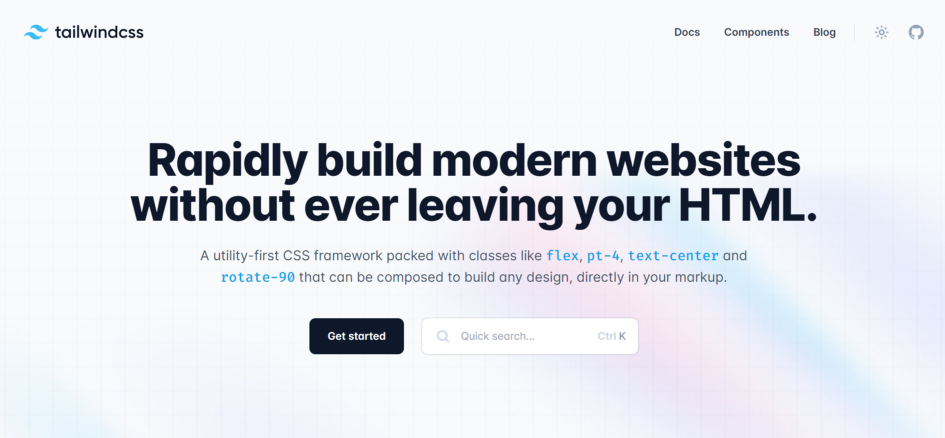
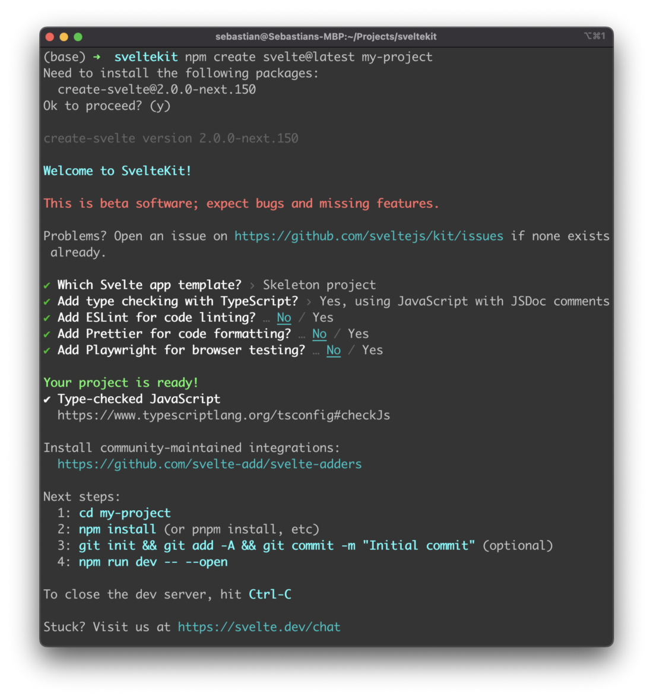
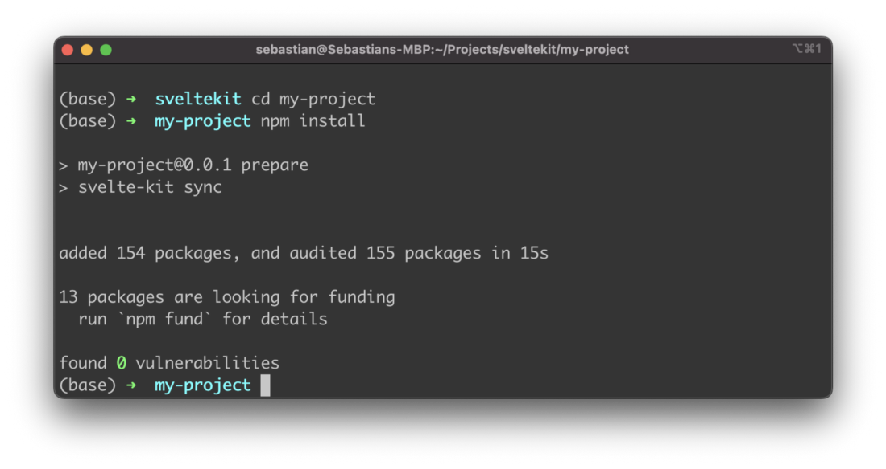
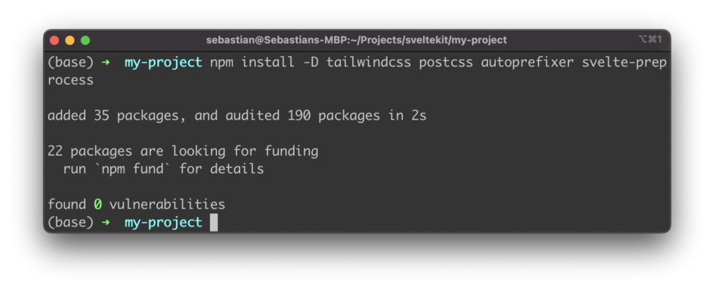
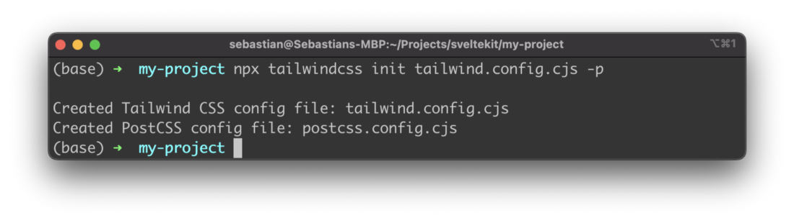
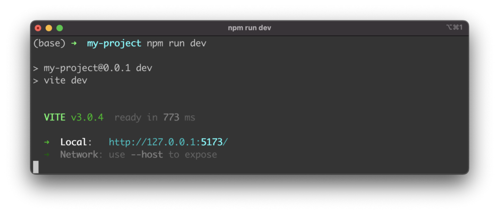
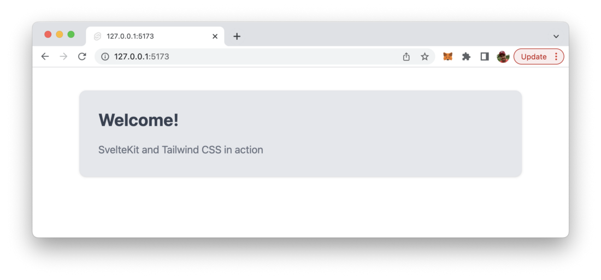

import { Image } from '@astrojs/image/components';
import YouTube from '~/components/widgets/YouTube.astro';
export const components = { img: Image };

This tutorial guides you through the process of setting up Tailwind CSS in a SvelteKit project.

Tailwind CSS is a utility-first CSS framework which makes it very easy to apply great styling to your Svelte web application by choosing from the framework’s ready-made CSS classes. This easy approach makes Tailwind CSS very popular among today’s CSS frameworks and speeds up the development & styling process significantly. If you’re new to Tailwind CSS you can find a good starting point at the project’s homepage at https://tailwindcss.com/.



Tailwind CSS Homepage available at https://tailwindcss.com/

Setting up your Svelte project with SvelteKit to be able to make use of Tailwind CSS is very easy and comprises only very few steps. In the following tutorial you can find the step-by-step approach of installing Tailwind CSS into your Svelte project and get started using Tailwind’s CSS classes for styling.

## Step 1: Create a new SvelteKit project

The first step is to create a new project with SvelteKit by using the NPM command in the following way:

```bash
$ npm create svelte@latest my-project
```

In order to complete the process you need to answer a few question on the command line as you can see in the following screenshot:



Once the creation is finished successfully you need to enter the new project folder and make sure that dependencies are being installed by running

```bash
$ npm install
```



## Step2: Install Tailwind CSS

Next you need to install the needed Tailwind CSS packages as well by executing:

```bash
$ npm install -D tailwindcss postcss autoprefixer svelte-preprocess
```



Furthermore we need to create and init Tailwind’s configuration file by using the following command:

```bash
$ npx tailwindcss init tailwind.config.cjs -p
```

The output on the command line should then look like the following and provide you with the configuration file names:



## Step 3: Configure CSS preprocessor

Tailwind requires a CSS preprocessor which is configured in svelte.config.js:

```js
import adapter from '@sveltejs/adapter-auto';
import preprocess from "svelte-preprocess";

/** @type {import('@sveltejs/kit').Config} */
const config = {
	preprocess: [
		preprocess({
		  postcss: true,
		}),
	],
	kit: {
		adapter: adapter()
	}
};

export default config;
```

## Step 4: Specify template paths in Tailwind’s configuration file

Furthermore we need to define which paths are containing our Svelte templates files in which Tailwind’s CSS classes can be used. Therefore the path is added in tailwind.config.cjs as you can see in the following code listing:

```js
/** @type {import('tailwindcss').Config} */
module.exports = {
  content: ['./src/**/*.{html,js,svelte,ts}'],
  theme: {
    extend: {},
  },
  plugins: [],
}
```

## Step 5: Import CSS

In the src folder create a new file app.js and insert the following three Tailwind CSS directives:

```
@tailwind base;
@tailwind components;
@tailwind utilities;
```

## Step 6: Make use of Tailwind CSS in your SvelteKit project

Finally we’re ready to make use of Tailwind’s CSS classes in our project, e.g. in the template section of file ./src/index.svelte:

```html
<div class="container mx-auto bg-gray-200 rounded-xl shadow border p-8 m-10">
    <p class="text-3xl text-gray-700 font-bold mb-5">
       Welcome!
    </p>
    <p class="text-gray-500 text-lg">
       SvelteKit and Tailwind CSS in action
    </p>
</div>
```

In order to check the result in the browser you first need to start up the development web server by using npm run dev command:



Then you can access the application’s output in the browser. You should be able to the an output like the following where the Tailwind CSS classes have been applied successfully:

