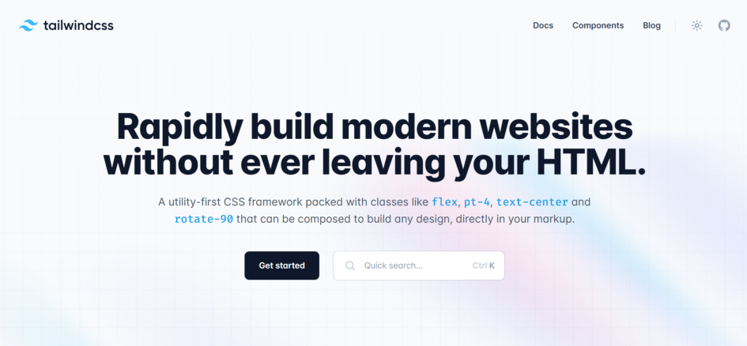
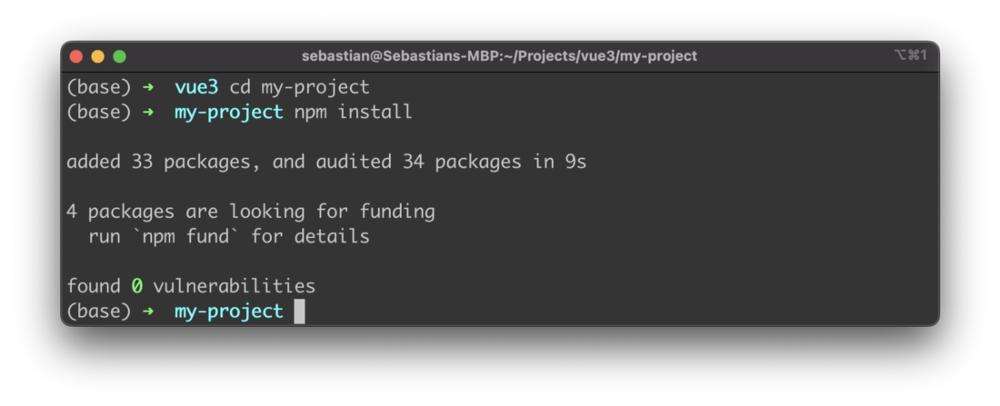
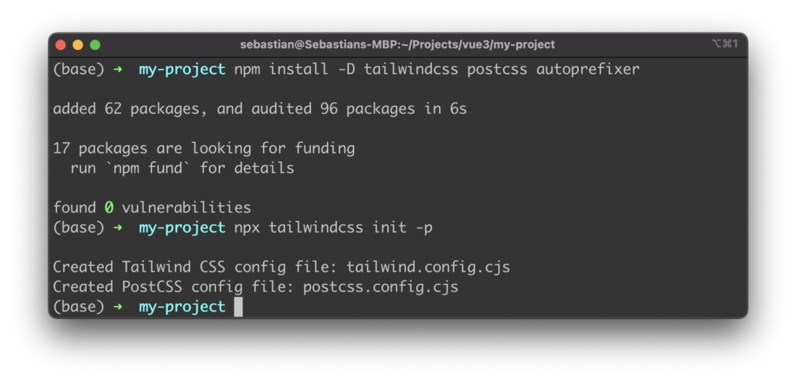
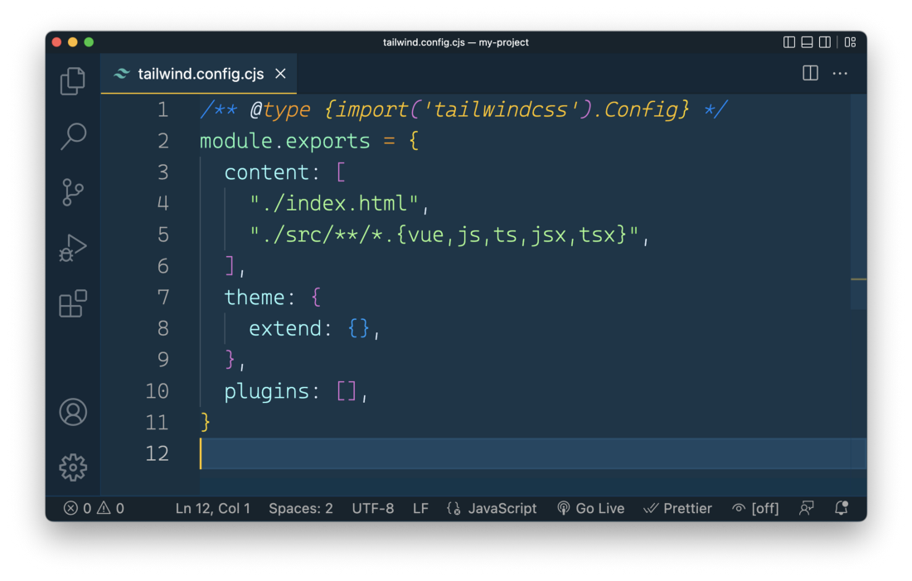
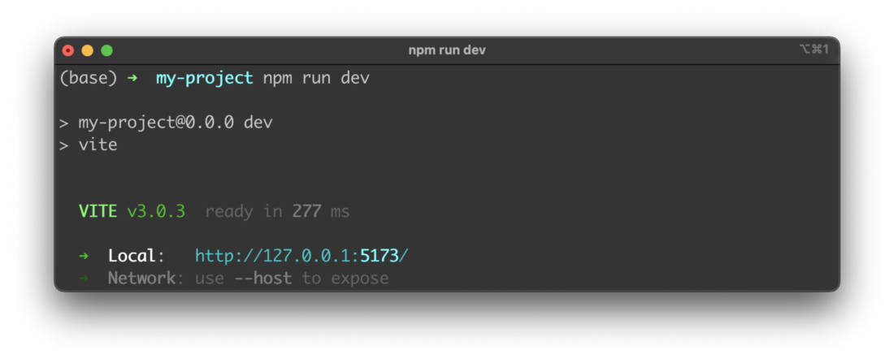
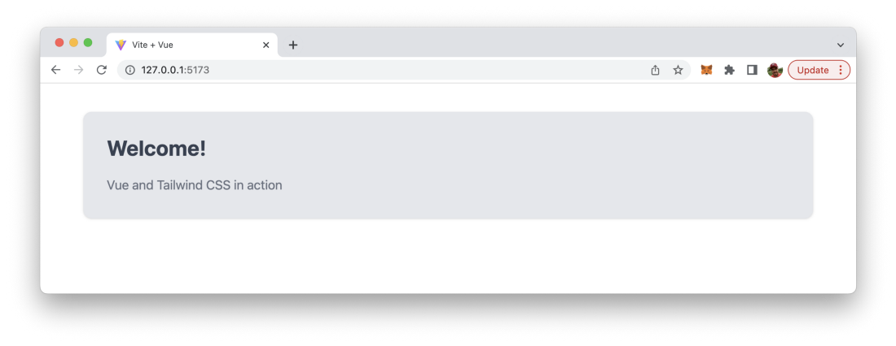

import { Image } from '@astrojs/image/components';
import YouTube from '~/components/widgets/YouTube.astro';
export const components = { img: Image };

This tutorial guides you through the process of setting up Tailwind CSS in a Vue 3 and Vite project.

Tailwind CSS is a utility-first CSS framework which makes it very easy to apply great styling to your Vue 3 web application by choosing from the framework’s ready-made CSS classes. This easy approach makes Tailwind CSS very popular among today’s CSS frameworks and speeds up the development & styling process significantly. If you’re new to Tailwind CSS you can find a good starting point at the project’s homepage at https://tailwindcss.com/.



Setting up your Vue 3 project with Vite to be able to make use of Tailwind CSS is very easy and comprises only very few steps. In the following tutorial you can find the step-by-step approach of installing Tailwind CSS into your Vue project and get started using Tailwind’s CSS classes for styling.

## Step 1: Create the Vite project

The first step is to setup a new Vue project by using vite-create. Just enter the command:

```bash
$ npm create vite my-project
```

This create a new project in folder my-project:


When executing the vite-create process you need to specify which framework and which variant to use. Use option vue for both cases.

Next you need to change into the newly create project folder and execute npm install to make sure that the default dependencies are being installed into the project folder:



## Step 2: Install Tailwind CSS dependencies

The project is ready now and we can continue installing the needed dependencies for Tailwind CSS using the Node Package Manager (NPM) in the following way:

```bash
$ npm install -D tailwindcss postcss autoprefixer
```

Furthermore the Tailwind CSS configuration files in the projects needs to be created by using command.

```bash
$ npx tailwindcss init -p
```



## Step 3: Specify template path in Tailwind’s configuration files

In the newly created Tailwind configuration file tailwind.config.cjs we need to specify the paths to our template file in the content array as you can see in the following screenshot:



## Step 4: Add Tailwind directives to CSS

Delete the default content of file ./src/style.css and insert the following three lines of code containing the Tailwind directives:

```
@tailwind base;
@tailwind components;
@tailwind utilities;
```

## Step 5: Use Tailwind’s CSS classes in your project

Finally we’re ready to make use of Tailwind’s CSS classes in our project, e.g. in the template section of file ./src/App.js:

```html
<template>
   <div class="container mx-auto bg-gray-200 rounded-xl shadow border p-8 m-10">
     <p class="text-3xl text-gray-700 font-bold mb-5">
       Welcome!
     </p>
     <p class="text-gray-500 text-lg">
       Vue and Tailwind CSS in action
     </p>
  </div>
</template>
```

In order to check the result in the browser you first need to start up the development web server by using npm run dev command:



Then you can access the application’s output in the browser. You should be able to the an output like the following where the Tailwind CSS classes have been applied successfully:

