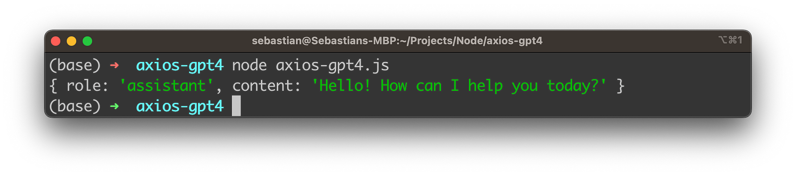

import { Image } from '@astrojs/image/components';
import YouTube from '~/components/widgets/YouTube.astro';
export const components = { img: Image };

In this blog post, we'll guide you through the process of using the GPT-4 API with Axios, a popular JavaScript HTTP library. We'll show you how to create chat completions with the API, configure settings for generating responses, and manage different request parameters. By the end of this post, you'll be ready to integrate GPT-4 into your application with Axios.

## Prerequisites:

To follow this tutorial, you need:

1. Basic knowledge of JavaScript and Node.js.
3. An OpenAI API key. You can obtain one by signing up at https://beta.openai.com/signup/.
3. Axios installed in your project. You can install it using `npm install axios`.

## Step 1: Configure Axios

First, let's set up Axios to work with the GPT-4 API. Create a new JavaScript file and import Axios:

```bash
const axios = require("axios");
```

Next, create an instance of Axios with a custom configuration:

```js
const openai = axios.create({
  baseURL: "https://api.openai.com/v1",
  headers: {
    "Content-Type": "application/json",
    "Authorization": `Bearer ${process.env.OPENAI_API_KEY}`,
  },
});
```

## Step 2: Create a Chat Completion Function

Now, let's create a function that sends a chat completion request to the GPT-4 API:

```js
async function createChatCompletion(messages, options = {}) {
  try {
    const response = await openai.post("/chat/completions", {
      model: options.model || "gpt-3.5-turbo",
      messages,
      ...options,
    });

    return response.data.choices;
  } catch (error) {
    console.error("Error creating chat completion:", error);
  }
}
```

## Step 3: Use the Chat Completion Function

To use the chat completion function, provide an array of messages and any additional options you want to customize:

```js
async function main() {
  const messages = [
    { role: "user", content: "Hello world" },
  ];

  const options = {
    temperature: 0.8,
    max_tokens: 100,
  };

  const choices = await createChatCompletion(messages, options);

  console.log(choices[0].message);
}

main();
```

Finally, let's take a look at the complete source code:

```js
const dotenv = require("dotenv");
dotenv.config();

const axios = require("axios");

const openai = axios.create({
  baseURL: "https://api.openai.com/v1",
  headers: {
    "Content-Type": "application/json",
    "Authorization": `Bearer ${process.env.OPENAI_API_KEY}`,
  },
});

async function createChatCompletion(messages, options = {}) {
  try {
    const response = await openai.post("/chat/completions", {
      model: options.model || "gpt-4",
      messages,
      ...options,
    });

    return response.data.choices;
  } catch (error) {
    console.error("Error creating chat completion:", error);
  }
}

async function main() {
  const messages = [
    { role: "user", content: "Hello world" },
  ];

  const options = {
    temperature: 0.8,
    max_tokens: 100,
  };

  const choices = await createChatCompletion(messages, options);

  console.log(choices[0].message);
}

main();
```

## Run The Node.js Application

To execute the program, follow these steps:

1. Ensure you have Node.js installed: If you don't already have Node.js installed, download and install it from the official website: https://nodejs.org/. We recommend using the LTS version.
2. Set up a new project: Create a new directory for your project, and navigate to it in your terminal or command prompt.
3. Initialize your project: Run `npm init -y` in the terminal to create a package.json file with default values.
4. Install Axios: Run `npm install axios` in the terminal to install the Axios library as a dependency.
5. Create a source file: Create a new file in the project directory called `axios-gpt4.js` and paste the provided source code into the file.
6. Set up your API key: Obtain your OpenAI API key from your OpenAI account. In your project directory, create a new file called `.env` and add your API key as follows:

```
OPENAI_API_KEY=your_api_key_here
```

Replace your_api_key_here with your actual OpenAI API key.

7. Install dotenv: Run `npm install dotenv` in the terminal to install the `dotenv` package, which allows you to load environment variables from the `.env` file.
   
8. Run the program: In the terminal, execute the script by running the following command:

```bash
node axios-gpt4.js
```

The program will send a chat completion request to the GPT-4 API and print the generated response in the terminal.



## Conclusion

You have now successfully integrated the GPT-4 API with Axios in your Node.js application. With this setup, you can create chat completions and customize the request parameters to suit your needs. As you continue to develop your project, be sure to consult the GPT-4 API documentation and the Axios documentation for more advanced configuration options and use cases.

Happy coding!