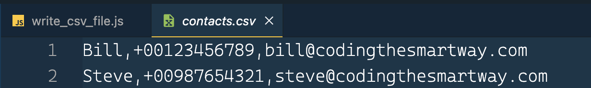

import { Image } from '@astrojs/image/components';
import YouTube from '~/components/widgets/YouTube.astro';
export const components = { img: Image };

A Comma Separated Values (CSV) file is a plain text file that contains a list of data. Node is a JavaScript runtime built on Chrome’s V8 JavaScript engine. Executing JavaScript apps outside the browser provides us with additional functionality such as reading and writing to files by using the Node standard module fs. In this short tutorial you’ll learn how to use functionality from the fs module to write CSV files with Node.

## Create A New Node Project

To get started we need to create a new Node project. This is quite easy, just enter the following command on the command line:

```bash
mkdir write_csv_file
cd write_csv_file
npm init
touch write_csv_file.js
```

First we’re creating a new empty folder called write_csv_file. Then we’re changing into the newly created project folder and by executing the npm init command we’re ready a new default package.json file in the project folder. Finally we’re adding a file called write_csv_file.js to the project folder. That’s the file where our code will go into.

First open file package.json and add the type configuration property and set it to value module in the following way:

```js
“type”: “module”,
```

This addition allows us to use the ES6 module import syntax in our Node application instead of the CommonJS import syntax.

## Import appendFileSync From fs Module

The first step to implement our Node sample application is to open file write_csv_file.js and start by adding the following import statement on top of the file:

```js
import { appendFileSync } from “fs”;
```

This gives us access to the appendFileSync function from the fs module. We’ll use this function to write CSV data to a file.

## Implement Contact Class

Second, let’s implement a class named Contact which represents a data set in our application:

```js
class Contact {
  constructor(name = “”, phone=””, email=””) {
    this.name = name;
    this.phone = phone;
    this.email = email;
  }
}
```

As you can see we’re adding a constructor to this class which is able to set three class members to initial values: name, phone, and email.

## Add saveAsCSV Method To Contact Class

In the next step we will extend the Contact class by adding a method named saveAsCSV:

```js
class Contact {
  …
  saveAsCSV() {
    const csv = `${this.name},${this.phone},${this.email}\n`;
    try {
      appendFileSync(“./contacts.csv”, csv);
    } catch (err) {
      console.error(err);
    }
  }
}
```

This method is used to store the class members (name, phone, email) in CSV format to file contacts.csv.

First we’re creating a string named csv which holds combines the class member values to a CSV string. Then we’re using funtion appendFileSync to write this string to file contacts.csv. If the file is not existing yet, Node is creating this file. If the file is already existing the csv string is added to the end of the file.

## Create Data And Save To CSV

Let’s bring everything together by adding a startApp function. In this function we’re creating two Contact class objects and then use method saveAsCSV for saving data of both instances to the CSV file:

```javascript
const startApp = () => {
  const contact1 = new Contact(“Bill”, “+00123456789”, “bill@codingthesmartway.com”);
  contact1.saveAsCSV();
  
  const contact2 = new Contact(“Steve”, “+00987654321”, “steve@codingthesmartway.com”);
  contact2.saveAsCSV();
}
startApp();
```

In the following listing you can see again the complete code in file *write_csv_file.js*:

If you now start the Node app by using the following command:

```bash 
$ node write_csv_file.js 
```

you should be able to see that a new file _contacts.csv_ is created (if not existing) in the project folder and that the two data sets are inserted in CSV format in the file:

