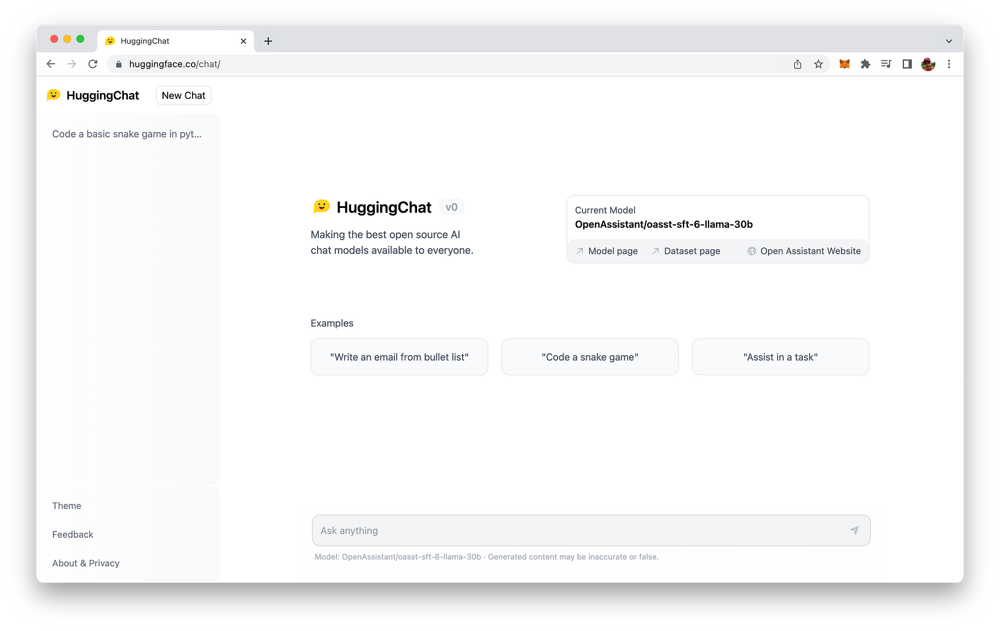
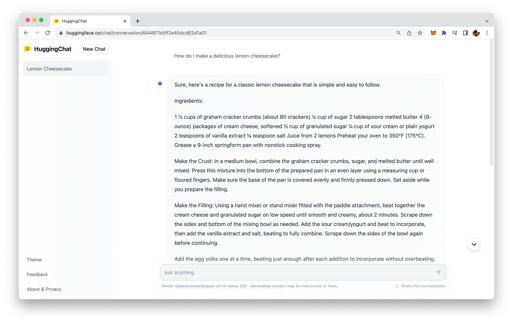

import { Image } from '@astrojs/image/components';
import YouTube from '~/components/widgets/YouTube.astro';
export const components = { img: Image };

A Brand-New Contender in the AI Chatbot Arena is Arriving.

As someone who's been keeping a close eye on the advancements in AI chatbots, I must say, OpenAI's ChatGPT has been making waves. But hey, there's a new kid on the block, and it's all set to disrupt the status quo. Meet HuggingChat, an open-source chatbot developed by the AI startup Hugging Face. In this blog post, I'll share my thoughts on HuggingChat's features, its impact on the AI community, and how it's working to democratize AI chatbot technology.

## The Emergence of HuggingChat

Hugging Face, a popular AI startup known for its ML tools and AI code hub, has just launched HuggingChat, an open-source alternative to ChatGPT. Created in collaboration with Open Assistant, a project led by the German nonprofit LAION, HuggingChat is built on the LLaMa 30B SFT 6 model, which is a modified version of Meta's 30 billion parameter LLaMA model. The best part? You can find this chatbot at hf.co/chat, and it's absolutely free to use.

## What Can HuggingChat Do?

Like ChatGPT, HuggingChat generates text in natural language or in a specific format when you need it. It can handle a variety of tasks like drafting emails, whipping up rap lyrics, and even writing code. Yep, that's right! HuggingChat can generate code in multiple programming languages, including Python, HTML, JavaScript, and CSS. This handy feature comes with syntax highlighting, which I think is a fantastic bonus for developers.

## The Interface and How It Feels to Use

When I first checked out HuggingChat, I noticed that its interface is pretty similar to ChatGPT, with a left bar showing the latest chats and a large browser window for the current chat. However, users can't log in to save their conversations for a longer period of time, at least not yet. The chatbot is responsive, and it's worth mentioning that its performance is roughly on par with GPT-3.5-turbo.

## Championing Open Source AI

Hugging Face's release of HuggingChat highlights their dedication to open-source AI. Both the CTO and co-founder, Julien Chaumond, and the CEO, Clem Delangue, have emphasized the importance of open-source alternatives to closed AI models like ChatGPT. By making AI applications transparent and accountable, they're aiming to promote inclusivity, distribution of power, and democratization of the AI industry.

## What's Next?

While HuggingChat is an impressive feat, it's not perfect. Like other text-generating models, it can derail quickly, depending on the questions asked. However, Hugging Face acknowledges these limitations and is actively working on refining the model.

But HuggingChat is just the start. Hugging Face plans to make all high-quality chat models available through a single hub, which could revolutionize the AI landscape. As the open-source AI movement gains momentum, I'm really excited to see how the industry evolves and how HuggingChat continues to challenge the status quo.

## Conclusion

As a fan of AI chatbots, I'm thrilled about HuggingChat, the open-source alternative to ChatGPT by Hugging Face. By offering a free, open-source chatbot with impressive features and advocating for transparency and accountability in AI applications, Hugging Face is all set to transform the way we interact with and develop AI chatbots. With its growing capabilities and the company's ambitious plans for the future, HuggingChat is poised to become a game-changer in the world of AI.