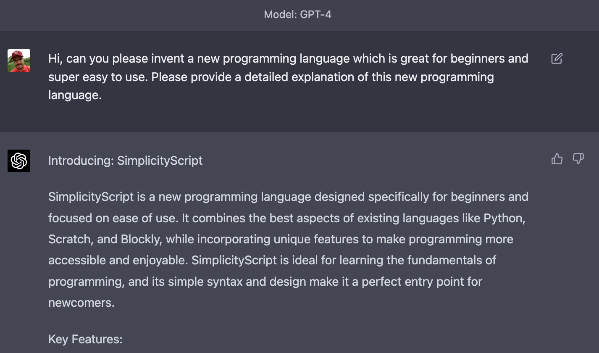
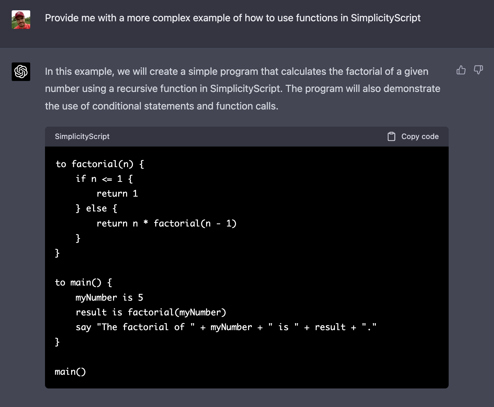
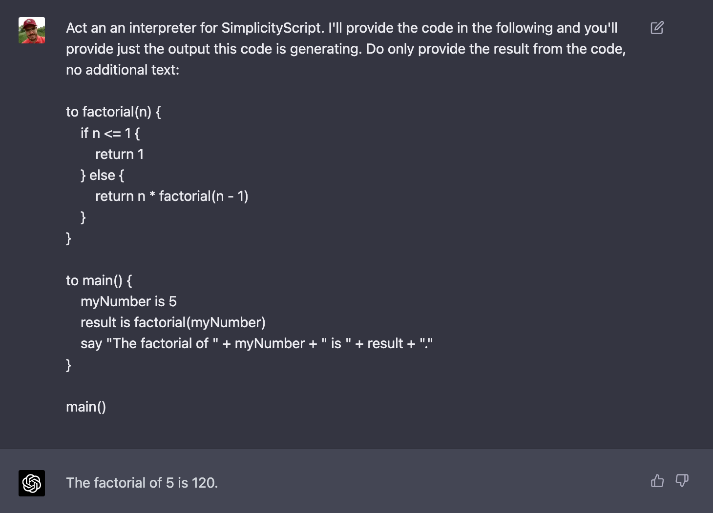

import { Image } from '@astrojs/image/components';
import YouTube from '~/components/widgets/YouTube.astro';
export const components = { img: Image };

Programming languages have always been the lifeblood of innovation, empowering developers to create groundbreaking applications, systems, and solutions. As we strive to push the boundaries of what’s possible, we find ourselves exploring uncharted territories, often with the help of artificial intelligence. Today, we take an exhilarating leap into the future by teaming up with OpenAI’s latest AI model, GPT-4, to get a new programming language created from scratch. Prepare to be amazed of what’s possible …

GPT-4, OpenAI’s most advanced system to date, designed to deliver safer and more useful responses to a wide range of tasks. Building upon the success of its predecessors, GPT-4 boasts enhanced general knowledge and problem-solving abilities, enabling it to tackle even the most complex challenges with remarkable accuracy. Its creativity and collaborative capabilities have also seen a significant leap forward, allowing GPT-4 to generate, edit, and iterate on creative and technical writing tasks alongside users, whether it’s composing songs, crafting screenplays, or adapting to a user’s writing style.

## Let’s Start The Journey — Get GPT4 To Invent a New Programming Language

GPT-4's capabilities extend far beyond just natural language processing; it has also demonstrated an impressive aptitude for generating code. As a state-of-the-art AI language model, it can understand and process programming languages, enabling it to assist developers in writing, debugging, and even optimizing code. This makes GPT-4 a valuable asset for programmers, as it can simplify complex tasks and facilitate efficient code generation in various programming languages.

In this blog post, we're taking GPT-4's talents to new heights by flipping the script and giving it an intriguing challenge: not only will GPT-4 invent a completely new programming language for us, but it will also assume the role of an interpreter for that newly created language. This ambitious endeavor will showcase GPT-4's ability to understand, analyze, and process the syntax of its own inventive creation.

Let's start with the following prompt:

**Hi, can you please invent a new programming language which is great for beginners and super easy to use. Please provide a detailed explanation of this new programming language.**

GPT-4 is now generating a response to that prompt and providing you the detailed description of a complete new programming language named SimplicityScript. Here is the result which GPT-4 is providing:



*SimplicityScript is a new programming language designed specifically for beginners and focused on ease of use. It combines the best aspects of existing languages like Python, Scratch, and Blockly, while incorporating unique features to make programming more accessible and enjoyable. SimplicityScript is ideal for learning the fundamentals of programming, and its simple syntax and design make it a perfect entry point for newcomers.*

*Here's a more detailed overview of SimplicityScript:*

*Basic Syntax:*

* *Variables are declared using the "is" keyword, and types are automatically inferred. Example:*

```
myNumber is 5
myText is "Hello, world!"
```

* *Functions are declared using the "to" keyword, followed by the function name and a list of parameters. Example:*

```
to greet(name) {
    say "Hello, " + name + "!"
}
```

* *Conditional statements use the "if" keyword, followed by a condition. Example:*

```
if myNumber > 0 {
    say "The number is positive."
} else {
    say "The number is non-positive."
}
```

* *Loops use the "repeat" keyword, followed by a range or a condition. Example:*

```
repeat 5 times {
    say "Hello!"
}

repeat while myNumber > 0 {
    myNumber is myNumber - 1
}
```

* *Simple built-in functions make it easy to perform common tasks. Example:*

```
length is lengthOf("Hello!")
random is randomBetween(1, 10)
```

## Diving Into A More Complex Example Of SimplicityScript

That's already a great starting point to gain a good understanding of the most important building blocks of the new invented programming language. Let's ask GPT-4 to provide a more complex example to dive deeper into the concept:

**Provide me with a more complex example of how to use functions in SimplicityScript.**



*In this example, we will create a simple program that calculates the factorial of a given number using a recursive function in SimplicityScript. The program will also demonstrate the use of conditional statements and function calls.*

```
to factorial(n) {
    if n <= 1 {
        return 1
    } else {
        return n * factorial(n - 1)
    }
}

to main() {
    myNumber is 5
    result is factorial(myNumber)
    say "The factorial of " + myNumber + " is " + result + "."
}

main()
```

*Here's a breakdown of the code:*

* *We define a function called `factorial` that takes a single parameter *n`. This function will calculate the factorial of `n` using a recursive approach.*
* *Inside the `factorial` function, we use an if statement to check if n is less than or equal to 1. If it is, we return 1, as the factorial of 1 or 0 is 1.*
* *If `n` is greater than 1, we return the product of `n` and the factorial of `n-1`. This is a recursive call to the factorial function, and it will continue until `n` is 1.*
* *We then define a `main` function that will serve as the entry point of our program. Inside this function, we declare a variable `myNumber` and assign it the value 5.*
* *We call the `factorial` function with `myNumber` as the input and store the result in a variable called `result`.*
* *We use the `say` function to output the factorial result along with a descriptive message.*
* *Finally, we call the `main` function to execute the program.*

*This example demonstrates the use of functions, conditional statements, and recursion in SimplicityScript. It shows how to define, call, and use functions to create a more complex program.*

## Make GPT-4 to Act As An Interpreter For SimplicityScript

Wow, now that we have a new programming language named SimplicityScript described and defined by GPT-4, let's see if we can get the model to act as an interpreter for this programming language as well in the following:



Wow, that's great! The code is interpreted correctly and the result is printed out as the answer!

## Conclusion

GPT-4's groundbreaking abilities have opened up a world of possibilities for the future of programming languages and software development. By tasking GPT-4 with inventing a new programming language and serving as its interpreter, we have pushed the boundaries of AI-generated languages, showcasing the immense potential of artificial intelligence in shaping the evolution of code.

This innovative experiment has not only demonstrated GPT-4's remarkable creativity and versatility but has also given us a glimpse into how AI can transform the way we approach software development. As we continue to explore the applications and implications of AI-generated programming languages, we stand on the brink of a technological revolution that could redefine the way we create, understand, and interact with code.