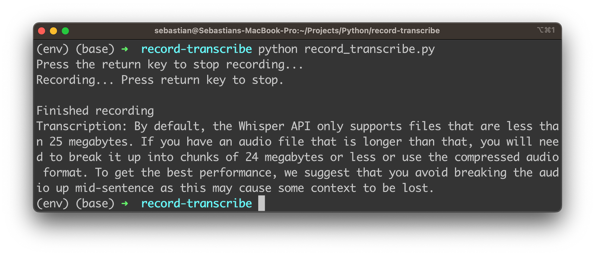
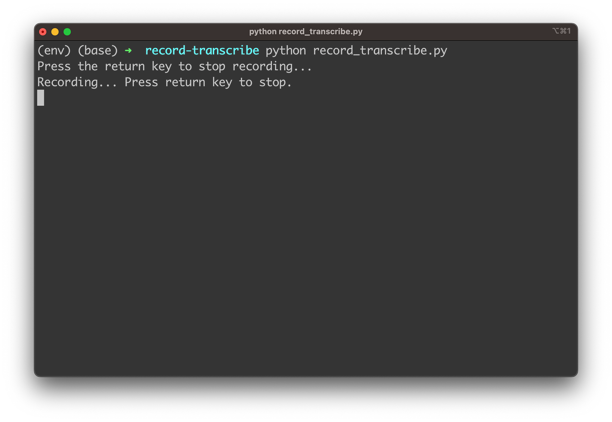

import { Image } from '@astrojs/image/components';
import YouTube from '~/components/widgets/YouTube.astro';
export const components = { img: Image };

The ability to quickly and accurately convert spoken words into written text has become increasingly important. Whether you're a developer, content creator, or simply someone who wants to save time and effort, a powerful speech-to-text tool can be a game-changer. That's where OpenAI's Whisper Speech-to-Text API comes in, providing a cutting-edge solution to your voice-to-text needs. In this blog post, we will guide you through the process of building a Python app that not only records your voice but also transcribes it instantly using the Whisper API, all in one seamless step.

By the end of this tutorial, you'll have a fully functional Python app that allows you to record audio on the fly and automatically transcribes it, making the task of voice-to-text conversion as easy as pressing a button. So, if you're ready to dive into the world of speech-to-text and unlock the potential of OpenAI's Whisper API, let's get started on this exciting journey!

## OpenAI's Whisper API

OpenAI's Whisper API is a powerful and versatile speech-to-text service that harnesses the capabilities of the state-of-the-art Whisper Automatic Speech Recognition (ASR) system. This API enables developers and businesses to convert spoken language into written text with remarkable accuracy and efficiency. By leveraging cutting-edge machine learning models and techniques, Whisper API provides a reliable solution for a wide range of applications, including transcription services, voice assistants, real-time captioning, and more.

Whisper ASR is built on a vast dataset containing 680,000 hours of multilingual and multitask supervised data collected from the web, ensuring impressive performance across numerous languages and use cases. With the Whisper API, developers can integrate this robust speech-to-text technology into their applications, products, or services, opening up new possibilities for communication, accessibility, and productivity in various domains.

## What Are We Going To Build

The app we are going to build harnesses the power of OpenAI's Whisper Speech-to-Text API to create a seamless audio recording and transcription experience. With this app, you will be able to record audio of variable lengths simply by using your microphone, and the app will then automatically transcribe the recorded audio into text using the Whisper API. You will have the freedom to decide when to stop recording by just pressing the return key, providing you with a flexible and user-friendly experience.

The application which we'll be building will be running on the command line. In the following you can see it in action, providing a high-quality transcription of a recording:



Curious? Let's get this app implemented …

## Creating A New Python Project With Virtual Environment

In order to start creating a new Python project start with creating a new project folder:

```bash
mkdir record-transcribe
cd record-transcribe
```

Next, create a new Python virtual environment:

```bash
python3 -m venv env
```

The command `python3 -m venv env` creates a new virtual environment named `env` using the Python 3 `venv` module.

Here's a breakdown of the command:

* `python3`: This specifies that the command should use Python 3 as the interpreter.
* `-m venv`: This flag indicates that the command should run the built-in venv module, which is used for creating virtual environments.
* `env`: This is the name of the virtual environment you want to create. In this case, the virtual environment will be named `env`.

A virtual environment is an isolated Python environment that allows you to install packages and dependencies specific to a particular project, without interfering with your system-wide Python installation or other projects. This isolation helps maintain consistency and avoid potential conflicts between different project requirements.

Once the virtual environment is created, you can activate it using the following command:

```bash
source env/bin/activate
```

With the virtual environment activated, we're ready to install the needed dependencies for our project by using the command:

```bash
pip install openai pyaudio wave
```

## Implementing The Application Logic

In order to start with the implementation, let's create a new file in the project folder:

```bash
touch record-transcribe.py
```

We'll use this file to insert the needed Python code in the following steps:

__Step 1: Import the required libraries__

First, we need to import the necessary libraries. We'll use `openai` for interacting with the Whisper API, `os` for accessing environment variables, `pyaudio` for recording audio, and `wave` for saving the recorded audio as a WAV file.

```python
import openai
import os
import pyaudio
import wave
```

__Step 2: Set your OpenAI API key__

Replace `"your_openai_api_key"` with your actual OpenAI API key, which you can obtain from the OpenAI platform. This key is used to authenticate your requests to the Whisper API.

```python
openai.api_key = "your_openai_api_key"
```

__Step 3: Create the record_audio function__

This function records audio from the default microphone using the `pyaudio` library and saves it as a WAV file. It takes two parameters: `filename` for the output WAV file and `duration` for the recording duration in seconds (default is 5 seconds).

```python
def record_audio(filename, duration=5):
    # ... (code for recording audio)
```

1. Set up audio recording parameters: Within the `record_audio` function, we define several constants to configure the audio recording process. `FORMAT`, `CHANNELS`, `RATE`, and `CHUNK` are used to define the audio format, number of channels, sample rate, and chunk size for the recording.
2. Record the audio: We create a `pyaudio.PyAudio` object and open an input stream to record audio. Then, we read data from the stream in chunks and append it to a list called `frames`. The recording process runs for the specified duration.
3. Close the stream and save the audio: After recording, we stop the stream, close it, and terminate the `pyaudio.PyAudio` object. Then, we save the recorded audio as a WAV file using the wave library.

Here is the complete implementation of this function:

```python
def record_audio(filename, duration=5):
    FORMAT = pyaudio.paInt16
    CHANNELS = 1
    RATE = 16000
    CHUNK = 1024

    audio = pyaudio.PyAudio()
    stream = audio.open(format=FORMAT, channels=CHANNELS,
                        rate=RATE, input=True,
                        frames_per_buffer=CHUNK)

    print("Recording...")

    frames = []

    for _ in range(0, int(RATE / CHUNK * duration)):
        data = stream.read(CHUNK)
        frames.append(data)

    print("Finished recording")

    stream.stop_stream()
    stream.close()
    audio.terminate()

    with wave.open(filename, 'wb') as wf:
        wf.setnchannels(CHANNELS)
        wf.setsampwidth(audio.get_sample_size(FORMAT))
        wf.setframerate(RATE)
        wf.writeframes(b''.join(frames))
```

__Step 4: Create the transcribe_audio function__

This function takes a `filename` parameter and sends the audio file to the Whisper API for transcription. The response from the API contains the transcribed text, which the function returns.

```python
# Transcribe audio
def transcribe_audio(filename):
    with open(filename, "rb") as audio_file:
        transcript = openai.Audio.transcribe("whisper-1", audio_file)
        return transcript["text"]
```

__Step 5: Define the main function__

In the `main` function, we call the `record_audio` function to record audio and save it as a WAV file. Then, we call the `transcribe_audio` function to transcribe the recorded audio. Finally, we print the transcription to the console.

```python
def main():
    audio_filename = "recorded_audio.wav"
    record_audio(audio_filename)
    transcription = transcribe_audio(audio_filename)
    print("Transcription:", transcription)
```

__Step 6: Run the application__

The if `__name__ == "__main__":` block at the end of the script ensures that the `main` function is executed when the script is run as a standalone program.

```python
if __name__ == "__main__":
    main()
```

After following these steps, you'll have a functional Python application that records audio and transcribes it using OpenAI's Whisper Speech-to-Text API. You can modify this code to suit your specific needs, such as extending the recording duration, handling user input, or integrating it into a larger application.

In the following let's take again a look at the complete code which should now be available in _record-transcribe.py_:

```python
import openai
import os
import pyaudio
import wave

# Set your OpenAI API key
openai.api_key = "your_openai_api_key"

# Record audio
def record_audio(filename, duration=5):
    FORMAT = pyaudio.paInt16
    CHANNELS = 1
    RATE = 16000
    CHUNK = 1024

    audio = pyaudio.PyAudio()
    stream = audio.open(format=FORMAT, channels=CHANNELS,
                        rate=RATE, input=True,
                        frames_per_buffer=CHUNK)

    print("Recording...")

    frames = []

    for _ in range(0, int(RATE / CHUNK * duration)):
        data = stream.read(CHUNK)
        frames.append(data)

    print("Finished recording")

    stream.stop_stream()
    stream.close()
    audio.terminate()

    with wave.open(filename, 'wb') as wf:
        wf.setnchannels(CHANNELS)
        wf.setsampwidth(audio.get_sample_size(FORMAT))
        wf.setframerate(RATE)
        wf.writeframes(b''.join(frames))

# Transcribe audio
def transcribe_audio(filename):
    with open(filename, "rb") as audio_file:
        transcript = openai.Audio.transcribe("whisper-1", audio_file)
        return transcript["text"]

# Main function
def main():
    audio_filename = "recorded_audio.wav"
    record_audio(audio_filename)
    transcription = transcribe_audio(audio_filename)
    print("Transcription:", transcription)

if __name__ == "__main__":
    main()
```

Let's test the application by entering:

```python
python record-transcribe.py
```

You should then be able to record your 5s audio. After the recording is finished the transcribed text is provided.

## Making The Recording Length Variable

The application so far is only supporting audio recording of a fixed length (5 seconds). Let's change the application logic to support variable recording length:

```python
import openai
import os
import pyaudio
import wave
import threading
import sys
import queue

# Set your OpenAI API key
openai.api_key = "your_openai_api_key"

# Record audio
def record_audio(filename, stop_event, audio_queue):
    FORMAT = pyaudio.paInt16
    CHANNELS = 1
    RATE = 16000
    CHUNK = 1024

    audio = pyaudio.PyAudio()
    stream = audio.open(format=FORMAT, channels=CHANNELS,
                        rate=RATE, input=True,
                        frames_per_buffer=CHUNK)

    print("Recording... Press return key to stop.")

    while not stop_event.is_set():
        data = stream.read(CHUNK)
        audio_queue.put(data)

    print("Finished recording")

    stream.stop_stream()
    stream.close()
    audio.terminate()

    with wave.open(filename, 'wb') as wf:
        wf.setnchannels(CHANNELS)
        wf.setsampwidth(audio.get_sample_size(FORMAT))
        wf.setframerate(RATE)
        wf.writeframes(b''.join(list(audio_queue.queue)))

# Transcribe audio
def transcribe_audio(filename):
    with open(filename, "rb") as audio_file:
        transcript = openai.Audio.transcribe("whisper-1", audio_file)
        return transcript["text"]

# Main function
def main():
    audio_filename = "recorded_audio.wav"
    stop_event = threading.Event()
    audio_queue = queue.Queue()

    record_thread = threading.Thread(target=record_audio, args=(audio_filename, stop_event, audio_queue))
    record_thread.start()

    input("Press the return key to stop recording...\n")
    stop_event.set()
    record_thread.join()

    transcription = transcribe_audio(audio_filename)
    print("Transcription:", transcription)

if __name__ == "__main__":
    main()
```

In this version of the Python application, we have modified the code to allow variable-length audio recording. Instead of specifying a fixed duration, the recording will continue until the user presses the return key. We will highlight the key differences from the first implementation and explain how this new version works.

__Import additional libraries__

We import `threading` and `queue` libraries to handle recording in a separate thread and storing audio data in a queue.

```python
import threading
import sys
import queue
```

__Update the record_audio function__

We modify the `record_audio` function to accept two additional parameters: `stop_event`, which is a `threading.Event` object to signal when to stop recording, and `audio_queue`, which is a `queue.Queue` object to store the recorded audio data.

```python
def record_audio(filename, stop_event, audio_queue):
    # ... (code for recording audio)
```

__Replace the duration-based loop with a stop event-based loop__

Instead of using a loop based on the recording duration, we now use a loop that continues until the `stop_event` is set. This allows the user to stop recording at any point by pressing the return key.

```python
hile not stop_event.is_set():
    data = stream.read(CHUNK)
    audio_queue.put(data)
```

__Save the recorded audio using data from the queue__

After recording is finished, we save the audio by writing the frames stored in the `audio_queue`.

```python
wf.writeframes(b''.join(list(audio_queue.queue)))
```

__Update the main function__

In the main function, we create a `threading.Event` object called `stop_event` and a `queue.Queue` object called `audio_queue`. We then start the `record_audio` function in a separate thread using a `threading.Thread` object. The `record_thread` will run in parallel with the main thread, allowing the user to press the return key to stop recording.

```python
stop_event = threading.Event()
audio_queue = queue.Queue()

record_thread = threading.Thread(target=record_audio, args=(audio_filename, stop_event, audio_queue))
record_thread.start()
```

__Wait for the user to press the return key__

We use the _input_ function to wait for the user to press the return key. Once the return key is pressed, we set the `stop_event`, which signals the `record_audio` function to stop recording.

```python
input("Press the return key to stop recording...\n")
stop_event.set()
```

__Join the recording thread__

We use the `join` method on the _record_thread_ to wait for the recording thread to finish before proceeding with the transcription.

```python
record_thread.join()
```

These modifications allow the user to control the recording length by pressing the return key when they wish to stop recording. The rest of the transcription process remains the same as in the first implementation.

## Run The Application

Let's run the application again:

```bash
python record_transcribe.py
```

The app is starting up and informing the user that recording is started. Now you need to record your speech. Once you're finished you simply need to hit the Return key:



The recording is stopped and the transcription text is providing as you can see in the following screenshot:


## Conclusion

We've explored the incredible potential of OpenAI's Whisper API for Speech-to-Text and demonstrated how to create a powerful Python app that can record and transcribe audio in real-time with variable recording lengths. By following the step-by-step tutorial, you'll be able to build your own app that leverages the power of the Whisper API to transcribe and process audio on-the-fly, creating new possibilities for voice-based applications, transcription services, and more.

As AI technologies continue to advance, speech recognition and transcription capabilities will become increasingly important in a wide range of fields, from customer service to content creation. By embracing and implementing the Whisper API in your projects, you'll be at the forefront of this exciting technological frontier.