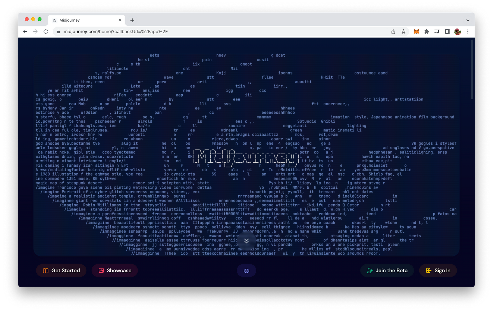
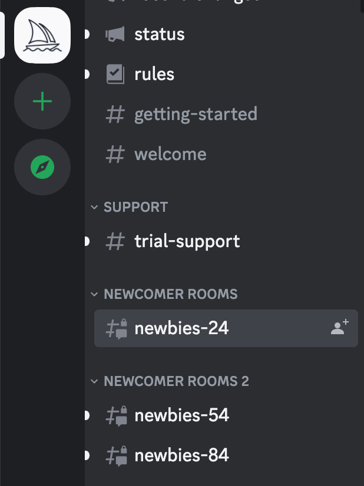
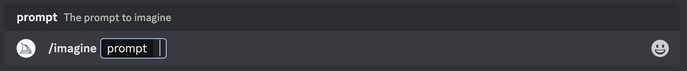
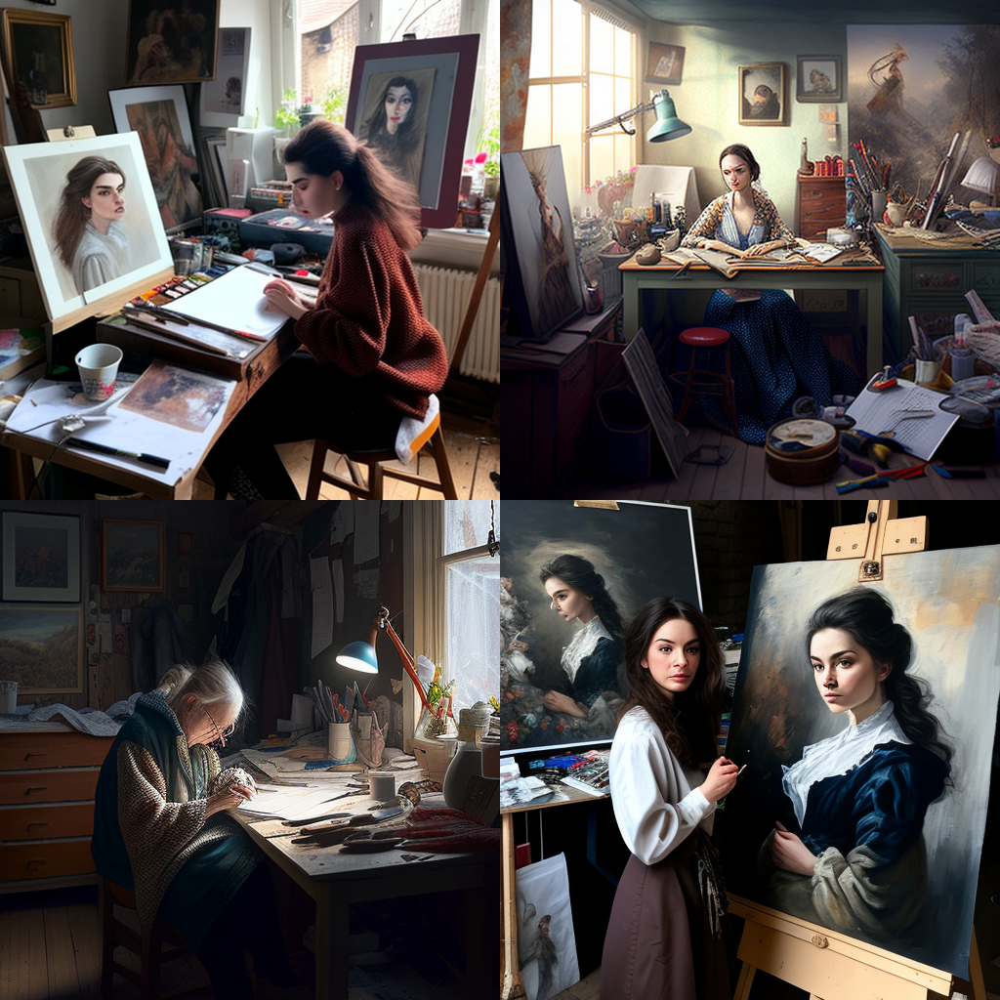
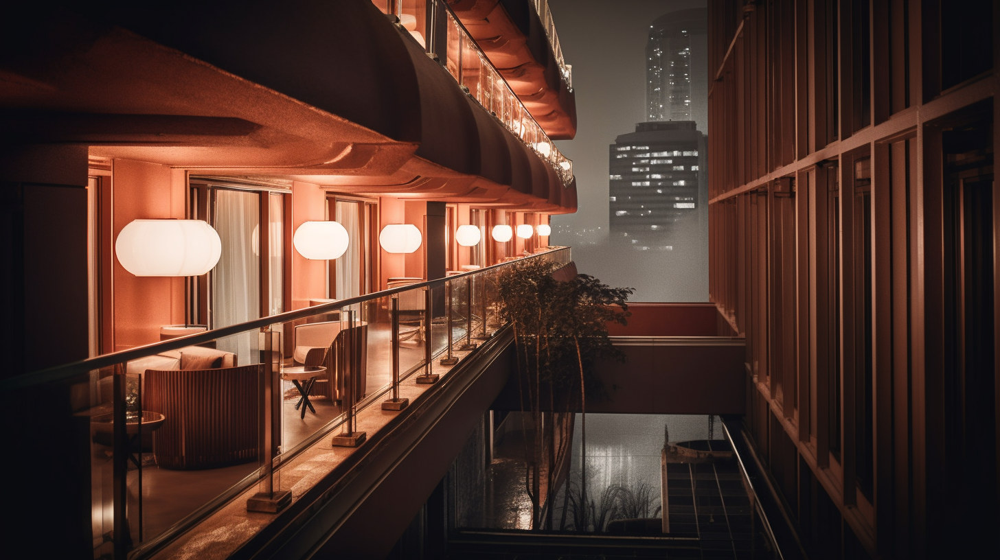
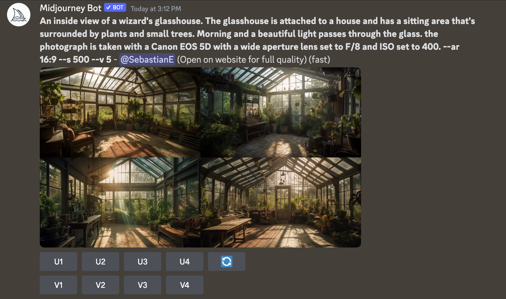
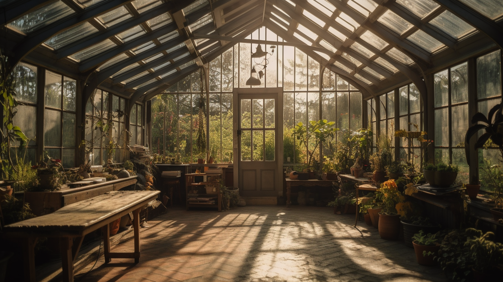

import { Image } from '@astrojs/image/components';
import YouTube from '~/components/widgets/YouTube.astro';
export const components = { img: Image };

March 15th the latest version 5 of Midjourney, one of the most advanced text-to-image AIs, was released. Building on the strengths of its predecessors, Midjourney V5 brings you a range of powerful new features and improvements that will take your image generation experience to new heights. In this blog post, we'll take you through the features and enhancements of Midjourney V5 and demonstrate how it raises the bar for AI-generated imagery.

## What is Midjourney V5?

The Midjourney project began as an ambitious endeavor to create an AI capable of transforming textual descriptions into stunning visual images. Over last months, it has released multiple versions, each refining the capabilities of the AI and making it more powerful and versatile.

The latest version Midjourney V5 marks a significant milestone in the evolution of our AI technology. It builds upon the previous versions' success and adds groundbreaking new features to deliver an unparalleled image generation experience for users.

## How To Get Access To Midjourney

In order to explore some of Midjourney's new capabilities you need to get

__Step 1: Join the Midjourney Discord server__

* Visit Midjourney.com and click on "Join the Beta" or go directly to the Midjourney Discord.
* If you don't have a Discord login, learn how to create one [here](https://discord.com/register)



__Step 2: Find a Newbies Channel__

* On the Midjourney Official Server, select any "newbies-#" channel visible in the left sidebar.
* On other servers, you can generate images with the Midjourney Bot if the server has invited the bot. Look for instructions on the server on where to use the bot.



__Step 3: Use the /imagine command__

* Type `/imagine prompt`: or select the /imagine command from the slash commands pop-up.
* Type a description of the image you want to create in the `prompt` field.
* Press return to send your message.

Note: If you don't see a pop-up when typing the /imagine command, try logging out, updating the Discord app, and logging back in. Commands only work in bot channels and will not work in regular channels like #trial-support.



__Step 4: Process the Job__

* The Midjourney Bot takes about a minute to generate four options.
* Generating an image activates the free Midjourney trial. Trial users can make roughly 25 jobs before needing to subscribe.
* A job is any action that uses the Midjourney Bot, such as creating a grid of images, upscaling images, or creating image variations. All of these actions use your free trial time.
* To check your remaining trial time, use the /info command to see your "Fast Time Remaining."

In order to make use of version 5 you have to add the

```
--v 5
```

parameter to the end of your prompt, or use the `/settings` command and select 5️⃣ MJ Version 5 to enable the new features and enhancements of Midjourney V5.

## New Features and Enhancements of Midjourney V5

Now that you've access to Midjourney's functionality we're ready to take a look at the most important features and enhancements of version 5 in the following.

__Higher native resolution__

Midjourney V5 boasts a higher native resolution compared to V4, resulting in sharper and more detailed images. This improvement not only allows for better image quality but also provides additional potential for further upscaling.

The 5th version of Midjourney delivers a significant enhancement in resolution, now capable of generating images up to 1024x1024 pixels, which is twice the resolution of previous versions.

__Unlimited aspect ratios__

With V5, users can now generate images in any desired aspect ratio, providing greater flexibility for creative projects and opening up new possibilities for unique and eye-catching visuals.

To apply a specific aspect ratio you need to add the following parameter to your prompt:

```
--ar [aspect ration]
```

E.g. if you want to get your image generated in a 16:9 aspect ration you need to use:

```
--ar 16:9
```

__Sharper, more detailed images__

Midjourney V5 produces images with enhanced sharpness and detail compared to its predecessor. By examining side-by-side comparisons of images generated by V4 and V5, users can appreciate the significant improvements in image quality and clarity.

Let's do a side by side comparison with the following very simple prompt. First, the prompt for version 4:

```
an artist in her studio --v 4
```

Result of version Midjourney V4:



Second, the prompt using version 5:

```
an artist in her studio --v 5
```

Result of Midjourney V5:


__Improved coherence and composition__

V5 excels at generating images with better coherence and composition. It now handles large groups of people more effectively and produces more realistic hands and fewer artifacts, resulting in more aesthetically pleasing and accurate images.

__Wider range of supported styles__

The stylistic range of Midjourney V5 has been expanded, allowing users to generate images in a more extensive selection of styles. From intricate landscapes to detailed architecture, V5 can now capture and render a broader array of visual aesthetics.

Let's try it out by using the following prompt:

```
Balcony of a hotel design by Philippe Starck, atmospheric background style 
of blade runner 2049, photography in the style of 
Thomas Struth --ar 16:9 --v 5
```

Which delivers the following result:



Here you can see that different styles are combined to generate this image.

__Enhanced natural language processing__

Midjourney V5 features a more sophisticated natural language processing system, which allows for better interpretation of text prompts. This improvement results in more accurate and contextually relevant image generation. In comparison to former version your prompt will benefit even more from being written in the form of sentences rather than just listing keywords.

For example consider the following prompt:

```
An inside view of a wizard's glasshouse. The glasshouse is attached to a 
house and has a sitting area that's surrounded by plants and small trees. 
Morning and a beautiful light passes through the glass. the photograph is 
taken with a Canon EOS 5D with a wide aperture lens set to F/8 and ISO 
set to 400. --ar 16:9 --s 500 --v 5
```

In the following screenshot you can see the result returned by Midjourney:



Let's decide for option 4 and by clicking on U4 retrieve the upscaled version:



As you can see this result has benefit a lot from the prompt description that was not only provided as a list of keywords but instead as a description of the scene in natural language.

__Support for tiling__

The new tiling feature enables users to generate repeating patterns and textures seamlessly. This functionality is particularly useful for creating backgrounds, wallpapers, and other design elements that require consistency and continuity.

The `--tile` parameter generates images that can be used as repeating tiles to create seamless patterns for fabrics, wallpapers and textures, let's do a quick example:

Prompt:

```
vibrant green frogs watercolor --v 5 --tile
```

Result:


__Improved image prompts and remixes__

Midjourney V5 handles image prompts and remixes more effectively than its predecessor. By comparing V4 and V5 image prompt handling, users will notice a significant difference in the quality and relevance of the generated images.

__Support for image weights__

The new image weights feature offers users greater control over the final output. By adjusting image weights, users can fine-tune the prominence of different elements within the generated image, enabling greater customization and creative expression.

When using a photo or picture as a reference, you can now adjust its influence by employing the

```
--iw N
```

parameter, with N values ranging from 0.5 to 2.0.

## Conclusion

Midjourney V5 represents a major leap forward in text-to-image AI technology. With its enhanced resolution, advanced features, and improved performance, it offers users a powerful and versatile tool for their creative endeavors.

It's exciting to see how users will employ Midjourney V5's capabilities to bring their ideas to life and create stunning visuals that push the boundaries of what AI-generated imagery can achieve.