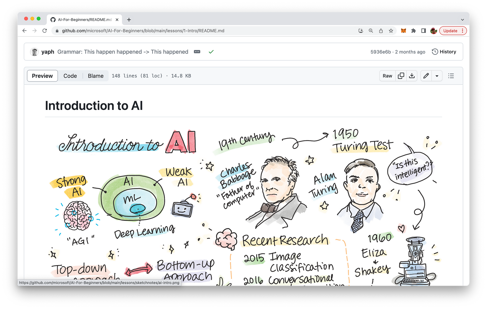

import { Image } from '@astrojs/image/components';
import YouTube from '~/components/widgets/YouTube.astro';
export const components = { img: Image };

Hello, tech enthusiasts! Today, I’m thrilled to share with you two fantastic resources that can help you dive into the fascinating world of Artificial Intelligence (AI) and Machine Learning (ML). The best part? They’re both completely free and accessible online, making them perfect for self-learners, students, and anyone curious about these cutting-edge technologies.

## AI for Beginners: A Comprehensive Introduction to AI

The first course is titled AI for Beginners, and it’s offered by none other than Microsoft. This course is designed to be a comprehensive introduction to the field of AI, covering a wide range of topics over 12 weeks and 24 lessons.

The course begins by exploring the fundamental concepts of AI, such as the difference between weak and strong AI, and the Turing Test’s role in defining intelligence. It then delves into the different approaches to AI, including top-down and bottom-up approaches, symbolic reasoning, and neural networks.

One of the course’s unique features is its focus on real-world applications and tasks that AI can handle, such as determining a person’s age from a photograph. The course also discusses the philosophical and ethical considerations of AI, which are crucial in today’s world where AI is increasingly integrated into our daily lives.

You can find the course at: https://github.com/microsoft/AI-For-Beginners

## ML for Beginners: A Classic Approach to Machine Learning

The second course, ML for Beginners, is also offered by Microsoft. This 12-week curriculum provides a thorough introduction to what is sometimes referred to as "classic machine learning." It avoids deep learning, which is covered in the aforementioned AI for Beginners course.

The ML for Beginners course is structured around 26 lessons and 52 quizzes, providing a comprehensive and interactive learning experience. It covers a wide range of topics, from regression and classification to clustering and natural language processing. The course also includes lessons on time series forecasting and reinforcement learning, offering a well-rounded understanding of different machine learning techniques.

One of the highlights of this course is its project-based approach. Each lesson is paired with a hands-on project, allowing you to apply what you've learned immediately. This pedagogical approach is proven to enhance understanding and retention of new skills.

You can find the course at: https://github.com/microsoft/ML-For-Beginners

## A Golden Opportunity in 2023

These two courses represent a golden opportunity for anyone looking to get started with AI and Machine Learning in 2023. They're comprehensive, free, and accessible to anyone with an internet connection. Whether you're a student, a professional looking to expand your skillset, or a tech enthusiast curious about these fields, these courses are a fantastic starting point.

Remember, the journey of a thousand miles begins with a single step. So why not take that step today and dive into the exciting world of AI and Machine Learning? Happy learning!