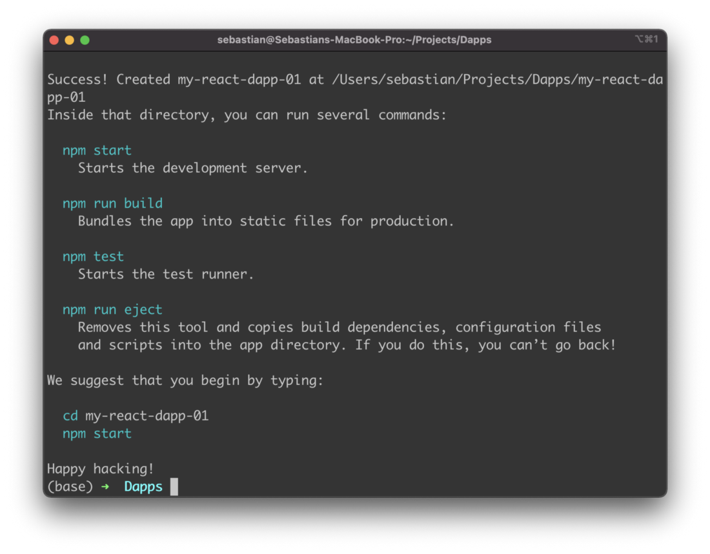
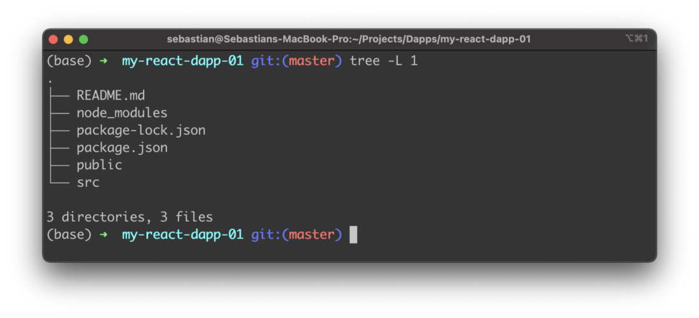
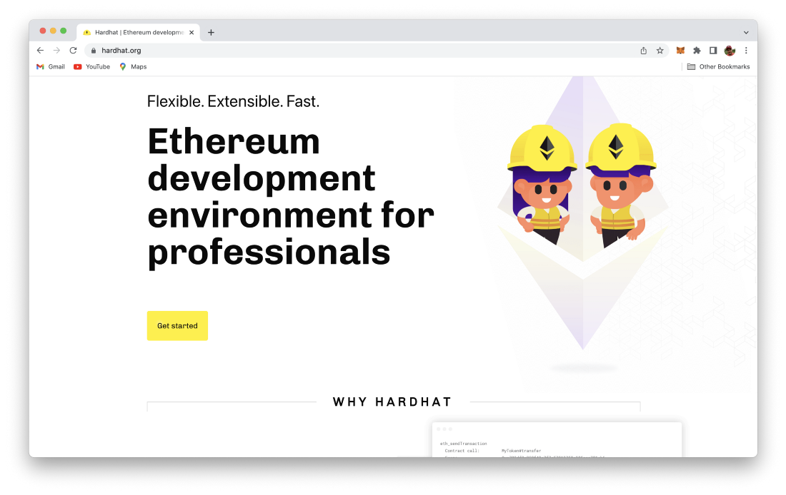
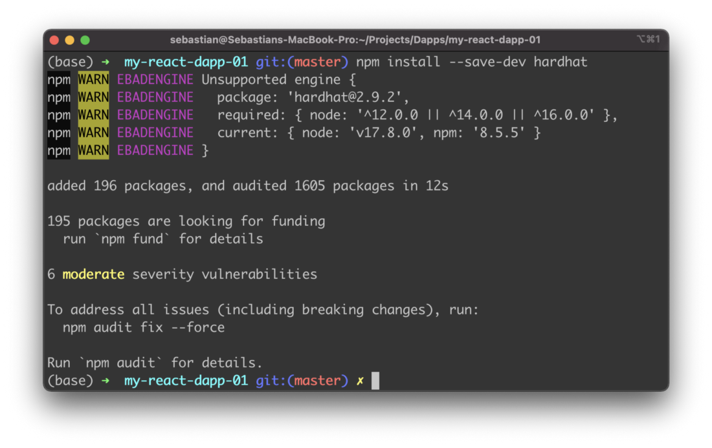
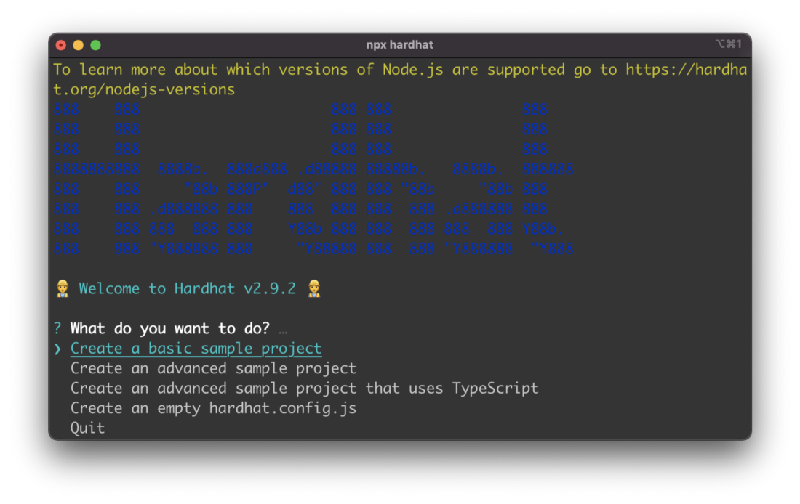
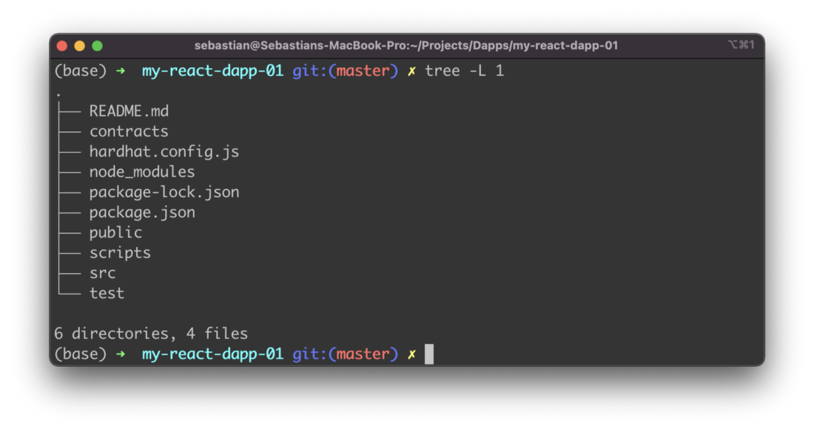
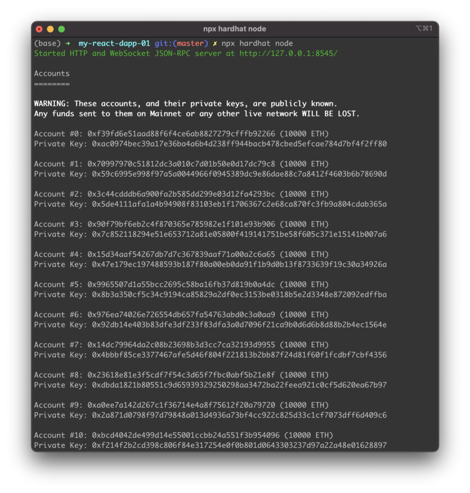

import { Image } from '@astrojs/image/components';
import YouTube from '~/components/widgets/YouTube.astro';
export const components = { img: Image };

# Setting Up The Project With React And Hardhat

This is the first part of the Learn Full Stack Ethereum Development series. This series will provide you with a beginner’s tutorial to learn full stack Ethereum development from scratch.

In this series you’ll learn how to setup Hardhat to run your local Ethereum blockchain and implement and deploy your first smart contract. You’ll get to know how to use the Solidity programming language to write your first smart contract implementation.

In order to cover the full-stack of an application we’ll also learn to connect with a front-end web application to the blockchain and how to interact with the smart contract. In order to implement to front-end part of our application we’ll be making use of the React framework.

This very first part of the tutorial series covers the first steps: setting up the general project structure, installing Hardhat and setting of the React front-end application. Let’s get started.

## Step 1: Creating A New React Application

First, we’re creating a new React project by using the create-react-app script. To execute this script directly we’re using the Node.js Package Runner npx like you can see in the following:

```bash
$ npx create-react-app my-react-dapp-01
$ cd my-react-dapp-01
```

If the React app is created successfully you should be able to see the following output on the command line:



The default React project structure should then look like you can see in the following screenshot:



## Step 2: Installing Hardhat

To setup our Ethereum development stack we need to add Hardhat next. Hardhat is a development environment for Ethereum which runs locally. The project’s homepage can be found at https://hardhat.org:



We can add Hardhat to the existing project by using the Node Package Manager (NPM). Just execute the following command in the project folder:

```bash
$ npm install --save-dev hardhat
```



Once Hardhat is installed we need to make sure that a few more dependencies are added to the project.

## Step 3: Installing Further Dependencies

Beside the hardhat package we need to install a few more dependencies by using the following npm command:

```bash 
$ npm install --save-dev @nomiclabs/hardhat-waffle ethereum-waffle chai @nomiclabs/hardhat-ethers ethers
```

Let’s take a closer look at the various packages we’re adding here:

- *ethereum-waffle*: Waffle is a library for writing and testing smart contracts.
- *hardhat-waffle*: This plugin adds a Hardhat-ready version of Waffle to the Hardhat Runtime Environment.
- *chai*: Chai is an assertion library, similar to Node’s built-in assert. It makes testing much easier by giving you lots of assertions you can run against your code.
- *ethers*: The ethers.js library aims to be a complete and compact library for interacting with the Ethereum Blockchain and its ecosystem.
- *hardhat-ethers*: This plugin brings to Hardhat the Ethereum library ethers, which allows you to interact with the Ethereum blockchain in a simple way.

## Step 4: Setting Up Hardhat

Now that all the needed packages have been added to the project we can start to setup Hardhat in our project by using the following command:

```bash
$ npx hardhat
```

Executing this command guides you through the process which is required to setup Hardhat. You need to answer a few questions on the command line to complete the process:



Choose option *Create a basic sample project* when you’re being asked the question: *“What do you want to do?”*.

Next confirm the default project root location which is being proposed and choose to add a .gitignore file.


When you take a look at the project structure again you’ll notice that for Hardhat the contracts and scripts folder have been added and a Hardhat configuration file (hardhat.config.js) has been created in the project root folder as well:



Finally, we’re ready to start up the Hardhat server which is running a local blockchain. by using the command:

```bash
$ npx hardhat node
```

As you can see from the output the server starts and also creates a bunch of test accounts. In the list which is outputted you can see the account key together with its private key. Each of these test accounts already has a balance of 10000 ETH. Later in this tutorial we’ll use some of these test accounts for interacting with the Hardhat local blockchain.



## What's Next?

In the next part of this tutorial series we’ll take a deeper look at the default Hardhat sample project to gain a better understanding of how a smart contract is implemented, how testing is executed, and how we can deploy the test smart contract to the local blockchain. This will help us to the implement our own smart contract in the following step.


