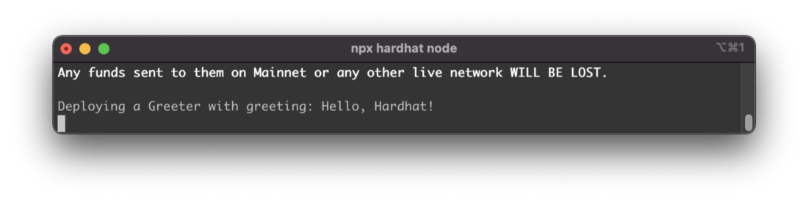

import { Image } from '@astrojs/image/components';
import YouTube from '~/components/widgets/YouTube.astro';
export const components = { img: Image };

# Default Project Setup — What’s included?

Welcome to the second part of the Learn Full Stack Ethereum Development series. This series will provide you with a beginner’s tutorial to learn full stack Ethereum development from scratch. In last part we’ve been setting up the React project structure and added the Hardhat development environment to the project. In this part we’re going to take a closer look at the default project setup and learn how a smart contract is implemented and deployed to Hardhat’s local Ethereum blockchain. Let’s get started …

## Sample Implementation Of Greeter Smart Contract

By adding Hardhat to our project a new folder contracts has been added to the project. This is the folder where you will put in all Smart Contract implementation files. A default Smart Contract implementation is provided in file Greeter.sol. From the file extension (*.sol) you can see that the programming language which is used for implementation is Solidity. If you take a look into the file you’ll see the following default implementation:

```js
//SPDX-License-Identifier: Unlicense
pragma solidity ^0.8.0;

import "hardhat/console.sol";

contract Greeter {
    string private greeting;

    constructor(string memory _greeting) {
        console.log("Deploying a Greeter with greeting:", _greeting);
        greeting = _greeting;
    }

    function greet() public view returns (string memory) {
        return greeting;
    }

    function setGreeting(string memory _greeting) public {
        console.log("Changing greeting from '%s' to '%s'", greeting, _greeting);
        greeting = _greeting;
    }
}
```

The first line of code is used to set the minimum Solidity version which must be used when compiling this Smart contract implementation by using the pragma keyword. In the example a minimum Solidity version of 0.8.0 is needed by the compiler.

In the next line you can find the import statement for package hardhat/console.sol which enables to output messages directly to the console.

The Greeter contract which is implemented in the following lines of code consists of:

- A private string property greeting
- A constructor
- The greet function
- The setGreeting function

This sample Smart Contract is used to store and manage a simple greeting string. The greeting message is set by the constructor to an initial value. The function greet can be used to retrieve the greeting message and the function setGreeting is used to set a new greeting message. We’ll see the Smart Contract in action later on.

## Default Hardhat Deployment Script

In the scripts folder you can find a sample deployment script which is used to deploy the Smart Contract to the blockchain. The file sample-script.js contains the following deployment code by default:

```js
// We require the Hardhat Runtime Environment explicitly here. This is optional
// but useful for running the script in a standalone fashion through `node <script>`.
//
// When running the script with `npx hardhat run <script>` you'll find the Hardhat
// Runtime Environment's members available in the global scope.
const hre = require("hardhat");

async function main() {
  // Hardhat always runs the compile task when running scripts with its command
  // line interface.
  //
  // If this script is run directly using `node` you may want to call compile
  // manually to make sure everything is compiled
  // await hre.run('compile');

  // We get the contract to deploy
  const Greeter = await hre.ethers.getContractFactory("Greeter");
  const greeter = await Greeter.deploy("Hello, Hardhat!");

  await greeter.deployed();

  console.log("Greeter deployed to:", greeter.address);
}

// We recommend this pattern to be able to use async/await everywhere
// and properly handle errors.
main()
  .then(() => process.exit(0))
  .catch((error) => {
    console.error(error);
    process.exit(1);
  });
```

The deployment code for the Greeter Smart Contract can be found within the main function. Rename the file sample-script.js to deploy.js.

## Hardhat Configuration File

The file hardhat.config.js in the root project folder contains the default configuration settings for Hardhat:

```js
require("@nomiclabs/hardhat-waffle");

// This is a sample Hardhat task. To learn how to create your own go to
// https://hardhat.org/guides/create-task.html
task("accounts", "Prints the list of accounts", async (taskArgs, hre) => {
  const accounts = await hre.ethers.getSigners();

  for (const account of accounts) {
    console.log(account.address);
  }
});

// You need to export an object to set up your config
// Go to https://hardhat.org/config/ to learn more

/**
 * @type import('hardhat/config').HardhatUserConfig
 */
module.exports = {
  solidity: "0.8.4",
};
```

For this tutorial we’ll be using the Hardhat local Ethereum blockchain, so we need to add the following networks entry to the module.exports section of the configuration file:

```js
module.exports = {
  networks: {
    hardhat: {
      chainId: 1337
    }
  },
  solidity: "0.8.4",
};
```

## Deploying The Greeter Smart Contract To The Blockchain

Now it’s time to use the deployment script (which we have renamed to deploy.js) and deploy the Greeter smart contract to the local Ethereum blockchain. Therefore we’ll use the following command:

```bash
$ npx hardhat run scripts/deploy.js --network localhost
```

Remember: This requires Hardhat to be running. If you haven’t started the Hardhat server before you first need to start it by using the following command:

```bash
$ npx hardhat node
```

After successful deployment of the Greeter Smart Contract you should then be able to see the following output on the console which is directly coming from Greeter’s constructor:



## What's Next?

In this part of the Learn Full Stack Ethereum Development tutorial series you’ve gained a deeper understanding of the default Hardhat project structure and you’ve learnt how the default Greeter Smart Contract implementation can be deployed to Hardhat’s local blockchain.

In the next part we’ll move on and learn how to install and use the Metamask wallet to connect to the Hardhat local blockchain and make use of some of the test accounts which are provided by Hardhat.
