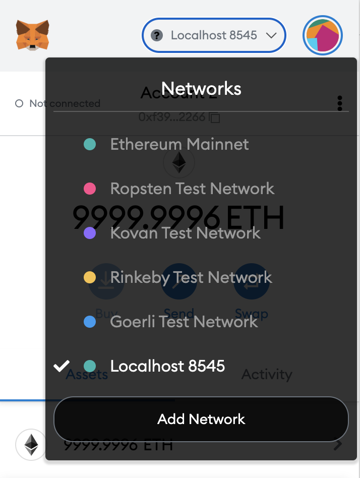

import { Image } from '@astrojs/image/components';
import YouTube from '~/components/widgets/YouTube.astro';
export const components = { img: Image };

# Installing And Setting Up MetaMask

Welcome to the third part of the Learn Full Stack Ethereum Development series. In the last part we’ve used Hardhat to deploy a first sample Smart Contract to the local Ethereum blockchain.

In this part we’re going to install and use MetaMask. MetaMask is a crypto wallet which can be used to interact with a blockchain. MetaMask is available as a browser extension for Chrome or an iOS / Android app. MetaMask can be found at https://metamask.io/:


For this tutorial it is assumed that you’re MetaMask within Chrome. To install MetaMask you can directly click on the button Download now. This takes you to the website you can see in the following screenshot:


Click on button Install MetaMask for Chrome and follow the installation instructions. To complete the installation of MetaMask you need to create a password and finally a secret backup phrase is provided. You should keep this secret backup phrase at a safe place. By using this backup phrase you’re able to restore your wallet (e.g. after a new installation).

Once MetaMask is installed you can access the plugin by clicking on the fox symbol in Chrome’s extension bar:


If this symbol is not visible by default you need to open the extension menu and pin MetaMask to the extension bar by using the pin symbol on the right side:


## Choose Network In MetaMask

Once the MetaMask browser extension is installed you can open in by clicking on the symbol.

From the dropdown menu on top you can select to connect to the local Hardhat blockchain which is running on localhost:8585:



Therefore it’s important the the Hardhat server is already started. If you haven’t started the server before you need to run the following command:

```bash
$ npx hardhat node
```

## Import Test Account Into MetaMask

When starting the Hardhat server process you’re getting a list of 20 test accounts which can be used to interact with the blockchain. Let’s add one of those test accounts to MetaMask.


Open the My Accounts menu by clicking on the symbol at the top right corner and select entry Import Account:


You should then be able to see the following input form. Use the text field to enter one of the private key from one of the 20 test accounts and confirm by clicking on button Import:


After having imported the test account you should see the new account in MetaMask:


Each of the test accounts has a value of 10000 Ether by default.

## What's Next

In the next part we’re going to connect our React web application with the Greeter smart contract. We’ll connect to MetaMask for using the connected test account to interact with the smart contract on the blockchain.