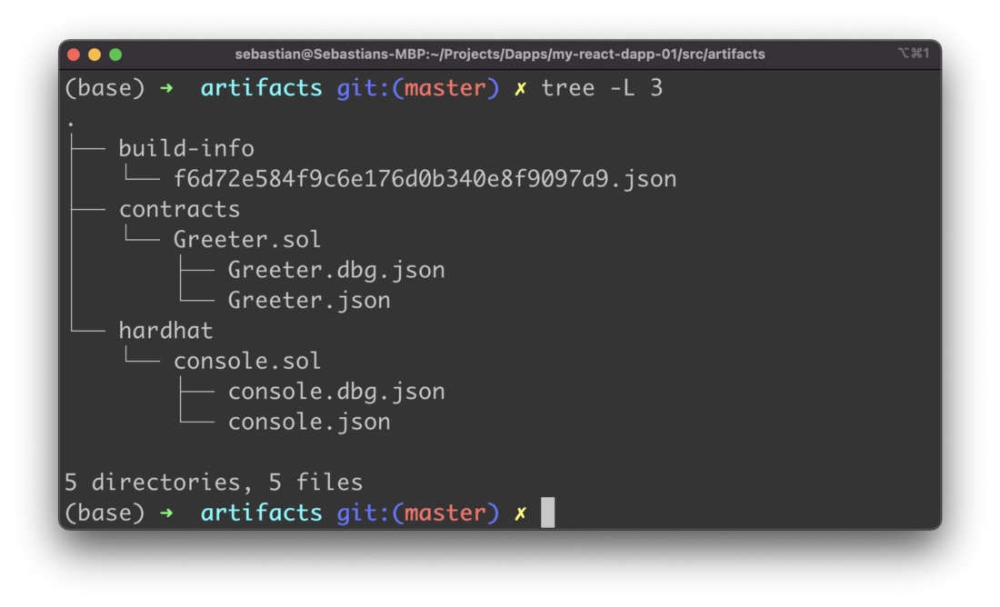
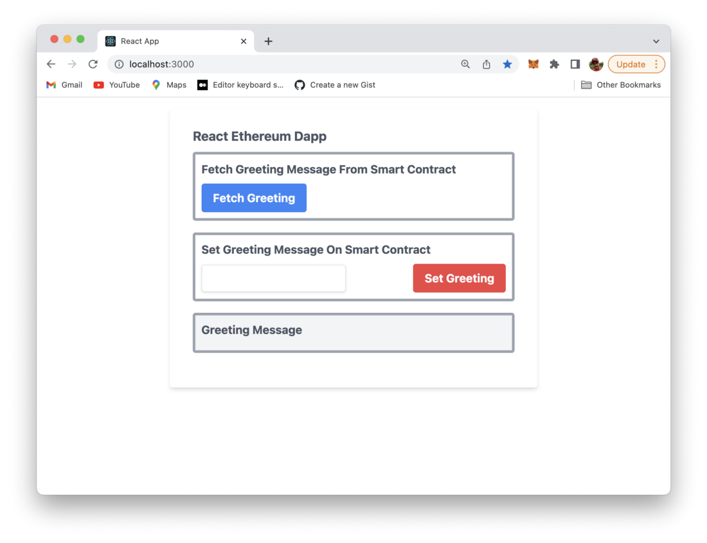
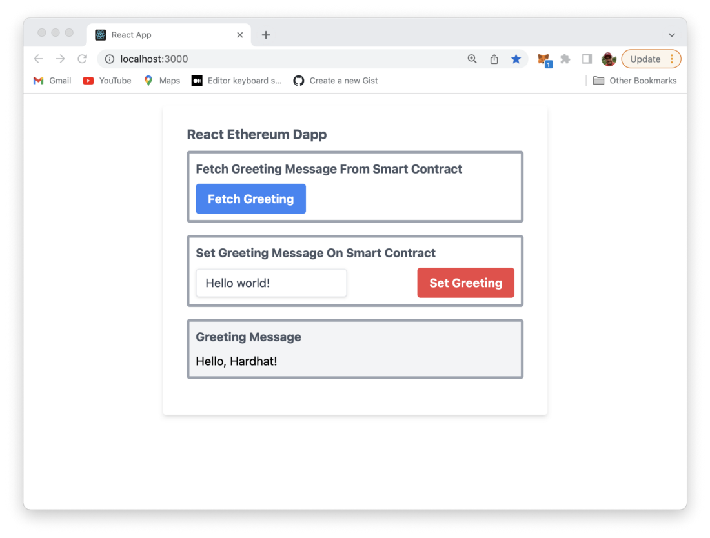
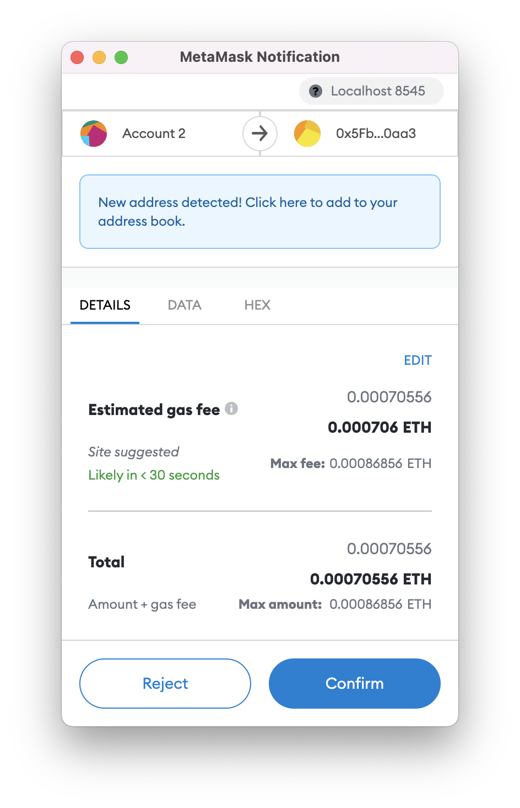
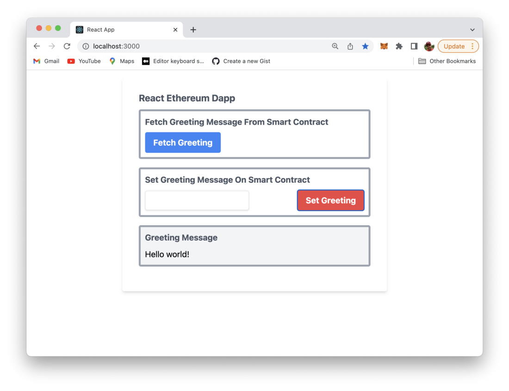

import { Image } from '@astrojs/image/components';
import YouTube from '~/components/widgets/YouTube.astro';
export const components = { img: Image };

# Connecting React Front-End App To Smart Contract

Welcome to the fourth part of the Learn Full Stack Ethereum Development series.

In the this part we’re going to connect our React web application with the Greeter smart contract. We’ll connect to MetaMask by using test accounts to interact with the smart contract on the blockchain. Let’s start …

# Step 1: Change Hardhat's Compiler Output Folder

First of all we need to make sure that the compiled smart contract is put into a folder within the src folder of the React project (e.g. src/artifacts). Therefore we’re adding the paths configuration property to the hardhat.config.js file as you can see in the following code listing:

```js
...
module.exports = {
  defaultNetwork: "hardhat",
  paths: {
    artifacts: "./src/artifacts",
  },
  networks: {
    hardhat: {
      chainId: 1337,
    },
  },
  solidity: "0.8.4",
};
```

If you now start the compilation process by using the following command again:

```bash
$ npx hardhat compile
```

The result should be available within folder src/artifacts like you can see in the following screenshot:



This will now help us to access and import the Greeter ABI later in the React front-end application.

>The __Contract Application Binary Interface (ABI)__ is the standard way to interact with contracts in the Ethereum ecosystem, both from outside the blockchain and for contract-to-contract interaction.

## Step 2: Import Greeter Smart Contract In App Component

The next step is to change the default implementation of App component which is the main application component of the React project and located in src/App.js. Replace the existing default implementation and start by adding the following three import statements on top of the file:

```js
import {ethers} from ‘ethers’
import React, { useState } from ‘react’
import Greeter from ‘./artifacts/contracts/Greeter.sol/Greeter.json’
```

With those three import statements we’re making sure that the Ethers.js library is imported, the useState React Hook is made available and the Greeter Smart Contract ABI is imported as well.

Next we need to add a variable which holds the address of the smart contract on the blockchain:

```
const greeterAddress = “0x5FbDB2315678afecb367f032d93F642f64180aa3”
```

This address was part of the output you could see when having executed the deployment command for the Greeter smart contract.

Next we need a simple App component implementation in App.js which is the our starting point to add further implementation details.

```js
function App() {
  const [greeting, setGreetingValue] = useState("")
  return (
    <div>
    </div>
  );
}
export default App;
```

Inside the App component function we’re making use of React’s useState Hook in order to create the greeting component state variable.

>What is a Hook? A Hook is a special function that lets you “hook into” React features. For example, useState is a Hook that lets you add React state to function components.

## Step 3: Implement fetchGreeting Function

Now it’s time to add the first function to App component which is fetchGreeting. This function is used to retrieve the greeting message from the smart contract. In the following listing you can see the code:

```js
async function fetchGreeting() {
  if (typeof window.ethereum !== 'undefined') {
    const provider = new ethers.providers.Web3Provider(window.ethereum)
    const contract = new ethers.Contract(greeterAddress, Greeter.abi, provider)
    try {
      const data = await contract.greet()
      setGreetingValue(data)
      console.log('data: ', data)
    } catch (err) {
      console.log('Error: ', err)
    }
  }
}
```

First of all we need to check for window.ethereum. This is defined if MetaMask is installed in the browser. Next we’re using Ethers.js to create a new instance of a Web3Provider. By using the provider object we’re ready to retrieve a reference to the Greeter smart contract on the blockchain by creating a new ethers.Contract object.

On the Contract instance we can call the greet() function to retrieve the greeting message.

## Step 4: Implement setGreeting Function

In order to provide a possibility to the user to set a new greeting message which is stored to the smart contract on the blockchain we do need a second function in App component: setGreeting. The following listing shows the code:

```js
async function setGreeting(value) {
  if (!value) return;
  if (!typeof window.ethereum !== 'undefined') {
    await requestAccount()
    const provider = new ethers.providers.Web3Provider(window.ethereum)
    const signer = provider.getSigner()
    const contract = new ethers.Contract(greeterAddress, Greeter.abi, signer)
    const transaction = await contract.setGreeting(value)
    await transaction.wait()
    fetchGreeting()
  }
}
```

The new value to which the greeting message text which is stored in the smart contract should be set is passed in as an argument.

Again, we need to check if window.ethereum (MetaMask) is available, so that we’re ready to interact with the smart contract by using Hardhat’s test account which has been added to MetaMask client before.

Next we’re using a function with name requestAccount (which is implemented later on) which helps us to retrieve the user account from the MetaMask client in the browser.

In order to call the method setGreeting on the Greeter smart contract to set our new greeting message text we first need to create a new Web3Provider instance. From there on we’re able to retrieve the Signer by calling provider.getSigner(). This time a Signer is needed because we’re using a method which is writing to the smart contract on the blockchain.

The reference to the Greeter smart contract is then created by setting up a new instance of ethers.Contract and passing three parameters to the constructor:

- The address of the smart contract on the blockchain which is available via greeterAddress.
- The Greeter smart contract ABI which is available via Greeter.abi.
- The signer which is available in variable signer.

We are then able to create the transaction for updating the greeting message text by

```js
const transaction = await contract.setGreeting(value)
```

and execute the transaction on the blockchain by calling

```js
await transaction.wait()
```

Finally we’re fetching the updated greeting message text again by calling function fetchGreeting().

## Step 5: Implement requestAccount Function

In the next step we need to add the missing implementation for the requestAccount function which we have used before. The implementation is simple and consists of the following lines of code:

```js
async function requestAccount() {
  await window.ethereum.request({ method: ‘eth_requestAccounts’ })
}
```

## Step 6: Implement the User Interface

Finally we need to implement the user interface of App component. In order to style our web application we’ll use the library Tailwind CSS. Adding Tailwind CSS to your existing React project is very easy and is fully described in:

[How To Use Tailwind CSS With React](https://www.codingthesmartway.com/how-to-use-tailwind-css-with-react/)

The complete user interface code which needs to be added in App.js is available in the following listing:

```js
return (
  <div className=”w-full max-w-lg container”>
    <div className=”shadow-md rounded px-8 pt-6 pb-8 mb-4 mt-4">
      <div className=”text-gray-600 font-bold text-lg mb-2">
        React Ethereum Dapp
      </div>
      <div className=”w-full border-4 p-2 mb-4 rounded border-gray-400">
        <div className=”text-gray-600 font-bold text-md mb-2">
          Fetch Greeting Message From Smart Contract
        </div>
        <div className=”flex “>
          <button className=”bg-blue-500 hover:bg-blue-700 text-white font-bold py-2 px-4 rounded” onClick={fetchGreeting}>Fetch Greeting</button>
        </div>
      </div>
      <div className=”w-full border-4 p-2 mb-4 rounded border-gray-400">
        <div className=”text-gray-600 font-bold text-md mb-2">
          Set Greeting Message On Smart Contract
        </div>
        <form 
          className=”flex items-center justify-between”
          onSubmit={event=>handleSubmit(event)}
          >
          <input
            className=”shadow appearance-none border rounded py-2 px-3 text-gray-700 leading-tight focus:outline-none focus:shadow-outline” 
            name=”greetingInput”/>
          <button className=”bg-red-500 hover:bg-blue-700 text-white font-bold py-2 px-4 rounded”>Set Greeting</button>
        </form>
      </div>
      <div className=”w-full border-4 p-2 mb-4 rounded border-gray-400 bg-gray-100">
        <div className=”text-gray-600 font-bold text-md mb-2">
          Greeting Message
        </div>
        <p>
          {greeting}
        </p>
      </div>
    </div>
  </div>
  );
}
```

From the user interface code you can learn that there is one more function we need to implement in App.js: handleSubmit. The code of that function looks like you can see in the following listing:

```js
async function handleSubmit(event) {
  event.preventDefault()
  await setGreeting(event.target.greetingInput.value)
setGreetingValue(event.target.greetingInput.value)
  event.target.greetingInput.value = “”
}
```

The handleSubmit function is called when the user submits the form (which consist of one text input field) by hitting button “Set Greeting”. The code within handleSubmit then takes care of preventing the default HTML form submit behavior (event.preventDefault()), calling setGreeting, updating the greeting component state and clearing the text input field.

Again, in the following listing you can find the complete implementation of App component in App.js:

```js
import React, { useState } from 'react'
import {ethers} from 'ethers'
import Greeter from './artifacts/contracts/Greeter.sol/Greeter.json'

const greeterAddress = "0x5FbDB2315678afecb367f032d93F642f64180aa3"

function App() {
  const [greeting, setGreetingValue] = useState("")

  async function fetchGreeting() {
    if (typeof window.ethereum !== 'undefined') {
      const provider = new ethers.providers.Web3Provider(window.ethereum)
      const contract = new ethers.Contract(greeterAddress, Greeter.abi, provider)
      try {
        const data = await contract.greet()
        setGreetingValue(data)
        console.log('data: ', data)
      } catch (err) {
        console.log('Error: ', err)
      }
    }
  }
  
  async function setGreeting(value) {
    if (!value) return;
    if (!typeof window.ethereum !== 'undefined') {
      await requestAccount()
      const provider = new ethers.providers.Web3Provider(window.ethereum)
      const signer = provider.getSigner()
      const contract = new ethers.Contract(greeterAddress, Greeter.abi, signer)
      const transaction = await contract.setGreeting(value)
      await transaction.wait()
      fetchGreeting()
    }
  }

  async function requestAccount() {
    await window.ethereum.request({ method: 'eth_requestAccounts' })
  }

  async function handleSubmit(event) {
    event.preventDefault()
    await setGreeting(event.target.greetingInput.value)
    setGreetingValue(event.target.greetingInput.value)
    event.target.greetingInput.value = ""
  }

  return (
    <div className="w-full max-w-lg container">
      <div className="shadow-md rounded px-8 pt-6 pb-8 mb-4 mt-4">
        <div className="text-gray-600 font-bold text-lg mb-2">
            React Ethereum Dapp
        </div>
        <div className="w-full border-4 p-2 mb-4 rounded border-gray-400">
          <div className="text-gray-600 font-bold text-md mb-2">
            Fetch Greeting Message From Smart Contract
          </div>
          <div className="flex ">
            <button className="bg-blue-500 hover:bg-blue-700 text-white font-bold py-2 px-4 rounded" onClick={fetchGreeting}>Fetch Greeting</button>
          </div>
        </div>
        <div className="w-full border-4 p-2 mb-4 rounded border-gray-400">
          <div className="text-gray-600 font-bold text-md mb-2">
            Set Greeting Message On Smart Contract
          </div>
          <form 
            className="flex items-center justify-between"
            onSubmit={event=>handleSubmit(event)}
            >
            <input 
              className="shadow appearance-none border rounded py-2 px-3 text-gray-700 leading-tight focus:outline-none focus:shadow-outline" 
              name="greetingInput"
            />
            <button className="bg-red-500 hover:bg-blue-700 text-white font-bold py-2 px-4 rounded">Set Greeting</button>
          </form>
        </div>
        <div className="w-full border-4 p-2 mb-4 rounded border-gray-400 bg-gray-100">
          <div className="text-gray-600 font-bold text-md mb-2">
            Greeting Message 
          </div>
          <p>
            {greeting}
          </p>
        </div>
      </div>
    </div>
  );
}

export default App;
```

## Step 7: Test The Application

Now it’s time to test the final React application. When opening the application in the browser you should be able to see the following:



First, let’s click on the Fetch Greeting button to retrieve the greeting message text from the smart contract on the local blockchain. The text is displayed in the Greeting Message section:


By default the greeting message which is retrieved from the smart contract is “Hello, Hardhat!”. In the second step we’re now ready to set the greeting message text to a new value. Therefore the text input field is used:



After having entered the new greeting message text click on button “Set Greeting”. Now you’ll see the MetaMask windows showing up and providing details of the transaction costs:



In order to update the greeting message text which is stored on the blockchain you need to confirm the transaction by clicking on the Confirm button.

>Remember, here we’re dealing with one of the test accounts which is provided by Hardhat and has an initial value of 10000 ETH, so you do not need to worry about the costs of the transaction.

If the transaction is finished successfully you will be able to see the new message in the output area as well:



## What's Next

Up until now we’ve reached the state of a fully functional full-stack Ethereum Dapp. We’ve managed to implemented the Greeter smart contract, deployed it to the local Hardhat blockchain and used React to build a web front-end application to interact with our smart contract.

In the next part of this tutorial series you’ll learn how we can make use of one of Ethereum’s live test networks instead of the local blockchain which is provided by Hardhat. We’ll update our deployment procedure accordingly and deploy the Greeter smart contract to the blockchain running on the test network.