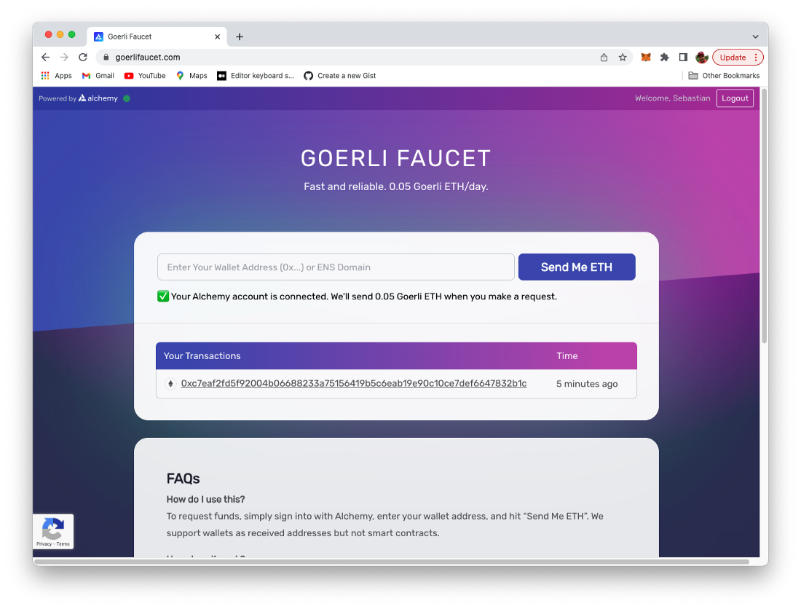
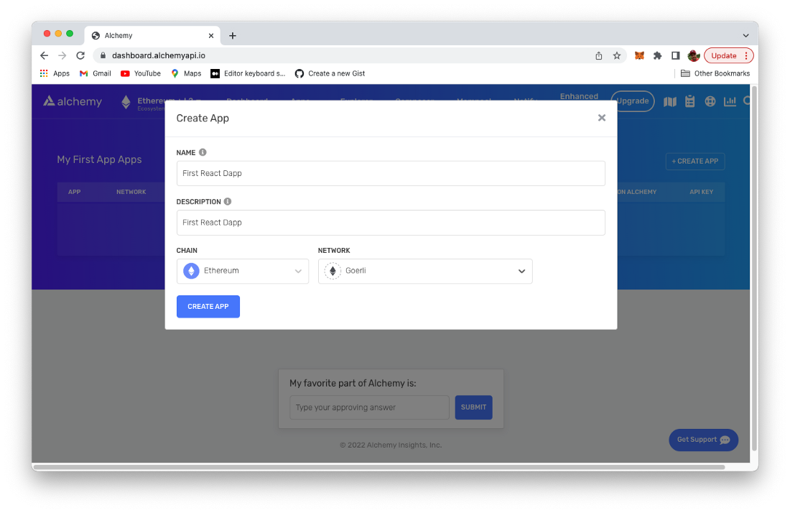
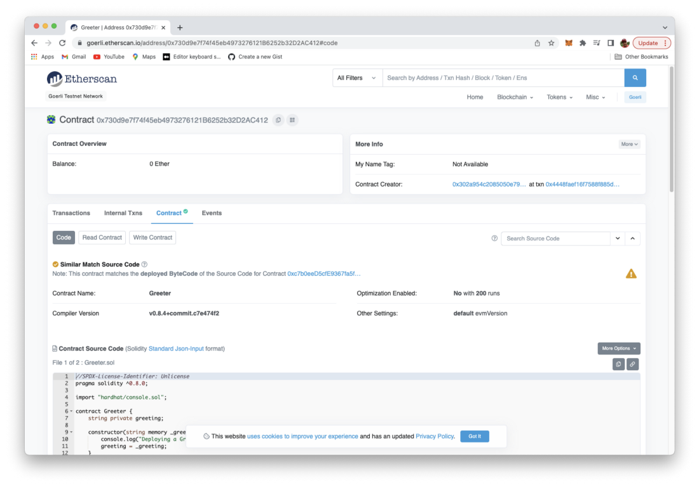

import { Image } from '@astrojs/image/components';
import YouTube from '~/components/widgets/YouTube.astro';
export const components = { img: Image };

# Deploy To An Ethereum Test Network

Welcome to the fifth part of the Learn Full Stack Ethereum Development series.

Up until now we’ve reached the state of a fully functional full-stack Ethereum Dapp. We’ve managed to implemented the Greeter smart contract, deployed it to the local Hardhat blockchain and used React to build a web front-end application to interact with our smart contract.

In this part of this tutorial series you’ll learn how we can make use of one of Ethereum’s live test networks instead of the local blockchain which is provided by Hardhat. We’ll update our deployment procedure accordingly and deploy the Greeter smart contract to the blockchain running on the test network.

## Ethereum Testnets

So far we’ve been using Hardhat’s local Ethereum blockchain to deploy our Greeter Smart Contract. During development and testing times this is a good option to go with.

The Ethereum network is also providing live public test networks (which Ethereum blockchains running on it) which can be used for testing purposes. In this case we do not need to run the blockchain locally.

>Public networks are accessible to anyone in the world with an internet connection. Anyone can read or create transactions on a public blockchain and validate the transactions being executed. Agreement on transactions and the state of the network is decided by a consensus of peers.

Here you need to distinguish between the Ethereum mainnet and the Ethereum testnets. The mainnet is the live Ethereum network we’re the main public Ethereum blockchain is running on which is used to deploy a Dapp which should be set live when it is finally ready. The blockchain on the mainnet is also the Blockchain were you can deal with real Ether (so spending real money).

Beside the mainnet Ethereum is offering multiple testnets which can be used for testing purposes only (often used in Dapp development before deploying to mainnet for testing purposes). In those networks you’ll not deal with real Ether, so you can test without spending real money.

In this tutorial we’ll use the Goerli Ethereum test network.

## Step 1: Switch To The Goerli Testnet In MetaMask

First step is to open the MetaMask client in Chrome again and use the list selection input field on the top to switch to the Goerli test network:


Of course, you can use any other test networks which are provided here. However, for the following steps it is assumed that we’re using the Goerli test network.

## Step 2: Use A Goerli Faucet To Send Ether To Your Account

When first switching with your MetaMask account to the Goerli test network you’ll notice that the amount of Ether is zero. In order to get some initial Ether assigned to our account which we can use when executing transactions we need to make use of a so called faucet. A crypto faucet is a website or an app that distributes cryptocurrencies for completing basic tasks.

You can find a faucet for the Goerli network by just searching for it on Google or you can use the faucet at https://goerlifaucet.com/ which you can also see in the following screenshot:



This faucet is powered by Alchemy (https://www.alchemy.com/), so you need an Alchemy account to be able to use this faucet. Once you’re logged in you just need to copy the Account address from MetaMask and insert this address into the input field and click ob button “Send Me ETH”.

After a few seconds you should be able to see that 0.05 Ether have been added to your account and are now visible within MetaMask:


So now we’ve added some test Ether to our account which can be used when executing transactions in the Goerli test network.

## Step 3: Creating An Alchemy Project

In the next step we need to log in into the Alchemy service directly (https://www.alchemy.com/).


As we need to interact with the test network without running our own node we need to connect to a service which has access to a node in the Goerli test network and provides us with the needed infrastructure. Alchemy is a service which can be used for that purpose, so let’s configure the Alchemy service accordingly. When first accessing Alchemy’s dashboard you you should be able to see an empty list of apps.


Click on button Create App in order to get to the following screen:



Here you can specify name, description, chain, and network of the app to be created. As our intention is to use Alchemy to connect to Goerli test network we have to select option Ethereum (CHAIN) and Goerli (NETWORK). Hit button Create App to confirm. You’re being redirected to the dashboard page again and now should be able to see the configured app in the list:


By clicking on link VIEW KEY you’re able to access the API key and HTTP endpoint of the application’s endpoint. Both is needed to configure Hardhat accordingly:


## Step 4: Configure Hardhat To Access Goerli Test Network via Alchemy

Now that we’ve configured Alchemy, we turn back to our Hardhat project and add the necessary configuration to connect via Alchemy to the Goerli test network.

First, install the dotenv package in your project directory:

```bash
$ npm install dotenv --save
```

Then, create a .env file in the root directory of our project, and add your MetaMask private key and HTTP Alchemy API URL to it in the following way:

```
API_URL = "INSERT YOUR ALCHEMY HTTP URL HERE"
PRIVATE_KEY = "INSERT PRIVATE KEY OF YOUR METAMASK ACCOUNT HERE"
```

To actually connect these to our code, we’ll reference these variables in our hardhat.config.js file next. Open the file and insert the following require statement on top of the file:

```js
require(‘dotenv’).config();
```

Herewith we’re making sure that we have access the variables which have been added to .env before. Just use the following line of code inside of hardhat.config.js the extract the stored values into API_URL and PRIVATE_KEY:

```js
const { API_URL, PRIVATE_KEY } = process.env;
```

Next, in the module.exports section of the configuration file we need to add the Goerli network configuration to the object which is assigned to the networks property:

```js
module.exports = {
  defaultNetwork: “hardhat”,
  paths: {
    artifacts: “./src/artifacts”,
  },
  networks: {
    hardhat: {
      chainId: 1337,
    },
    goerli: {
      url: API_URL,
      accounts: [`0x${PRIVATE_KEY}`]
    }
  },
  solidity: “0.8.4”,
};
```

## Step 5: Deploy Smart Contract

Once the Hardhat configuration for the Goerli test network is in place we can use this as target when performing the deployment of our smart contract by using the following command:

```bash
$ npx hardhat run scripts/deploy.js --network goerli
```

The deployment process to the Ethereum test network might take a few seconds to complete. Once the deployment is ready you’ll see an output similar the following, notifying you about the address on blockchain to which the Greeter smart contract has been deployed:

```
Greeter deployed to: 0x730d9e7f74f45eb4973276121B6252b32D2AC412
```

As we’ve now deployed to a live test blockchain we’re able to use Etherscan to get direct insides into the Goerli Ethereum blockchain. Open URL: https://goerli.etherscan.io/ and enter the address to which the smart contract has been deployed. You should then see a result similar to the following screenshot:



Here you can find all information about the deployed Greeter smart contract.

## Step 6: Connect React Front-End Application

The Greeter smart contract is deployed to the Ethereum test network and ready to be used. In order to make our React front-end web application working with the Greeter smart contract on the Goerli blockchain we only need to make minor changes.

We just need to edit file src/App.js. Here we need to update the the address of the smart contract to the new value:

```
const greeterAddress = “0x730d9e7f74f45eb4973276121B6252b32D2AC412”
```

That’s it. No more changes are necessary in order to make our React application work with the Goerli test network.

## Step 7: Test The Application

Finally let’s test the application once again, now interacting with the Greeter smart contract deployed to the Ethereum Goerli test network:

Make sure the React development web server is running by using command:

```bash
$ npm start
```

The web application will show up in the browser and present the default view:


Make sure that MetaMask extension is available and you’re connected to the Goerli test network with an account with has some test Ether:


Let’s first fetch the greeting message from the smart contract:


Let’s set a new greeting message by using the text input element and button “Set Greeting”. When hitting the button a MetaMask windows will be popping up:


MetaMask is providing you details of the transaction which needs to be send out to the Goerli network in order to be able to update the greeting text on the blockchain. Here you can also see the amount of Ether which needs to spend to send this transaction. In order to send this transaction to the network you need to click on the “Confirm” button in the MetaMask transaction window.

In MetaMask you will then see that the “Set Greeting” transaction has been sent out to the network but is still pending:


It might take a few second until the transaction is confirmed. Once the transaction is confirmed you’ll get a notification from MetaMask and on the same time you can see that the web application output is updated and the new greeting message text is shown in the output section:


Here we’re are! Now we have a fully working Dapp based on a smart contract which is running on one of the Ethereum test networks and is accessible by using a React-based web user interface! Congratulations!