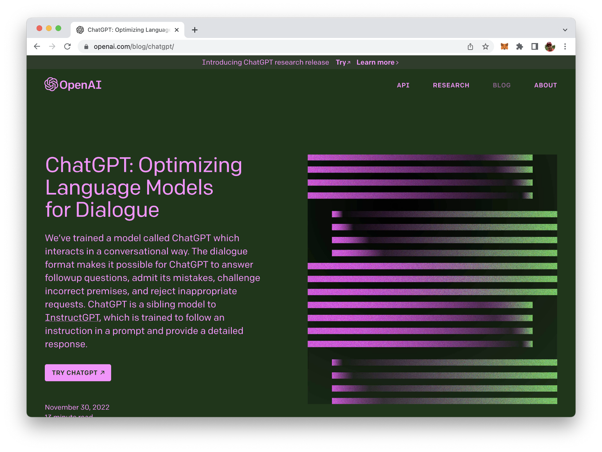
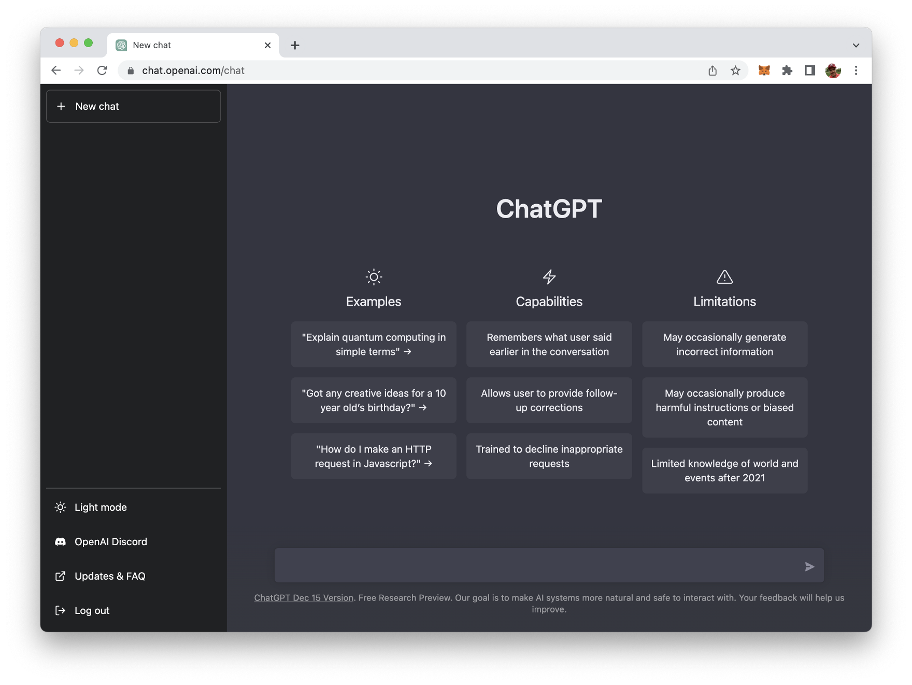
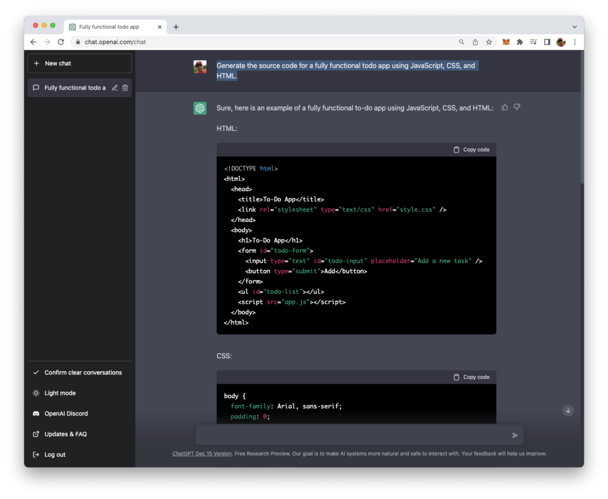
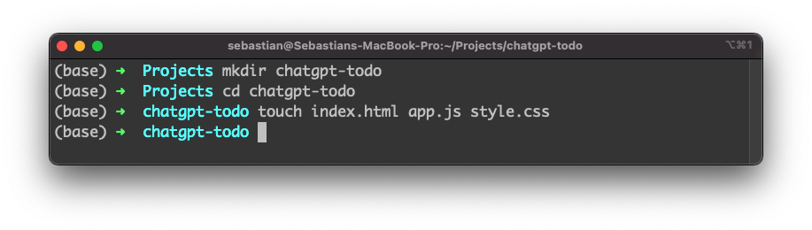
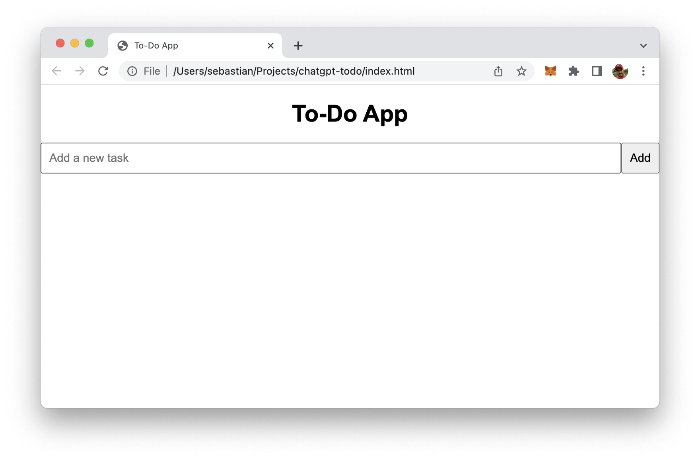
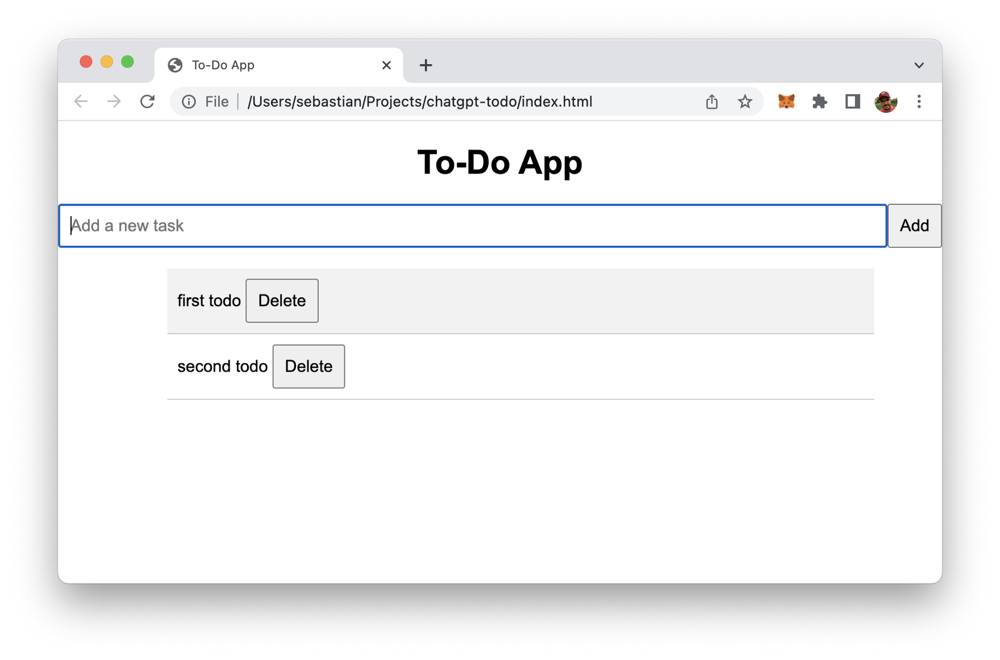
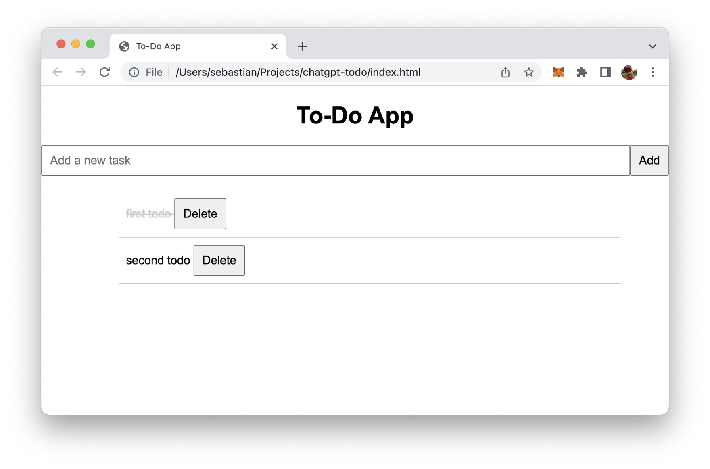
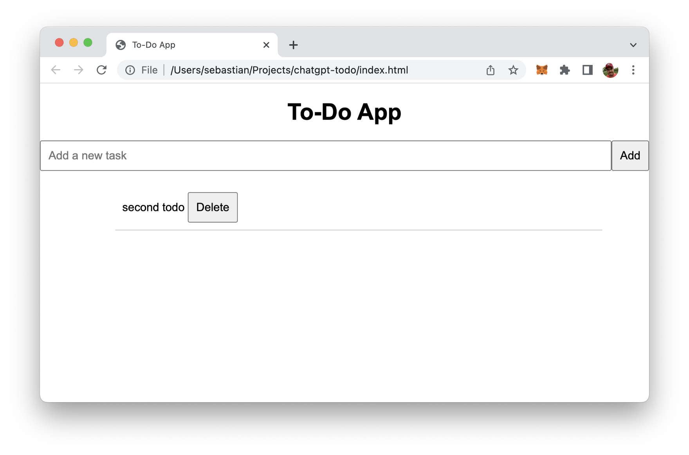

import { Image } from '@astrojs/image/components';
import YouTube from '~/components/widgets/YouTube.astro';
export const components = { img: Image };

ChatGPT is a pre-trained transformer-based neural network model developed by OpenAI. ChatGPT is capable of generating text that resembles human-written text, and this includes code as well. In this article we'll explore if ChatGPT is able to automatically generate source code for a fully functional Todo app based on JavaScript, CSS, and HTML only.

If you haven't signed up for ChatGPT yet, you first need to go to the website https://openai.com/blog/chatgpt/ and signup for a new and free account:



Once you're logged in you'll see the ChatGPT user interface:



Here you can start directly interacting with ChatGPT by providing your input in the input element on the bottom of the screen.

## Ask ChatGPT To Write A Todo App By Using JavaScript, CSS, and HTML

Now we're ready to make use of ChatGPTs ability to generate source code based on our requirements. Let's directly start by typing in:

*Generate the source code for a fully functional todo app using JavaScript, CSS, and HTML.*

Immediately ChatGPT starts providing you the answer with the code included:



Great! Now let's use this code which is provided by ChatGPT and prepare everything what is needed to execute the todo application.

## Test The Todo Application

To test the generated source code we need to copy the code into respective files. So we need to create a new project folder, and inside this folder create the following new files: index.html, app.js, and style.css by using the following command:



Next open your code editor and copy and paste the generated source code into the respective files:

__index.html:__

```html
<!DOCTYPE html>
<html>
  <head>
    <title>To-Do App</title>
    <link rel="stylesheet" type="text/css" href="style.css" />
  </head>
  <body>
    <h1>To-Do App</h1>
    <form id="todo-form">
      <input type="text" id="todo-input" placeholder="Add a new task" />
      <button type="submit">Add</button>
    </form>
    <ul id="todo-list"></ul>
    <script src="app.js"></script>
  </body>
</html>
```

__style.css:__

```css
body {
    font-family: Arial, sans-serif;
    padding: 0;
    margin: 0;
  }
  
  h1 {
    text-align: center;
  }
  
  form {
    display: flex;
    justify-content: center;
    margin-top: 20px;
  }
  
  input {
    padding: 10px;
    font-size: 16px;
    flex-grow: 1;
  }
  
  button {
    padding: 10px;
    font-size: 16px;
  }
  
  #todo-list {
    margin-top: 20px;
    width: 80%;
    margin-left: auto;
    margin-right: auto;
    list-style: none;
  }
  
  .todo-item {
    padding: 10px;
    border-bottom: 1px solid #ccc;
  }
  
  .todo-item:hover {
    background-color: #f2f2f2;
  }
  
  .completed {
    text-decoration: line-through;
    color: #ccc;
  }
```

__app.js:__

```js
const form = document.querySelector('#todo-form');
const input = document.querySelector('#todo-input');
const todoList = document.querySelector('#todo-list');

form.addEventListener('submit', (event) => {
  event.preventDefault();
  if (!input.value) return;
  addTodo(input.value);
  input.value = '';
});

function addTodo(text) {
  const todo = document.createElement('li');
  todo.classList.add('todo-item');
  todo.innerHTML = `
    ${text}
    <button class="delete-btn">Delete</button>
  `;
  todoList.appendChild(todo);
  todo.querySelector('.delete-btn').addEventListener('click', () => {
    todoList.removeChild(todo);
  });
  todo.addEventListener('click',() => {
    todo.classList.toggle('completed');
  });
}
```

When you open file index.html in the browser you should be able to see the user interface of the todo app:



Use the input field and the "Add" button to create new tasks:



Clicking on the text of a task item completes a tasks by showing the text crossed out:



You can also use button "Delete" to delete items from the list:



## Conclusion

We've managed to create a simple todo app in JavaScript, HTML, and CSS from scratch with ChatGPT without writing a single line of code on our own. That's awesome and a good starting point for further enhancing the implementation with additional functions.
