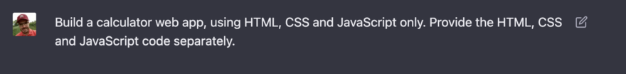
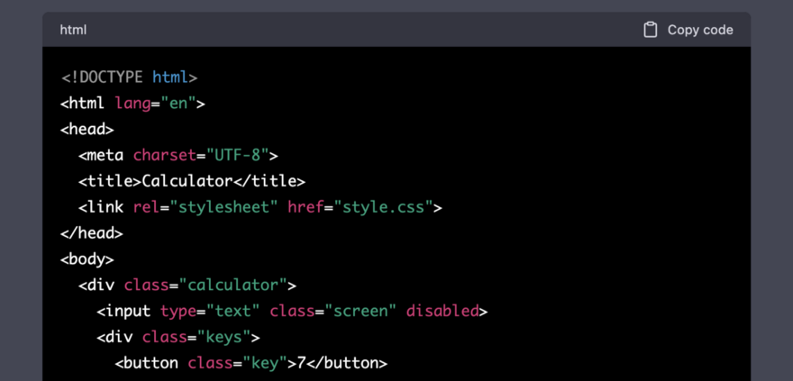
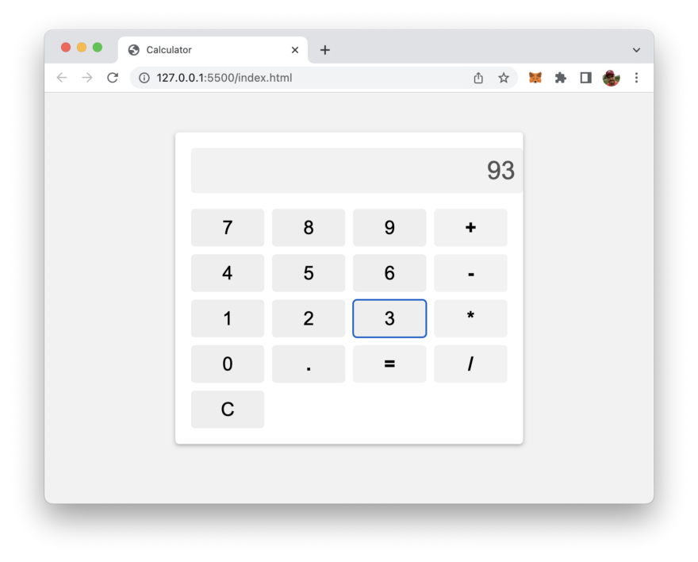

import { Image } from '@astrojs/image/components';
import YouTube from '~/components/widgets/YouTube.astro';
export const components = { img: Image };

Looking to build a custom calculator web app but don't want to spend hours coding HTML, CSS, and JavaScript? Then you need to try out ChatGPT, the language model trained by OpenAI. With ChatGPT, you can generate the complete HTML, CSS, and JavaScript code for your calculator web app automatically, making the implementation process fast and effortless.

In this tutorial, we will show you how to use ChatGPT to build your own calculator web app in just a few minutes. By leveraging the power of ChatGPT's automated code generation, you can focus on designing your calculator's interface and leave the rest to the model. With ChatGPT, you don't need any programming skills to create a professional-looking calculator web app.

Whether you want to use your calculator on your own website or share it with others, ChatGPT has got you covered. In just a few steps, you'll have a fully functional calculator web app that you can customize to your liking. So, let's get started and discover how easy it is to build a calculator web app with ChatGPT!

Let's start by providing a short, but clear prompt to ChatGPT:

_"Build a calculator web app, using HTML, CSS and JavaScript only. Provide the HTML, CSS and JavaScript code separately."_



As a result the AI chatbot is able to directly generate HTML, CSS and JavaScript code:



In the following listing you can see the complete HTML code which has been generated by ChatGPT. This code needs to be inserted into a new file index.html:

```html
<!DOCTYPE html>
<html lang="en">
<head>
  <meta charset="UTF-8">
  <title>Calculator</title>
  <link rel="stylesheet" href="style.css">
</head>
<body>
  <div class="calculator">
    <input type="text" class="screen" disabled>
    <div class="keys">
      <button class="key">7</button>
      <button class="key">8</button>
      <button class="key">9</button>
      <button class="key operator">+</button>
      <button class="key">4</button>
      <button class="key">5</button>
      <button class="key">6</button>
      <button class="key operator">-</button>
      <button class="key">1</button>
      <button class="key">2</button>
      <button class="key">3</button>
      <button class="key operator">*</button>
      <button class="key">0</button>
      <button class="key decimal">.</button>
      <button class="key equals">=</button>
      <button class="key operator">/</button>
      <button class="key clear">C</button>
    </div>
  </div>
  <script src="script.js"></script>
</body>
</html>
```

This is a basic HTML code for a calculator web app.

The first line, `<!DOCTYPE html>`, indicates the document type as HTML.

The `head` tag contains information about the document, such as the character encoding (`<meta charset="UTF-8">`) and the title of the webpage (`<title>Calculator</title>`).

The link tag with `rel="stylesheet"` specifies the location of the external CSS file (`href="style.css"`).

The `body` tag contains the content of the webpage. In this case, it includes a `div` element with a class of `calculator`, which contains an `input` element with a class of `screen` and `disabled` attribute (indicating that it can't be edited by the user). The div also contains other button elements for inputting numbers, operators, and a "clear" button.

Finally, the `script` tag with `src="script.js"` specifies the location of an external JavaScript file (script.js) that is used to provide the functionality of the calculator.

In the next listing you can see the complete CSS code which was provided as part of ChatGPT's answer to our prompt. This code need to be copy and paste into a new file style.css which needs to be stored in the same folder as index.html:

```css
body {
  background-color: #f2f2f2;
  font-family: Arial, sans-serif;
}

.calculator {
  background-color: #fff;
  border-radius: 5px;
  box-shadow: 0 2px 5px rgba(0, 0, 0, 0.3);
  margin: 50px auto;
  max-width: 400px;
  padding: 20px;
}

.screen {
  background-color: #f2f2f2;
  border: none;
  border-radius: 5px;
  font-size: 2em;
  margin-bottom: 20px;
  padding: 10px;
  text-align: right;
  width: 100%;
}

.keys {
  display: grid;
  grid-gap: 10px;
  grid-template-columns: repeat(4, 1fr);
}

.key {
  background-color: #eee;
  border: none;
  border-radius: 5px;
  cursor: pointer;
  font-size: 1.5em;
  padding: 10px;
}

.operator {
  background-color: #f2f2f2;
  font-weight: bold;
}

.decimal {
  font-weight: bold;
}

.equals {
  background-color: #f2f2f2;
  font-weight: bold;
}
```

The generated CSS code is very simply and straight forward!

The `body` tag specifies a background color and font-family for the entire webpage.

The `.calculator` class sets the background color, border-radius, box-shadow, margin, max-width, and padding for the calculator container.

The `.screen` class sets the background color, border, border-radius, font-size, margin-bottom, padding, text-align, and width for the input field of the calculator.

The `.keys` class displays the buttons of the calculator in a grid format with grid-gap and grid-template-columns.

The `.key` class sets the background color, border, border-radius, cursor, font-size, and padding for all calculator buttons.

Additionally, there are specific classes for the operator button, decimal button, and equals button, which set specific styles for those buttons.

Finally let's take a look at the JavaScript code which has been provided and needs to be inserted into a new file called script.js:

```js
const screen = document.querySelector(".screen");
const keys = document.querySelector(".keys");
let operand1 = null;
let operand2 = null;
let operator = null;
let result = null;

keys.addEventListener("click", function (event) {
  if (event.target.matches(".key")) {
    const key = event.target;
    const keyValue = key.textContent;

    if (keyValue === "C") {
      clearScreen();
    } else if (
      keyValue === "+" ||
      keyValue === "-" ||
      keyValue === "*" ||
      keyValue === "/"
    ) {
      handleOperator(keyValue);
    } else if (keyValue === ".") {
      handleDecimal();
    } else if (keyValue === "=") {
      handleEquals();
    } else {
      handleNumber(keyValue);
    }
  }
});

function handleNumber(number) {
  if (operator === null) {
    operand1 = appendDigit(operand1, number);
    updateScreen(operand1);
  } else {
    operand2 = appendDigit(operand2, number);
    updateScreen(operand2);
  }
}

function handleOperator(op) {
  operator = op;
}

function handleDecimal() {
  if (operator === null) {
    operand1 = appendDecimal(operand1);
    updateScreen(operand1);
  } else {
    operand2 = appendDecimal(operand2);
    updateScreen(operand2);
  }
}

function handleEquals() {
  if (operand1 !== null && operand2 !== null && operator !== null) {
    result = operate(operator, operand1, operand2);
    updateScreen(result);
    clearOperands();
  }
}

function operate(op, a, b) {
  switch (op) {
    case "+":
      return parseFloat(a) + parseFloat(b);
    case "-":
      return parseFloat(a) - parseFloat(b);
    case "*":
      return parseFloat(a) * parseFloat(b);
    case "/":
      return parseFloat(a) / parseFloat(b);
    default:
      return null;
  }
}

function appendDigit(operand, digit) {
  if (operand === null) {
    return digit;
  } else {
    return operand + digit;
  }
}

function appendDecimal(operand) {
  if (operand === null) {
    return "0.";
  } else if (!operand.includes(".")) {
    return operand + ".";
  } else {
    return operand;
  }
}

function clearScreen() {
  screen.value = "";
  clearOperands();
}

function clearOperands() {
  operand1 = null;
  operand2 = null;
  operator = null;
  result = null;
}

function updateScreen(value) {
  screen.value = value;
}
```

This JavaScript code implements a simple calculator functionality. It defines functions for handling user input, processing arithmetic operations, and updating the calculator display. The calculator can handle basic arithmetic operations like addition, subtraction, multiplication, and division.

## Test The Web App

Now we're ready and open index.html in a browser to see the resulting calculator web application:



The calculator is fully functional and can be used to perform simple arithmetic calculations.

## Conclusion

ChatGPT is a powerful tool for building a calculator web app quickly and easily. With its ability to generate complete HTML, CSS, and JavaScript code automatically, you can focus on designing the interface and leave the coding to the model.

We hope this tutorial has given you a better understanding of how to use ChatGPT to build a calculator web app, even if you have little to no coding experience. By following the steps outlined in this guide, you can create a fully functional calculator web app in just a few minutes.

As you continue to explore the capabilities of ChatGPT, you'll discover even more ways to leverage its power to build amazing web applications. So go ahead and experiment with the model and see what other projects you can create.

Thank you for reading and we hope this tutorial has been helpful in your journey to mastering ChatGPT!