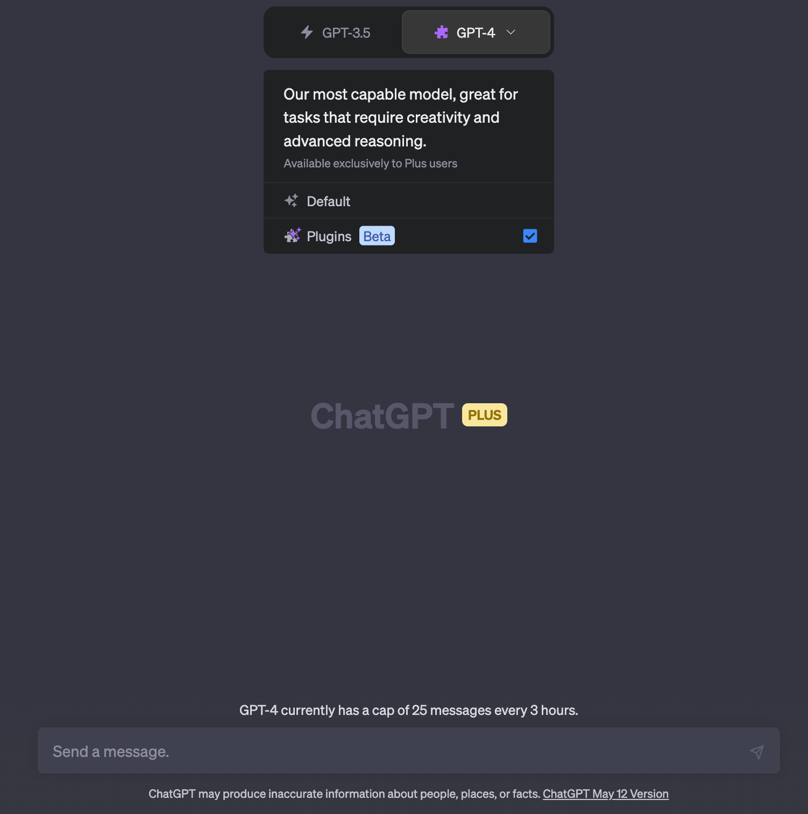
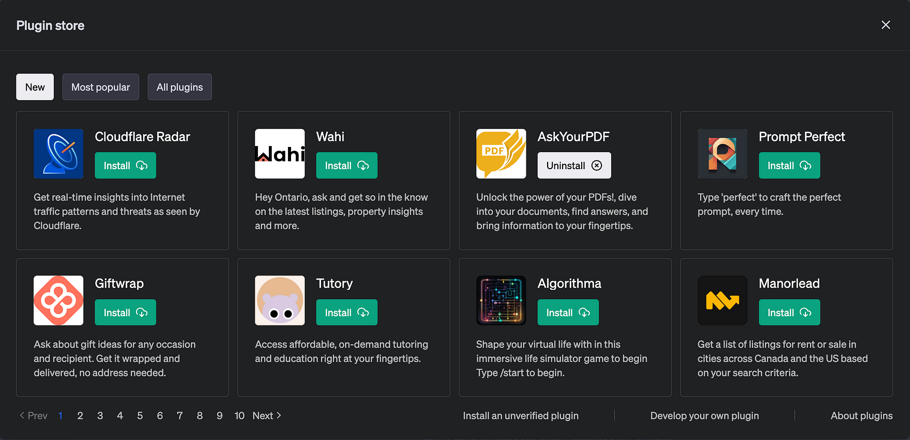

import { Image } from '@astrojs/image/components';
import YouTube from '~/components/widgets/YouTube.astro';
export const components = { img: Image };

Hello, friends! I hope you’re all doing well. Today, I want to talk about something that’s been arriving lately: OpenAI’s ChatGPT plugins. Now, if you’re not familiar with these, don’t worry. I’m here to break it all down for you.

## What are ChatGPT Plugins?

OpenAI’s ChatGPT plugins are a way to connect ChatGPT to third-party applications. These plugins allow ChatGPT to interact with APIs defined by developers, which means that ChatGPT’s capabilities can be significantly enhanced. For instance, with the right plugin, ChatGPT can retrieve real-time information like sports scores, stock prices, or the latest news. It can also access knowledge-base information such as company docs or personal notes. And it doesn’t stop there. ChatGPT can even perform actions on behalf of the user, like booking a flight or ordering food.

Now, it’s important to note that these plugins are currently in a beta stage, which means they may not be accessible to everyone just yet. In order to use Plugins with ChatGPT and GPT-4 language model you need to sign up for a ChatGPT Plus account:



## How do ChatGPT Plugins Work?

The magic behind these plugins lies in the way they're built. Plugin developers expose one or more API endpoints, along with a standardized manifest file and an OpenAPI specification. These elements define the plugin's functionality, allowing ChatGPT to consume the files and make calls to the developer-defined APIs.

The AI model acts as an intelligent API caller. Given an API spec and a natural-language description of when to use the API, the model proactively calls the API to perform actions. For example, if a user asks, "Where should I stay in Paris for a couple nights?", the model may choose to call a hotel reservation plugin API, receive the API response, and generate a user-facing answer combining the API data and its natural language capabilities.



## Building a Plugin

Building a plugin involves a few key steps. First, you create a manifest file and host it at yourdomain.com/.well-known/ai-plugin.json. This file includes metadata about your plugin, details about any required authentication, and an OpenAPI spec for the endpoints you want to expose.

Next, you register your plugin in the ChatGPT UI. If authentication is required, you'll need to provide an OAuth 2 client_id and client_secret or an API key.

Users then need to manually activate your plugin in the ChatGPT UI. During the alpha stage, plugin developers can share their plugin with 15 additional users. Over time, OpenAI plans to roll out a way to submit your plugin for review to be exposed to all of ChatGPT's user base.

## The Conversation Begins

Once your plugin is activated, users can start a conversation. OpenAI will inject a compact description of your plugin in a message to ChatGPT, which is invisible to end users. This includes the plugin description, endpoints, and examples.

When a user asks a relevant question, the model may choose to invoke an API call from your plugin if it seems relevant. The model will incorporate the API results into its response to the user. The model can also output markdown (like an image URL from your API) and the ChatGPT UI will render the markdown in the UI.

## The Building Blocks of a Plugin

Creating a plugin is like building a Lego set. You have different pieces that need to come together to form the final structure. In our case, these pieces are:

* An API that you build
* Documentation of the API in OpenAPI yaml or JSON format
* A JSON manifest file that holds all the important metadata for your plugin

For the sake of this post, let's imagine we're building a plugin for managing a todo list.

## The Manifest File: Your Plugin's ID Card

Every plugin needs an ID card, something that tells ChatGPT what it is and what it does. This is where the `ai-plugin.json` file comes in. This file needs to be hosted on your API's domain and includes all the necessary information about your plugin.

Here's a sneak peek into what a basic `ai-plugin.json` file might look like:

```json
{
    "schema_version": "v1",
    "name_for_human": "TODO Plugin",
    "name_for_model": "todo",
    "description_for_human": "A handy plugin for managing your TODO list.",
    "description_for_model": "This plugin allows you to add, remove and view TODOs.",
    "auth": {
        "type": "none"
    },
    "api": {
        "type": "openapi",
        "url": "http://localhost:3333/openapi.yaml",
        "is_user_authenticated": false
    },
    "logo_url": "http://localhost:3333/logo.png",
    "contact_email": "support@example.com",
    "legal_info_url": "http://www.example.com/legal"
}
```

## The OpenAPI Definition: The Blueprint of Your API

Next up, we need to create the OpenAPI specification to document the API. This is like the blueprint of your API, telling ChatGPT everything it needs to know about it.

Here's a glimpse of what a basic OpenAPI specification might look like:

```yaml
openapi: 3.0.1
info:
  title: TODO Plugin
  description: This plugin lets you create and manage a TODO list using ChatGPT.
  version: 'v1'
servers:
  - url: http://localhost:3333
paths:
  /todos:
    get:
      operationId: getTodos
      summary: Fetch the list of todos
      responses:
        "200":
          description: OK
          content:
            application/json:
              schema:
                $ref: '#/components/schemas/getTodosResponse'
components:
  schemas:
    getTodosResponse:
      type: object
      properties:
        todos:
          type: array
          items:
            type: string
          description: The list of todos.
```

## Running Your Plugin: The Test Drive

Once you've got your API, manifest file, and OpenAPI specification ready, it's time to take your plugin for a test drive. You can connect the plugin via the ChatGPT UI. If you're running your API locally, you can point the plugin interface to your localhost server. If your plugin is on a remote server, you can add the plugin manifest file to the yourdomain.com/.well-known/ path and start testing your API.

## Writing Descriptions

Now, let's talk about the art of communication. When a user makes a query that might be a potential request for a plugin, the model looks through the descriptions of the endpoints in the OpenAPI specification along with the `description_for_model` in the manifest file.

The OpenAPI spec is like a guidebook for the model, telling it about the various functions of your API, what parameters they take, and so on. The `description_for_model` attribute is your chance to instruct the model on how to use your plugin in general. The key here is to use natural language, be concise yet descriptive, and maintain an objective tone.

## Best Practices: The Do's and Don'ts

Here are some golden rules to follow when writing your *description_for_model* and descriptions in your OpenAPI specification, as well as when designing your API responses:

* Don't try to control the mood, personality, or exact responses of ChatGPT. It's designed to write appropriate responses to plugins.
* Don't encourage ChatGPT to use the plugin when the user hasn't asked for your plugin's particular category of service.
* Don't prescribe specific triggers for ChatGPT to use the plugin. It's designed to use your plugin automatically when appropriate.
* Plugin API responses should return raw data instead of natural language responses unless it's necessary. ChatGPT will provide its own natural language response using the returned data.

## Debugging: The Detective Work

By default, the chat will not show plugin calls and other information that is not surfaced to the user. To get a more complete picture of how the model is interacting with your plugin, you can see the request and response by clicking the down arrow on the plugin name after interacting with the plugin.

If you're developing a localhost plugin, you can also open the developer console by going to "Settings" and toggling "Open plugin devtools". This will give you more verbose logs and a "refresh plugin" option which re-fetches the Plugin and OpenAPI specification.

## Wrapping Up

Creating a plugin for ChatGPT might seem like a daunting task at first, but once you understand the process and the tools at your disposal, it becomes a lot more manageable. Remember, the key is to start small, test often, and iterate based on feedback.

I hope you found this deep dive into OpenAI's ChatGPT plugins helpful.

Before I sign off, I'd like to leave you with a few thought-provoking questions:

1. __The Potential of Plugins__: How do you think the introduction of plugins will change the way we interact with AI models like ChatGPT?
2. __The Developer's Perspective__: If you're a developer, what kind of plugin would you like to create for ChatGPT? How would it enhance the user's experience?
3. __The User's Perspective__: As a user, what kind of plugin would you find most useful in your interactions with ChatGPT?

Remember, the future of AI is a collaborative effort. Your ideas and insights are valuable contributions to this exciting field. Until next time, keep exploring, keep learning, and keep pushing the boundaries of what's possible with AI!

Happy coding!

