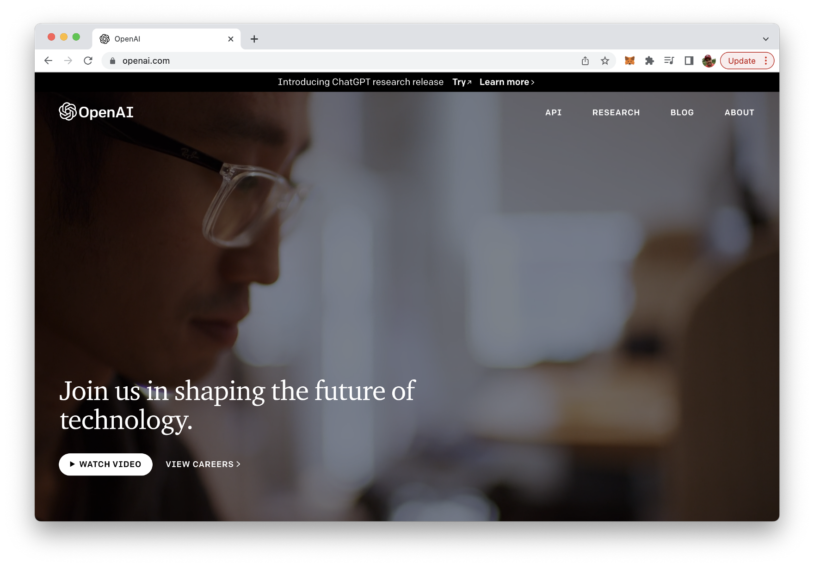
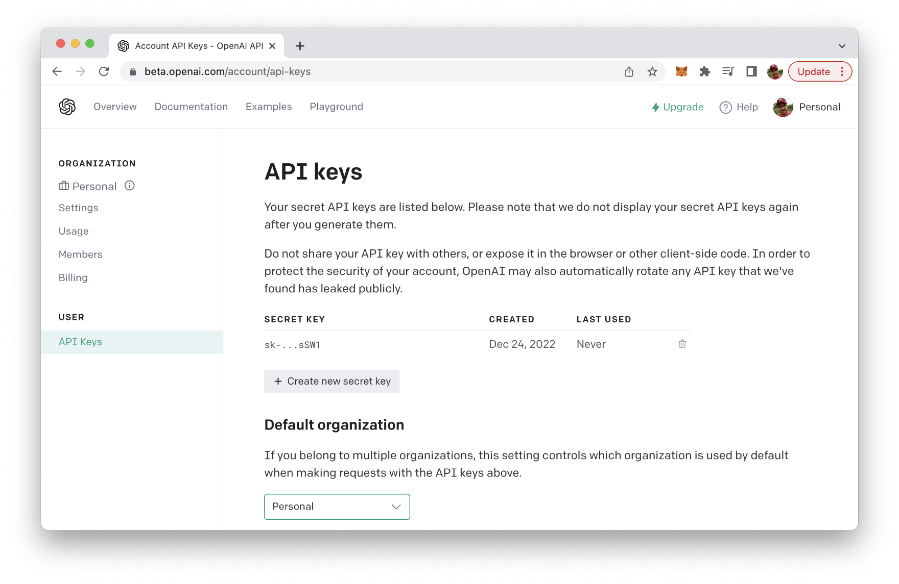
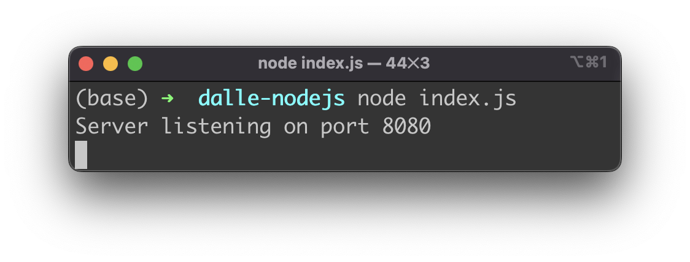
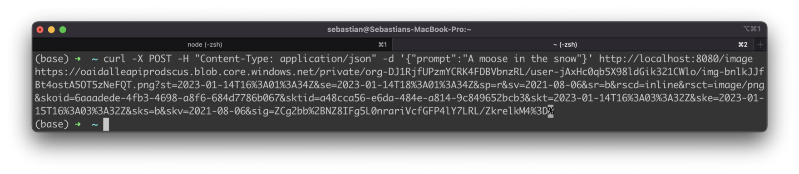
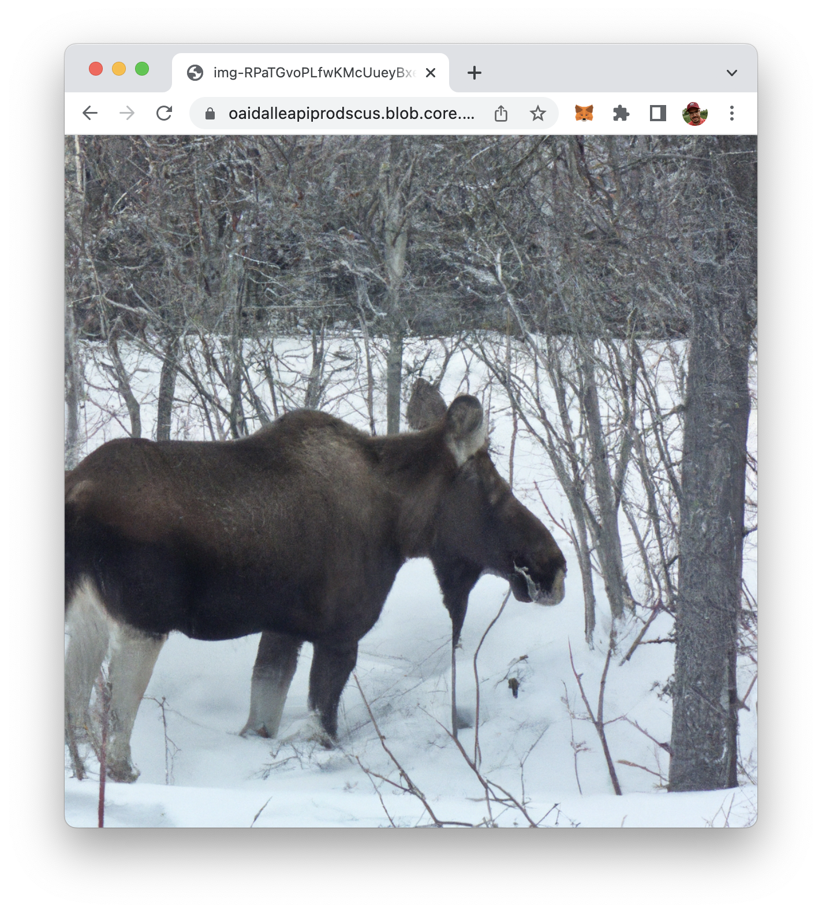

import { Image } from '@astrojs/image/components';
import YouTube from '~/components/widgets/YouTube.astro';
export const components = { img: Image };

DALL-E is a Generative Pre-trained Transformer (GPT) model developed by OpenAI that can generate images from textual descriptions. It is trained on a dataset of text and images, allowing it to understand the relationship between the two and generate images that match a given text description. The API is available for developers to use and it can be integrated with various programming languages such as JavaScript, Python, and others. In this tutorial you'll learn how to use DALL-E with Node.js.

In order to make use of DALL-E in Node.js we need to prepare a project first. Therefore let's start with creating a new empty project folder:

```bash
$ mkdir dalle-nodejs
```

And change into the newly created project folder:

```bash
$ cd dalle-nodejs
```

Let's create a package.json file by using the following command:

```bash
$ npm init -y
```

Then we're ready to install the openai npm package:

```bash
$ npm install openai
```

The OpenAI Node.js library provides convenient access to the OpenAI API from Node.js applications. In the following steps we'll be making use of this library to implement our Node.js sample application.

Next we're going to install express, body-parser and cors package.

```bash
npm install express body-parser cors
```

Furthermore we do need to install the dotenv package:

```bash
$ npm install dotenv --save
```

To start with the implementation create a new file named index.js and a new file .env in the project folder:

```bash
$ touch index.js .env
```

Open file .env in a text editor and insert the following environment variable which holds the API key from your OpenAI account:

```
OPENAI_API_KEY="INSERT YOUR OPENAI API KEY HERE"
```

## Obtaining The OpenAI API Key

To obtain an API key for the OpenAI API, you will need to sign up for a free OpenAI account on the OpenAI website (https://openai.com/):



To sign up for an account, click the "Sign Up" button in the top right corner of the homepage, and then follow the prompts to create a new account. Once you have created an account, you can obtain an API key by visiting the "API" section of your account settings.

In the "API" section, you will find a button labeled "Generate API Key". Click this button to generate a new API key, which you can then use to make requests to the OpenAI API from your Node.js application. Be sure to keep your API key secure and do not share it with anyone else.



## Implementing The Node.js Application

Now open index.js and start by including the following two require statements on top of the file:

```js
const { Configuration, OpenAIApi } = require("openai");
require('dotenv').config()
```

Add the following three lines of code underneath:

```js
const express = require("express");
const cors = require("cors");
const bodyParser = require("body-parser");
```

This code imports three modules: express, cors, and body-parser.

* _express_ is a popular web framework for Node.js that allows for easy routing and handling of HTTP requests.
* _cors_ is a middleware that enables Cross-Origin Resource Sharing (CORS) with various options.
* _body-parser_ is middleware that parses the body of an HTTP request, making it easier to extract data from the request.

We'll use all three packages to setup the Node.js / Express server in the following.

Next add the following code to index.js:

```js
const configuration = new Configuration({
  apiKey: process.env.OPENAI_API_KEY,
});
const openai = new OpenAIApi(configuration);
```

This code is initializing the OpenAI API with an API key.

The first line creates a new instance of the Configuration class, which takes in an object containing the API key. The API key is taken from the process.env.OPENAI_API_KEY, which gives us access to the API key which we have stored in .env file.

The second line creates a new instance of the OpenAIApi class, which takes in the configuration object created in the first line. This creates an instance of the OpenAI API client which can be used to make API requests to OpenAI's API service.

Next let's create and configure the Express server instance by including the following lines of code:

```js
// Set up the server
const app = express();
app.use(bodyParser.json());
app.use(cors());
```

This code sets up an Express.js server and configures it to use the body-parser and cors middlewares.

`const app = express()` creates an instance of an Express.js application and assigns it to the constant variable app.

`app.use(bodyParser.json()`)` is used to configure the body-parser middleware to parse JSON data sent in the request body. This allows the server to access the JSON data in the request body as an object in the request object.

`app.use(cors())` is used to configure the cors middleware. This middleware allows for cross-origin resource sharing, which means that the server can be accessed from a different domain than the one it is hosted on.

Let's continue with setting up an endpoint (`/image`) which will be used to generate images from text descriptions:

```js
// Set up the DALL-E endpoint
app.post("/image", async (req, res) => {
  // Get the prompt from the request
  const { prompt } = req.body;

  // Generate image from prompt
  const response = await openai.createImage({
    prompt: prompt,
    n: 1,
    size: "1024x1024",
  });
  // Send back image url
  res.send(response.data.data[0].url);
});
```

This code sets up an endpoint for a DALL-E image generation service.

`app.post("/image", async (req, res) => {` sets up a route for a POST request to the path /image. It is an asynchronous function that takes in the request and response objects as arguments.

`const { prompt } = req.body;` extracts the prompt variable from the request body, which is expected to be in JSON format.

`const response = await openai.createImage({` is used to generate an image from the prompt using the OpenAI API. The createImage function takes an object as an argument with the following parameters:

* prompt: The text prompt used to generate the image.
* n: The number of images to generate.
* size: The size of the generated image.

`res.send(response.data.data[0].url);` is used to send back the URL of the generated image as the response.

Finally we need to active the server to listen on port 8080:

```js
// Start the server
const port = 8080;
app.listen(port, () => {
  console.log(`Server listening on port ${port}`);
});
```

## Compete Source Code

Finally, let's take a look at the complete source code which should now be available in index.js:

```js
const { Configuration, OpenAIApi } = require("openai");
require("dotenv").config();

const express = require("express");
const cors = require("cors");
const bodyParser = require("body-parser");

const configuration = new Configuration({
  apiKey: process.env.OPENAI_API_KEY,
});
const openai = new OpenAIApi(configuration);

// Set up the server
const app = express();
app.use(bodyParser.json());
app.use(cors());

// Set up the DALL-E endpoint
app.post("/image", async (req, res) => {
  // Get the prompt from the request
  const { prompt } = req.body;

  // Generate image from prompt
  const response = await openai.createImage({
    prompt: prompt,
    n: 1,
    size: "1024x1024",
  });
  // Send back image url
  res.send(response.data.data[0].url);
});

// Start the server
const port = 8080;
app.listen(port, () => {
  console.log(`Server listening on port ${port}`);
});
```

## Testing The Node.js Application

Now it's time to test our application. Therefore we need to start the Node.js application with the following command:

```js
$ node index.js
```

You should then see a message information that the server is running on port 8080 now.



Let's send a HTTP POST request to the /image endpoint by using the curl command directly via the command line:

```bash
$ curl -X POST -H "Content-Type: application/json" -d '{"prompt":"A moose in the snow"}' http://localhost:8080/image
```

The body of the POST request is formatted as JSON and contains the prompt property. The text value which is assigned to this property is containing our description of the image we'd like to get generated by DALL-E.

If you execute this command, after a few seconds you'll receive a URL on the command line which is pointing to the generated image.



Copy this URL string (the % sign at the end of the URL string needs to be removed) into a browser. The image file should be loaded and displayed:



## Conclusion

DALL-E is a powerful AI for generating images from textual descriptions. DALL-E provides an API for which can be easily used in your own application. In this article you've learned how to integrate DALL-E's API in your Node.js application easily.