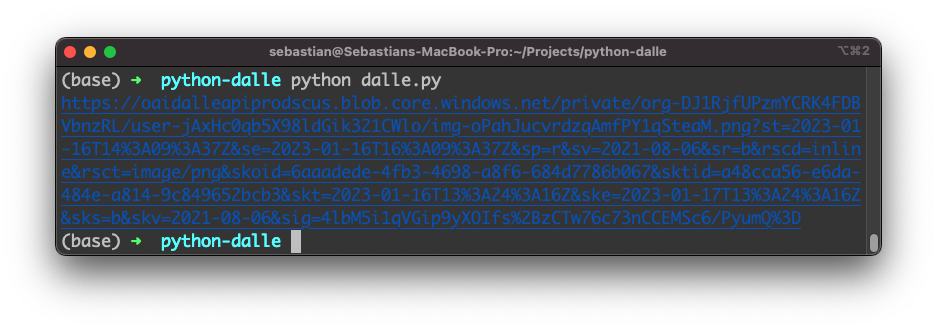

import { Image } from '@astrojs/image/components';
import YouTube from '~/components/widgets/YouTube.astro';
export const components = { img: Image };

DALL-E is a Generative Pre-trained Transformer (GPT) model developed by OpenAI that can generate images from textual descriptions. It is trained on a dataset of text and images, allowing it to understand the relationship between the two and generate images that match a given text description. The API is available for developers to use and it can be integrated with various programming languages such as JavaScript, Python, and others. In this tutorial you'll learn how to use DALL-E with Python.

## Project Preparation

Let's get started. First create a new empty project folder:

```bash
$ mkdir python-dalle
$ cd python-dalle
```

In the next step we need to obtain an OpenAI API client key from the OpenAI dashboard.

## Obtaining The OpenAI API Key

To obtain an API key for the OpenAI API, you will need to sign up for a free OpenAI account on the OpenAI website (https://openai.com/):


To sign up for an account, click the "Sign Up" button in the top right corner of the homepage, and then follow the prompts to create a new account. Once you have created an account, you can obtain an API key by visiting the "API" section of your account settings.

In the "API" section, you will find a button labeled "Generate API Key". Click this button to generate a new API key, which you can then use to make requests to the OpenAI API from your Python application. Be sure to keep your API key secure and do not share it with anyone else.


## Installing OpenAI API client library for Python

To install the OpenAI API client library for Python, you will need to have Python and pip, the Python package manager, installed on your system.

To install the library, open a terminal or command prompt and type the following command:

```bash
$ pip install openai
```

This will install the OpenAI API client and all of its dependencies.

Once the installation is complete, you can import the library in your Python code by adding the following line at the top of your script:

```python
import openai
```

Let's do so: Create a new file dalle.py in the project folder and start by insert the import statement on top of the file.

Let's extend the Python code further and use the OpenAI client library to interact with DALL-E:

```python
import openai

# Your DALL-E API key
openai.api_key = "YOUR_API_KEY_HERE"

# The text prompt you want to use to generate an image
prompt = "A moose in the snow"

# Generate an image
response = openai.Image.create(
    prompt=prompt,
    model="image-alpha-001",
    size="1024x1024",
    response_format="url"
)

# Print the URL of the generated image
print(response["data"][0]["url"])
```

This code uses the OpenAI Python client library to interact with the DALL-E API and generate an image based on a text prompt.

First, it imports the `openai` library. Then, it sets the API key with openai.api_key to the key you obtained from OpenAI.

Then, it defines the text prompt, which is used to generate an image with the prompt "A moose in the snow" in this example.

Next, it calls the `openai.Image.create()` function with several parameters:

* `prompt`: The text prompt used to generate the image.
* `model`: The DALL-E model to use for image generation.
* `size`: The size of the generated image.
* `response_format`: The format of the response - "url" in this case.

This function sends a request to the DALL-E API and returns a response in the form of a dictionary.

Finally, it prints the URL of the generated image by accessing the "url" field in the response data.

It's worth noting that this code is an example and you can change the prompt, model and the parameters according to the requirement.

## Test The Python Script

Let's test if the Python script is working as expected by typing in the following command:

```bash
$ python dalle.py
```

You should then receive as a result an URL linking to the image which has been generated by DALL-E based on the provided text prompt:



Open the image URL in the browser, so that you can see the result:

