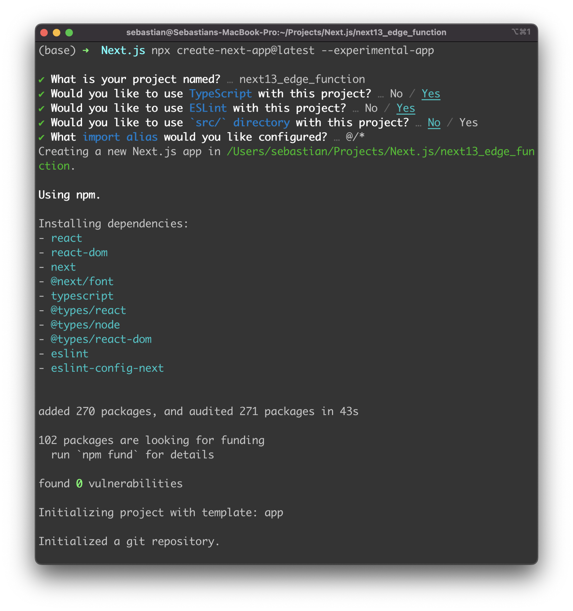
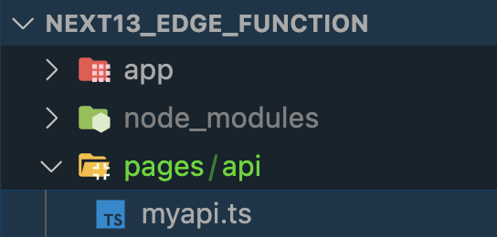
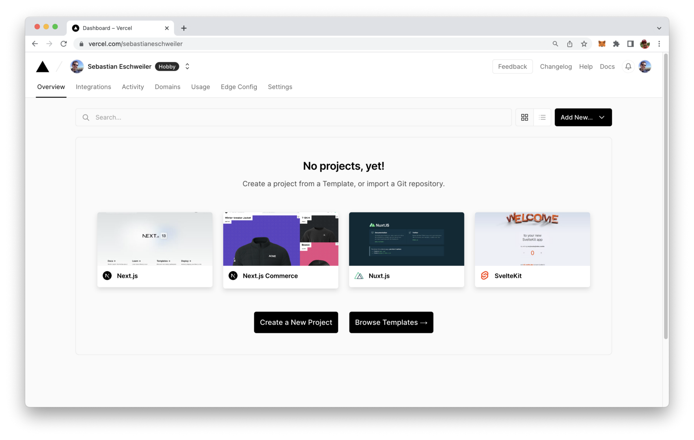
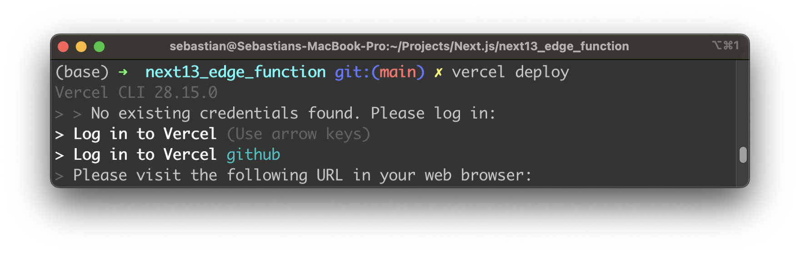
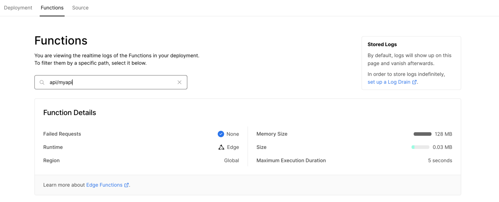
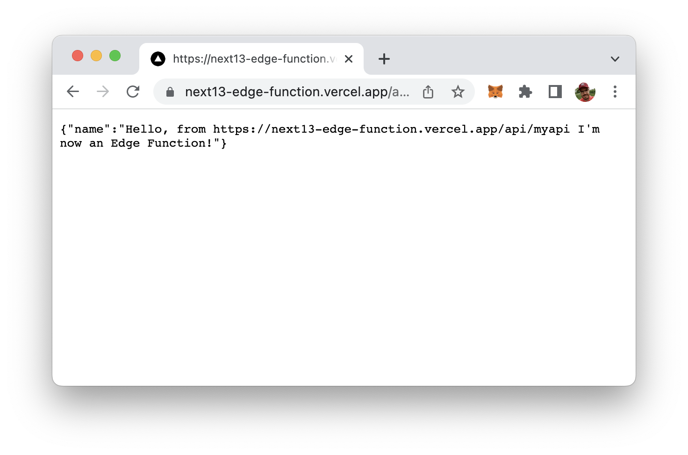

import { Image } from '@astrojs/image/components';
import YouTube from '~/components/widgets/YouTube.astro';
export const components = { img: Image };  

<YouTube url="https://youtu.be/jggOKuD8xd0" />

In cloud computing, the term Edge Function refers to a computing capability that is located at or near the edge of a network, typically closer to the source of data. In this step-by-step tutorial you’ll learn how to create Edge Functions with Next.js 13 with easy.

Edge functions are used to process data close to where it is generated, rather than sending all data to a centralized cloud for processing. This reduces the latency and bandwidth required for data transfer, and can improve the efficiency, scalability, and security of cloud-based applications.

## Serverless Functions vs. Edge Functions

Edge Functions can be understood as a variation of serverless functions. To explain, let's compare Edge Functions to serverless functions.

A serverless function deployed on Vercel runs on a server located somewhere in the world. The request made to the function is executed on the server. If the request originates from a location close to the server, it's fast. But if it's from a far-off place, the response is slower.

Edge Functions solves this problem. Simply put, Edge Functions are serverless functions that run close to the user, resulting in fast requests, regardless of the user's location.

## 1. Create A New Next.js 13 Project

Let's start by creating a new Next.js 13 project by using the following command:

```bash
$ npx create-next-app@latest --experimental-app
```

After hitting return you'll be guided through the process of creating a new Next.js 13 project on the command line. You need to specify a name for the new project and provide answers to the following questions:



Once the project is created successfully we're ready to enter the newly created project directory next13_edge_function and start the application next.

## 2. Add A New API Route

In order to create a new standalone Edge Function create a new file inside the pages/api folder of the default project structure. Let's name this file myapi.ts as you can see in the following:



## 3. Add Implementation

Let's start implementing by inserting the following lines of code into myapi.ts:

```js
import { NextRequest, NextResponse } from 'next/server';

const handler = (req: NextRequest) => {
  return NextResponse.json({
    name: `Hello, from ${req.url} I'm now an Edge Function!`,
  });
};

export default handler;
```

This code exports a function called handler which takes in an object req of type NextRequest as an argument. The function returns a JSON response object with a property name that holds a string "Hello, from [request URL] I'm now an Edge Function!". The response string includes the URL of the incoming request. This code is a basic handler for an HTTP request in a Next.js application.

## 4. Set Edge Runtime

Next let's add the following code:

```js
export const config = {
  runtime: 'edge',
};
```

This code exports an object config with a single property runtime which is set to the string value 'edge'. The config object specifies configuration options for Next.js API route. The property runtime is used to specify the runtime environment in which the handler function is executed. The value 'edge' specifies that the application is executed on an edge computing platform.

Again, in the following listing you can see the complete source code of myapi.ts:

```js
import { NextRequest, NextResponse } from 'next/server';

export const config = {
  runtime: 'edge',
};

const handler = (req: NextRequest) => {
  return NextResponse.json({
    name: `Hello, from ${req.url} I'm now an Edge Function!`,
  });
};

export default handler;
```

## 5. Deploy To Vercel

Finally, we're ready to deploy to the Vercel platform. First make sure to install the latest version of the Vercel CLI by using the following command:

```bash
$ npm i -g vercel@latest
```

Next, sign up for a free account at vercel.com, so that you're able to access the dashboard:



In the Next.js project directory execute the vercel command with option deploy:

```bash
$ vercel deploy
```

You then need to log in with the credentials you have used before when signing up for a Vercel account:



The deployment is then done automatically and after the process is finished you should be able to see your deployed Next.js application in Vercel's dashboard.

From here you can access the Functions tab and see that the API function at api/myapi is deployed to the global Edge network:



When you now access the function by using the URL which is provided by Vercel (and extending this URL with the API endpoint api/myapi) you should be able to receive the response from our API function which is executed in the Edge network:



The Edge API function is live and running!