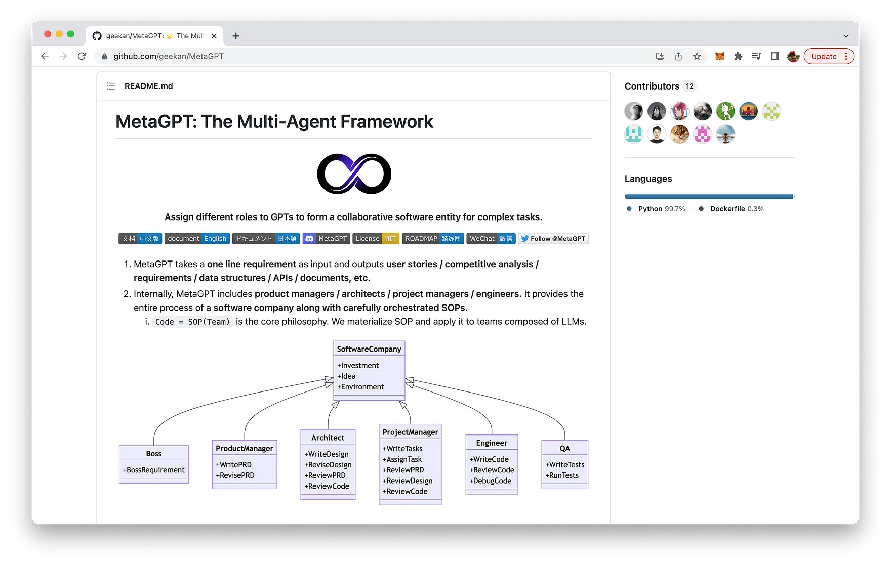
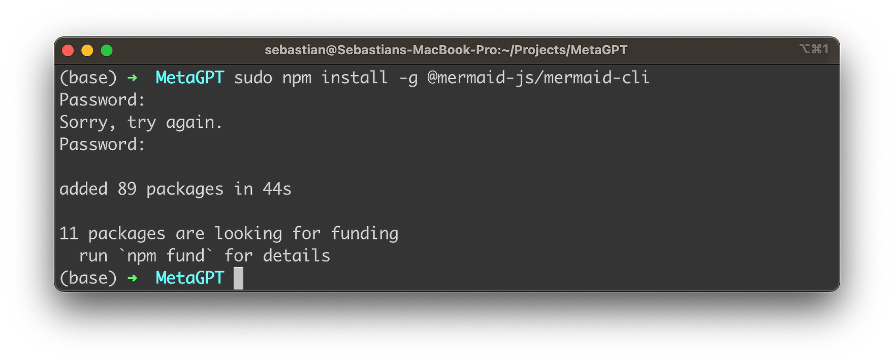
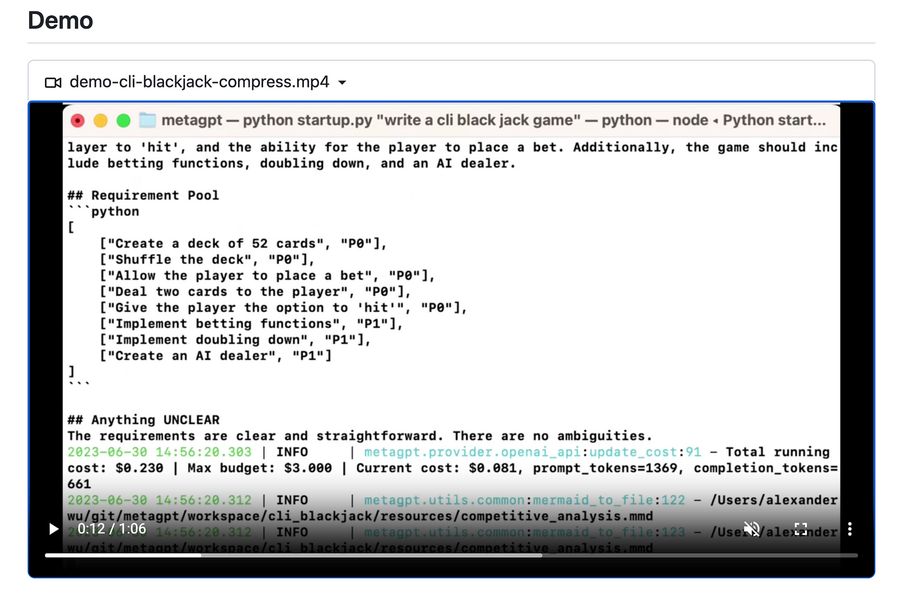

import { Image } from '@astrojs/image/components';
import YouTube from '~/components/widgets/YouTube.astro';
export const components = { img: Image };

Hello, fellow developers and tech enthusiasts! Today, we're going to delve into the world of AI and explore a fascinating tool called MetaGPT. This multi-agent framework is a game-changer in the realm of software development, capable of transforming a single-line requirement into a comprehensive project, complete with PRD, design, tasks, and a repository.

## Introduction to MetaGPT

MetaGPT is a revolutionary tool that assigns different roles to GPTs (Generative Pretrained Transformers) to form a collaborative software entity for complex tasks. It takes a one-line requirement as input and outputs user stories, competitive analysis, requirements, data structures, APIs, documents, and more.

Internally, MetaGPT includes product managers, architects, project managers, and engineers. It provides the entire process of a software company along with carefully orchestrated tasks.

The project is hosted on GitHub and can be found at: https://github.com/geekan/MetaGPT



## Step-by-Step Installation Guide

Let's dive into how to install MetaGPT on your system. Please note that this guide assumes you have Python 3.9+ installed on your system. If you don't, please install it before proceeding.

__Step 1:__ Ensure that NPM is installed on your system. Then install mermaid-js. You can do this by running the following commands:

```bash
npm --version
sudo npm install -g @mermaid-js/mermaid-cli
```



__Step 2:__ Clone the MetaGPT repository to your local machine and install it:

```bash
git clone https://github.com/geekan/metagpt
cd metagpt
python setup.py install
```

## Configuring MetaGPT with Your OpenAI Key

Once you have MetaGPT installed on your system, the next crucial step is to configure it with your OpenAI key. This key is essential for MetaGPT to function correctly as it allows the tool to access the OpenAI API. Here is a step-by-step guide on how to do it:

__Step 1:__ Locate your OpenAI key. This is usually provided when you sign up for OpenAI's services. If you don't have one, you'll need to sign up for OpenAI and generate a key.

__Step 2:__ MetaGPT allows you to configure your OpenAI key in three places: `config/key.yaml`, `config/config.yaml`, or as an environment variable. The priority order is as follows: `config/key.yaml` > `config/config.yaml` > environment variable. This means that if the same key is set in multiple places, the key in `config/key.yaml` will take precedence.

__Step 3:__ To set the key in `config/key.yaml`, first copy the configuration file:

```bash
cp config/config.yaml config/key.yaml
```

__Step 4:__ Open the `config/key.yaml` file in a text editor and locate the `OPENAI_API_KEY` field. Replace the placeholder text with your OpenAI key:

```
OPENAI_API_KEY: "sk-..."
```

__Step 5:__ Save and close the file. Your OpenAI key is now configured, and MetaGPT is ready to use!

Remember, it's crucial to keep your OpenAI key secure. Do not share it with anyone or publish it in a public repository. If you suspect that your key has been compromised, generate a new one through your OpenAI account as soon as possible.

## A Simple Example of How to Use MetaGPT

Now that we have MetaGPT installed, let's see it in action. Here's a simple example of how to use MetaGPT:

```bash
python startup.py "Write a cli snake game"
# Use code review will cost more money, but will opt for better code quality.
python startup.py "Write a cli snake game" --code_review True
```

After running the script, you can find your new project in the workspace/ directory.

Check out the demo video on https://github.com/geekan/MetaGPT to see this command in action:



## Conclusion
MetaGPT is a powerful tool that leverages the capabilities of AI to streamline and automate the software development process. By transforming a single-line requirement into a comprehensive project, it significantly reduces the time and effort required in the initial stages of project development.

Whether you're a seasoned developer looking to optimize your workflow or a tech enthusiast eager to explore the latest advancements in AI, MetaGPT is a tool worth exploring. Happy coding!